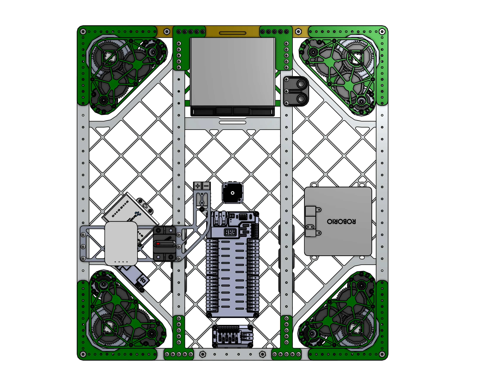

<!--  -->

# 2910 Charged Up Drivebase

<figure markdown="span">
[{height=80% width=80%}](https://cad.onshape.com/documents/28a885d3b8ad7de567efebbd/w/33b7dd39d54ec1ab15f2e2aa/e/d78c591638c349b708e238e6){target = "_blank"}
<figcaption>Swerve drivetrain featuring mk4i swerve moduels, a pocketed bellypan, and a billet brass frame rail for weight distribution.</figcaption>
</figure>

## Behind the design
This drivebase embodies all fundamentals of good drivebase design, including the following features:

___

### 
Design for ***Rigidity*** 

|||
|:-:|:-:|
|<figure>{height=70% width=70%}</figure>| This drivebase is constructed primarily from 1/8 inch boxutbe, with important cross-members providing rigidity to the structure. Drivebases must be built extremely tough, as they will experience the brunt of each collision while robots travel accross the field at high speed. The bellypan offers extra rigidity by holding the frame members prallel with each other.|

| Image        | Text                                                                |
| ------------ | ------------------------------------------------------------------- |
| <figure>{height=70% width=70%}</figure> | This drivebase is constructed primarily from 1/8 inch boxutbe, with important cross-members providing rigidity to the structure. Drivebases must be built extremely tough, as they will experience the brunt of each collision while robots travel accross the field at high speed. The bellypan offers extra rigidity by holding the frame members prallel with each other. |
