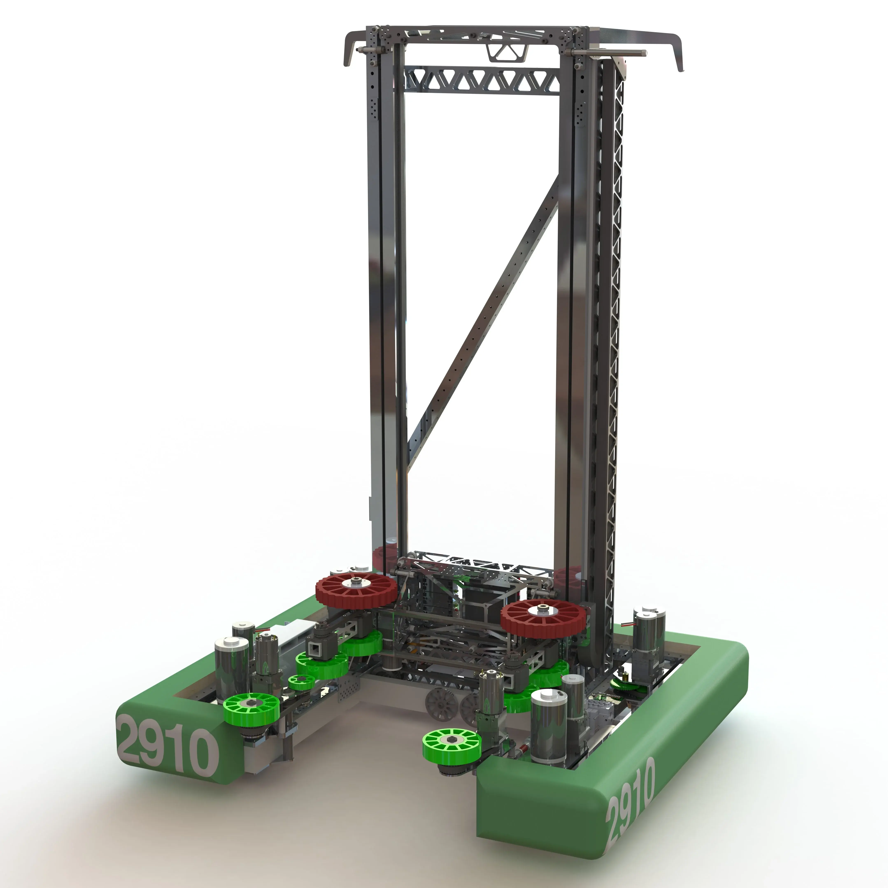
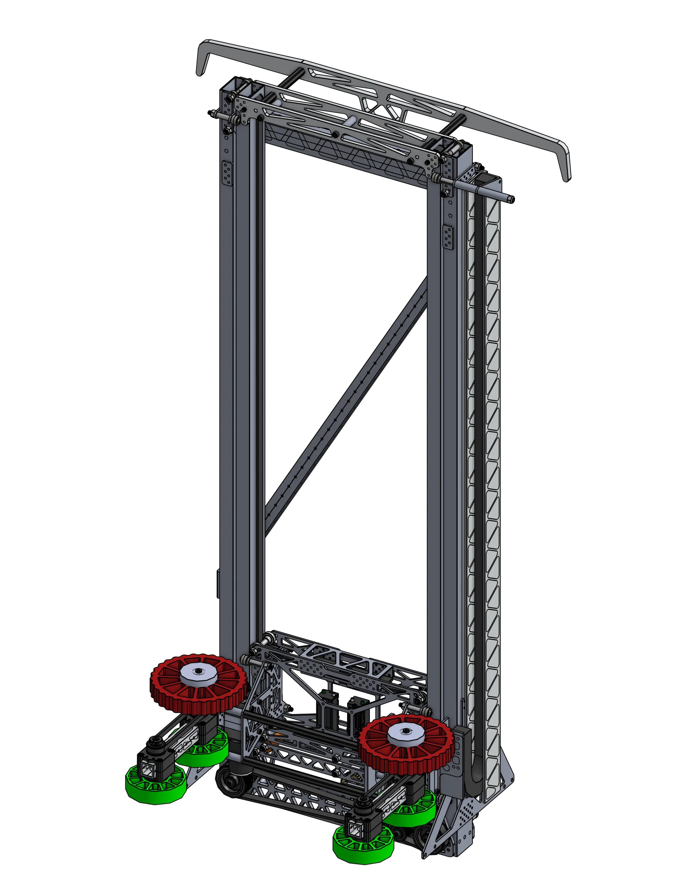
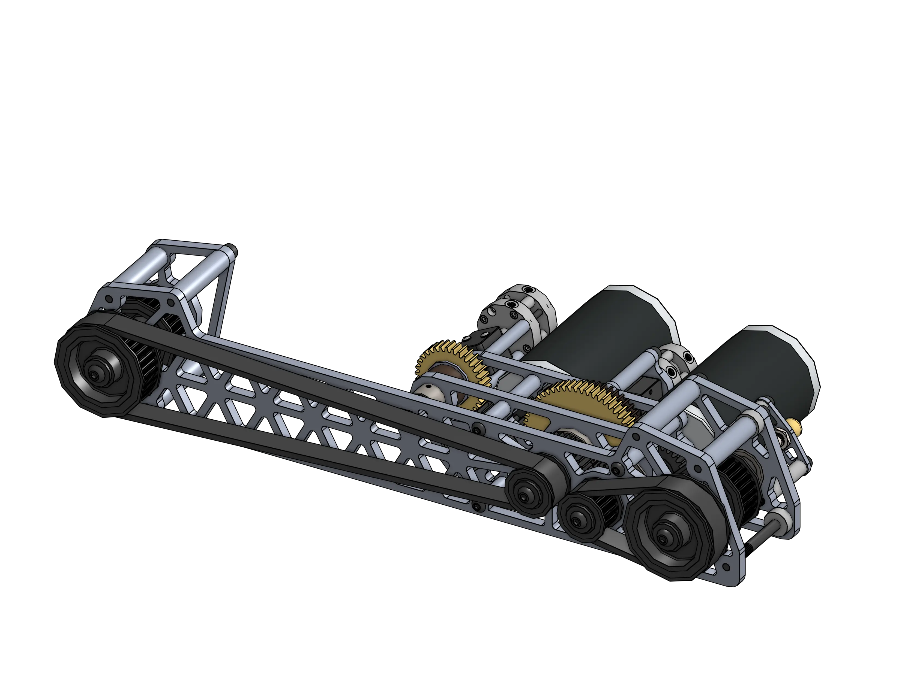

# 2910 Jack in the Bot - Kayla (Power Up, 2018)
## Internally-Belted Continuous Elevator

[{height=30% width=30%}](https://cad.onshape.com/documents/705c4ac7f3520517d5d5b798/w/f1c74ab419618cdf83f5b3da/e/125f2d341803212d0807aece){target = "_blank"} 
[{height=30% width=30%}](https://cad.onshape.com/documents/705c4ac7f3520517d5d5b798/w/f1c74ab419618cdf83f5b3da/e/196d4a2306d67ce8ad4e2608){target = "_blank"}

<figure markdown="span">
<figcaption>A 2-stage elevator, internally rigged with a single massive HTD5 timing belt, featuring a plate-based carriage for a mechanism.</figcaption>
</figure>

## Behind The Design
This internally-belted continuous elevator raised 2910 to initial fame in 2018, where it took them to Einstein along with their swerve. It has two stages, with a manipulator on a plate carriage and a large hook on the top for climbing. A lot of teams since have used this belted elevator as inspiration.

### Shifting Gearbox
The elevator did double duty, with a shifting gearbox to allow high speeds to raise the manipulator, or high torque to allow it to climb. 

 [{height=60% width=60%}](https://cad.onshape.com/documents/705c4ac7f3520517d5d5b798/w/f1c74ab419618cdf83f5b3da/e/380a2b669974d91bf4ae9aa8){target = "_blank"}

It was powered by two CIM motors, with some reduction built into the belt runs to each side of the elevator, for the belts that made the elevator move up and down. It was aided by the fact that the robot itself wasn't very heavy.

- continuous elevator -> compact rigging, keeps CoG low because of how the carriage moves
- energy chain, thoughtful placement of motor controllers for wiring
- cross brace to maintain rigidity
- single belt attached to top and bottom of the carriage on each side, when ran one way it decreases the length of the belt going through the tubes and pulls the carriage up, when going the other way it decreases the length of the belt under the carriage and brings it back down again.

