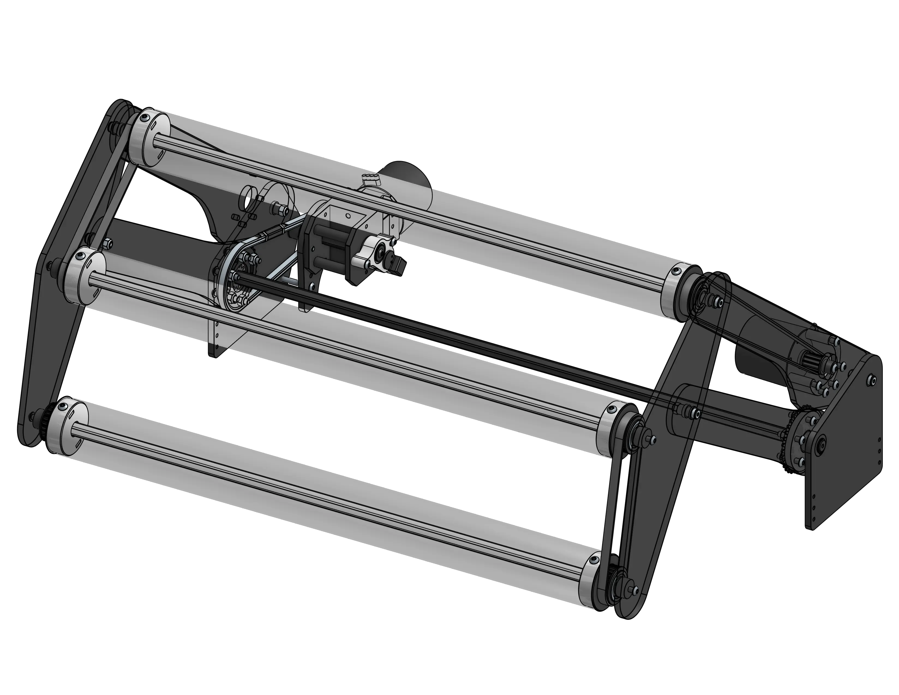
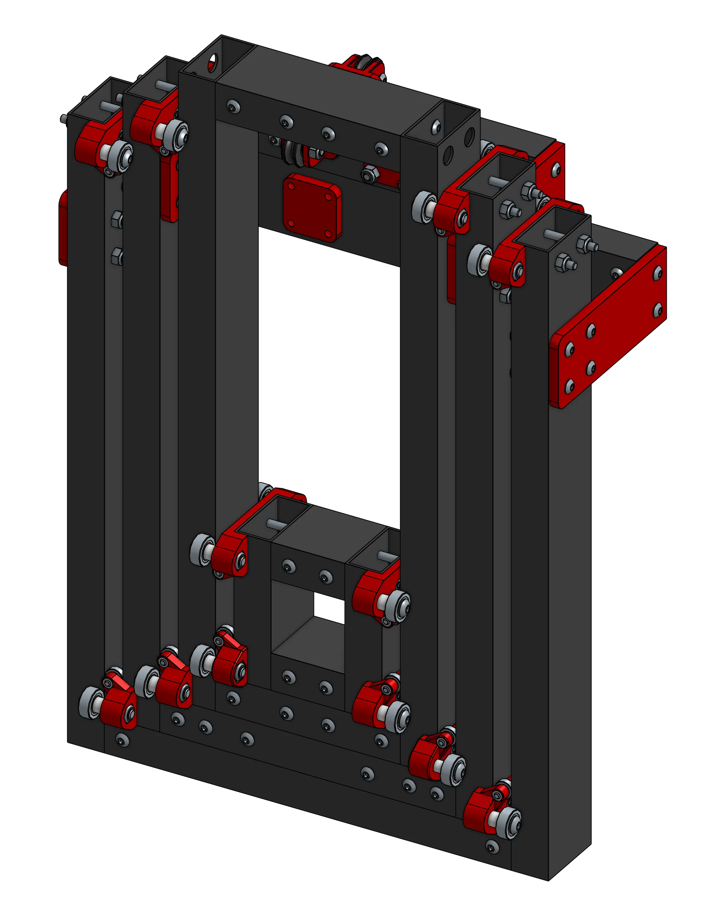
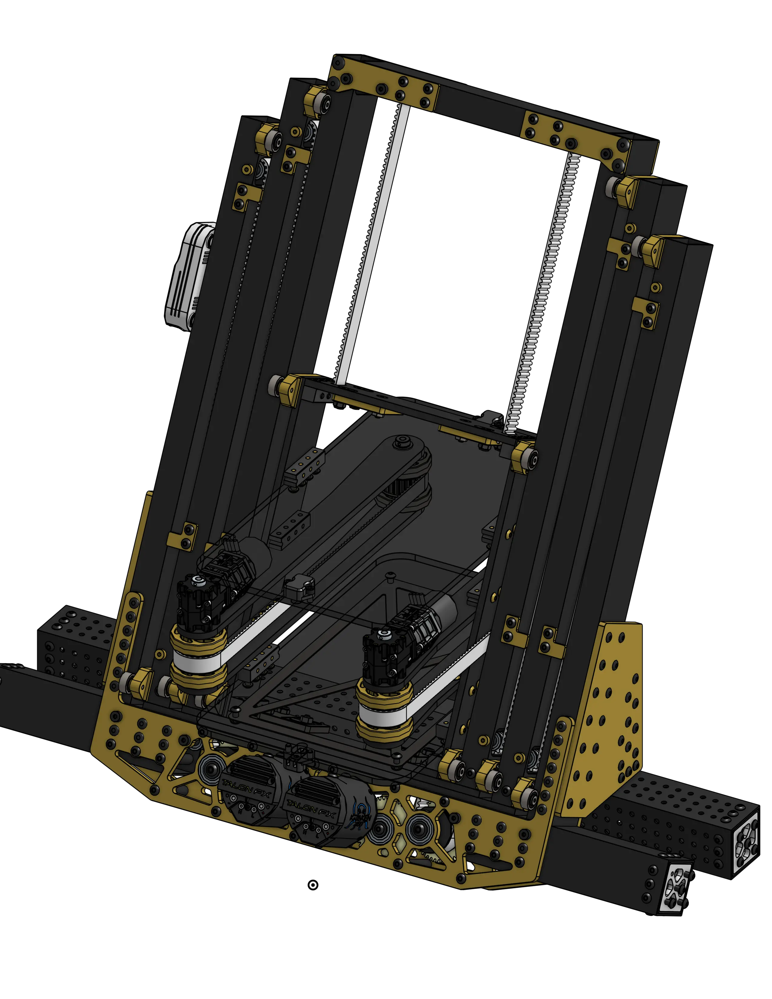

# CAD Examples

"Steal from the best invent the rest." has been an FRC ethos ever since the competitions creation. Because of how important looking at past designs is in the learning process we have created a library of mechanisms that can be used as reference, when learning how to design a wide variety of FRC mechanisms.

!!! tip

    On any of the CAD Example pages you can click the header image to open the model in Onshape!

## Categories

- [Swerve Drivebases](drivebase/index.md)

    

- [Slapdown Style Intakes](intake/slapdown/index.md)

    

- [4 Bar Style Intakes](intake/4bar/index.md)

    

- [Cascade Elevators](elevator/cascade/index.md)

    

- [Continuous Elevators](elevator/continuous/index.md)

    

- [Shooters](shooter/index.md)

    