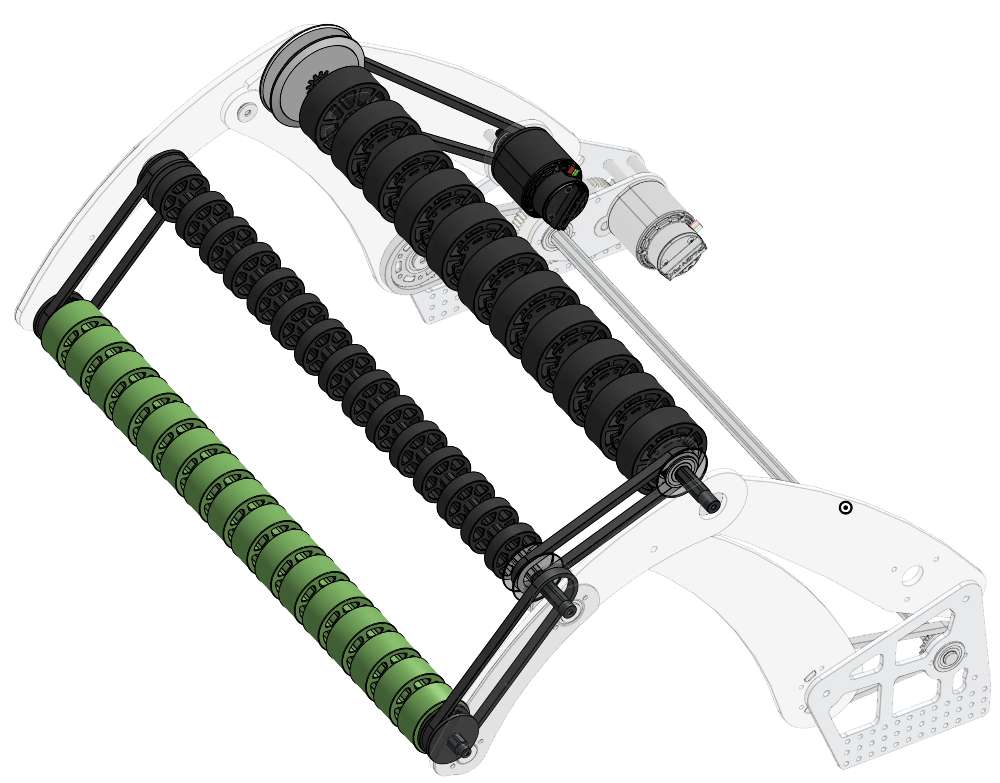
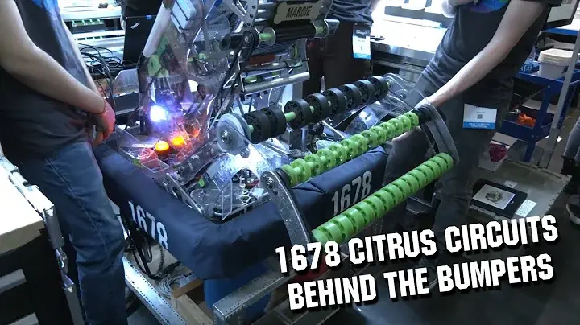

# 1678's 2022 Intake

<figure markdown="span">
[{height=65% width=65%}](https://cad.onshape.com/documents/85e97134bff4283227dd7814/w/1b7989bff6276a96f0730470/e/3761d128b68089769ab731a0){target = "_blank"}
<figcaption>Motor driven 4 bar intake designed to take up minimal horizontal space</figcaption>
</figure>

## Behind the design

4 bar OTB intakes are built to pull gamepieces off the floor and into the robot, but to do so they put themselves in a precarious situation. Sitting outside the robots frame perimeter, they are susceptible to damage from collisions with the field and other robots. All OTB intake designs are heavily influenced by the design requirements to be robust against impacts and damage, fast, and light.

||||
|:-:|:-:|:-:|
|<figure>{height=120% width=120%}<figcaption> Always include a way to tension your chains! </figcaption></figure>| OTB intakes must actuate quickly and accurately, so a motor is a good choice to power them. 1678 used a single [Falcon 500](https://www.vexrobotics.com/217-6515.html) with a 30:1 ratio. This intake featured a torque transfer shaft (highlighted yellow in the image) to transfer power to both sides of the intake. Driving both sides of the intake pivot prevents the entire intake from bending under the loads of extension and retraction. The pivot itself is driven by chain on a [32t plate sprocket](https://www.revrobotics.com/ion-25-sprockets/). Using a chain for the final reduction and power transmission is optimal due to its ability to absorb shock loads.|<figure>{height=120% width=120%}<figcaption> These screws and washers prevent bearings from popping out during impacts. </figcaption></figure>|

|||
|:-:|:-:|
| OTB intakes must actuate quickly and accurately, so a motor is a good choice to power them. 1678 used a single [Falcon 500](https://www.vexrobotics.com/217-6515.html) with a 30:1 ratio. This intake featured a torque transfer shaft (highlighted yellow in the image) to transfer power to both sides of the intake. Driving both sides of the intake pivot prevents the entire intake from bending under the loads of extension and retraction. The pivot itself is driven by chain on a [32t plate sprocket](https://www.revrobotics.com/ion-25-sprockets/). Using a chain for the final reduction and power transmission is optimal due to its ability to absorb shock loads.|<figure>{height=200% width=200%}<figcaption> Always include a way to tension your chains! </figcaption></figure>|

***

## 
 See this Intake in Action Here 

|||
|:-:|:-:|
|[<figure>{height=200% width=200%}<figcaption>1678 Behind the Bumpers</figcaption><figure>](https://youtu.be/ijiDMVvGc_E?feature=shared&t=83)|[<figure>{height=55% width=55%}<figcaption>1678 Match Video</figcaption></figure>](https://www.youtube.com/watch?v=2KTDGhm7Sjc)|