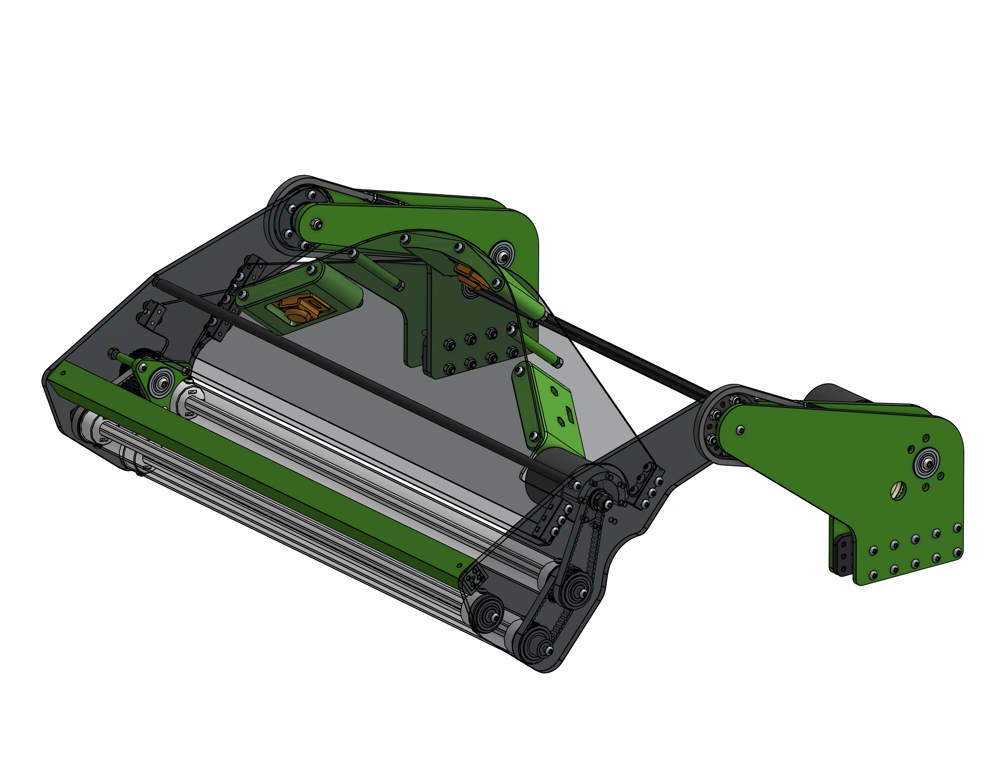

<meta property="og:title" content="Intake CAD Example: 6423 Crescendo Flip Intake">
<meta property="og:type" content="website">
<meta property="og:url" content="https://www.frcdesign.org/cad-examples/intake/slapdown/examples/6423otb/">
<meta property="og:image" content="https://www.frcdesign.org/img/cad-examples/intake/slapdown/6423crecendo.webp">
<meta name="theme-color" content="#4CAE4F">
<meta name="twitter:card" content="summary_large_image">

# 6423 Crescendo Flip Intake

<figure markdown="span">
[{height=60% width=60%}](https://cad.onshape.com/documents/e466c9e10766af7b45952ce2/w/daa5adbb115d62e1a82bdad9/e/efc90f45c6b5a34bffb7429c){target = "_blank"}
<figcaption>This common 2024 design was inspired by the ri3d team Cranberry Alarm. It is distinct from the traditional "passthrough" intake design, not letting the note travel fully through the intake. </figcaption>
</figure>

## Behind the design

**Coming Soon**

