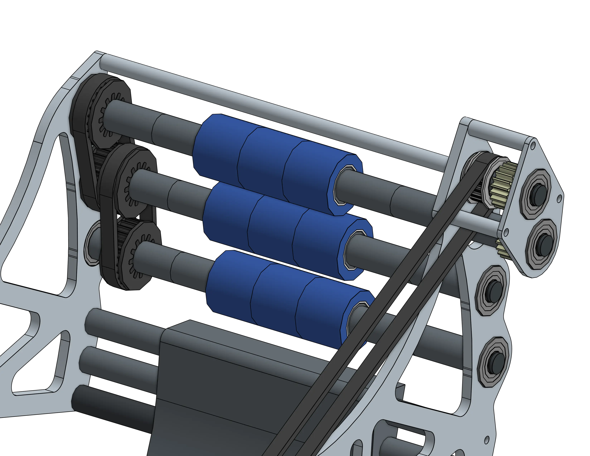

# 1678 Citrus Shooter 2022

<figure markdown="span">
[{height=65% width=65%}](https://cad.onshape.com/documents/5171f477c0b2b518f0252641/w/cbf30882b3a7cbd588a0ad5a/e/a8d11c6d37daaefe163e2d01){target = "_blank"}
<figcaption>Integrated hooded shooter and indexer for simplicity. This design is optimized to shoot large balls as accurately and consistently as possible.</figcaption>
</figure>

<!-- ### 
Design for ***Rigidity*** 
 -->

## Behind the Design

Hooded ball shooters all follow the same fundamental design principles, in an effort to produce the most consistant and accurate shots possible. These can be broken down to the following ideas: 

- Maximize contact time with the game piece you are shooting. This benefits shot consistency as it gives the gamepiece more time to match the speed of the flywheels. 
- Ensure your shooter can aim with adequite precision.
- Ensure your flywheels have enough mass to hold a consistant speed throughout the shot.
- *In some cases,* spin can be beneficial.

### This shooter was designed for the 2022 game, [Rapid React](https://www.youtube.com/watch?v=LgniEjI9cCM)
not sure how to transition into this next segment

|||
|:-:|:-:|
|<figure>{height=90% width=90%}| Hooded shooters in 2022 featured backrollers for one main purpose: Controling backspin. A unique aspect of the 2022 game was the high goal that robots were required to shoot into. The geometry of the goal led many teams to find that their shots bounced out with high backspin. As a remedy, teams added backrollers to their shooters that were geared to spin in the opposite direction as the main flywheel. This reduced backspin on the balls to a manageable amount, but in some cases left just a little bit. This is due to the aerodynamics of spinning balls; thanks to the [Magnus effect](https://youtu.be/T9xsTO6ujqM?feature=shared&t=594), backspin on rapid react balls helped them arc better into the high goal, and increased their stability in flight for long distance shots.|

|||
|:-:|:-:|
|Hooded shooter flywheels typically use [TTB Urethane Wheels](https://www.thethriftybot.com/products/4-solid-urethane-wheel-1-2-hex-bore-45a-durometer?_pos=8&_sid=e09924749&_ss=r) or [Stealth Wheels](https://www.andymark.com/products/stealth-wheels-options). It is important that your flywheels maintain enough mass to hold a constant speed throughout the shot, ensuring consistant results. Games in which you can hold and shoot multiple pieces at a time such as Rapid React and [Infinite Recharge](https://www.youtube.com/watch?v=gmiYWTmFRVE) especially necessitate massed flywheels. The 1678 shooter in 2022 utilized two SDS flywheels for its mass.  |<figure>{height=90% width=90%}|