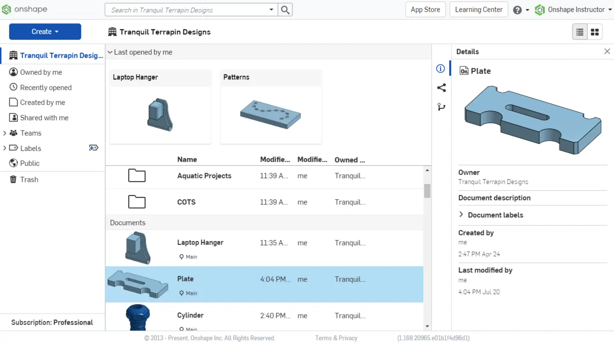
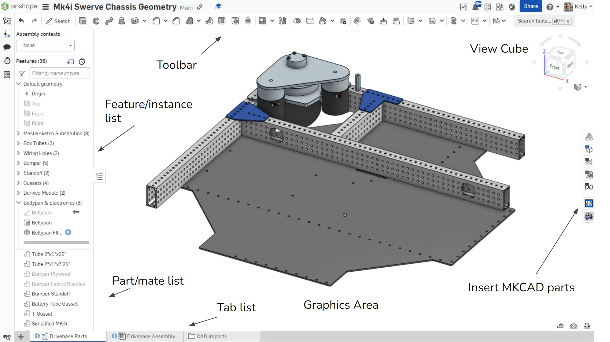

# 0C: Navigating Onshape

[< 0B: Onshape Setup](0B-setup.md) [0D: Theory >](0D-theory.md)
 

## Getting Started
An Onshape document is not a CAD file, but rather a generic container that holds data related to a project, including any number of part studios, assemblies, drawings, and other media/files. It can be versioned and linked to from other documents. 

### Documents Page
Documents can be viewed and managed from the documents page. You can sort them with folders and labels. On the sidebar, you can switch between stuff owned by you and stuff owned by a classroom/team/organization, and a public search page which can be used to look through public Onshape files. In the top right corner of the page, you can access the app store, learning center, and account settings.

You can create a document or folder or import CAD files from your computer using the "Create" dropdown button on the left.

You can use [this page](https://learn.onshape.com/learn/course/navigating-onshape/onshape-interface/the-documents-page?page=1) in the learning center to explore the documents page.

### Customizing Your Account

- Change default units and precision
- Change email notifications
- Change default view manipulation if you're more familiar with a different CAD software
- Use the subscriptions section to renew your student/educator subscription each year

## Document Details and Navigation

There are two main types of environments in a document: part studios and assemblies.

### Document Navigation
A document has some defined regions that stay generally consistent in both main environments.

- **Document Toolbar:** You can manage the document, navigate back to documents page (click logo), and view versions and history.
- **Toolbar:** Changes depending on the environment, but contains all the features you use to perform actions in Onshape. Most of these have keyboard shortcuts (full list in the help menu).
- **Tab bar:** Organizes different tabs in the document. Can be sorted into folders. Add new folders and tabs to the document by clicking the plus on the bottom left.
- **Left Side (Feature/Part/Instance/Mate List)**: Breaks down how parts/assembly was made.

  

The space in the middle is called the graphics area. You can interact with the model by selecting entities or rotating the view. 

  

Onshape has persistent selection, which means each left click on a face or entity adds it to a selection group. Deselect by clicking an entity again or pressing the spacebar.

To measure lines or distances, select the entities you want to take the measurement of and the numbers will display next to the tape measure in the bottom right of the graphics area. Select the tape measure for more detailed measurements.

### Part Studios
One of the main differences between Onshape and other CAD systems is the part studio. 

A part studio is an environment where you can design and model one or more parts at a time and add robust relationships between them. You do this using a series of sketches and features. This helps build design intent between multiple parts easily without having to switch between different files.

Remember that the part studio is for designing the parts, while an assembly is used for putting the parts together and defining motion (this means only model one of each part if there are duplicates and duplicate them in the assembly instead.)

### Part Studio Navigation

- The "feature toolbar" is the main toolbar in the part studio (this changes to the sketch toolbar when editing a sketch)
- Each feature and sketch pops up a dialogue box with options to configure and confirm it
- In both feature and sketch toolbars:
    - Basic geometry creation tools
    - Geometry alteration tools

(Will be supplemented with a video in the future)

### Assemblies
Assemblies are for positioning and establishing movement between parts. The main function for this "mates", which establish the degrees of freedom between parts. Parts can move freely in an assembly before their position/movement is defined with mates. 

### Assembly Navigation

- Using the assembly toolbar, you can:
    - Insert parts and subassemblies
    - Different kinds of mates (restrict different degrees of freedom)
    - Special tools for movement and replication

- Every part and face generates mate connectors at smart spots
    - You can manually create mate connectors in part studios

- When using a mate:
    - Select two separate mate connectors
    - Flip or rotate axis to get the part/assembly in the right orientation
    - You can offset in a specific axis by distance or angle

(Will be supplemented with a video in the future)

## Other Notes

### Organization Practices
One of the big reasons Onshape is desirable for FRC is its collaboration capabilities, but that means nothing when nobody can read or work with your CAD. Different subsystem leads will have to collaborate and view other separate subsystems. None of the easy communication and collaboration can be done without good organization and naming practices.

Make it annoyingly clear what sketches and features do what. Name sketches and features, and try to use folders. Sort by parts or groups of parts (e.g. tubes, gussets, bellypan). The instance list in assemblies can also get very messy and slow down your workflow, so keep similar instances in folders. And finally, just make sure to name tabs. This will all make a big difference for the readability of your CAD by other people and yourself.

### Versions and History
Every action by every user is saved in the history, and can be rolled back to or created a version at. When assemblies are linked between documents, documents have to be versioned. This reduces loading times as well, since it's only referencing a single static version and not constantly attempting to update. Versions cannot be deleted, and branches can be created and merged for changes, similar to git.

 

0C: Navigation
 
[< 0B: Onshape Setup](0B-setup.md) [0D: Theory >](0D-theory.md)
 
 