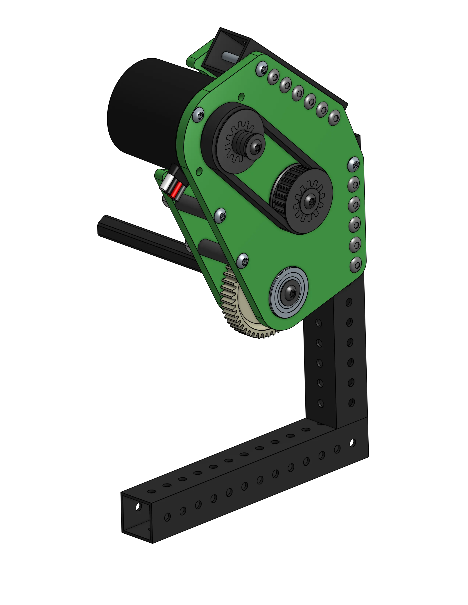

# 1C: Gearbox Projects

[< 1B: Design Methodology](1B-designMethodology.md) [Stage 2A >](../stage2/2A-drivebaseFullDetail.md)
 

Though you can buy premade planetary gearboxes from vendors (which are still very good in a lot of use cases and packaging), custom gearboxes are typically more versatile in tight packaging situations, and can be tuned better to avoid backlash.
[comment]: <> (Link to designing for control page for reducing backlash)

## Transfer of Motion
Motors are used to add movement to your robot through rotation. Gears, belts, and chains are used to both transfer motion (torque and speed) from one shaft/mechanism to another, both to move mechanisms and spin rollers and wheels. Object manipulation, movement around the field, just about anything on your robot can be moved with the right motors and mechanical advantage.

### Mechanical Advantage

Mechanical advantage is a measure of the ratio of output force to input force in a system. Given a set speed and torque from a motor, you can use the difference between gear teeth, pulley teeth, or sprocket teeth to transfer speed to torque, or vice versa. This is described using a ratio of mechanical advantage (e.g. 3:1 reduction, 1:2 upduction). 

- A small gear on your motor meshing with a large gear on another axle will decrease the output speed but increase the torque, and is called a *reduction*. The opposite is true as well: a large gear meshing with a smaller gear will increase output speed but decrease the torque, and is called an *upduction*.
- Besides rollers and shooter wheels, reductions are necessary to optimize motor speed vs. torque. This reduction can be calculated with [ReCalc](https://www.reca.lc/) or a variety of spreadsheet calculators found on ChiefDelphi, such as [KLib](https://www.chiefdelphi.com/t/klib-a-tool-for-frc-design/398904/16).
- The choice between gears, belts, or chain for making the reduction or upduction depends on the purpose and packaging constraints.

### Types of Power Transfer

- Gears mesh together directly and cause the direction of rotation to switch, belts/pulleys and chain/sprockets work at a distance and don't cause a change in direction of rotation.
- Belts are lightweight and drive high speed mechanisms well, but can skip with high loads if not tensioned perfectly
- Chains are heavy duty and handle high torque well, but always need an extra tensioning mechanism for maintenance as they stretch through use

### Bearings

- Allows things to spin easily on the inside vs. the outside
- Can fix the bearing to a plate and fit an axle through it to allow the axle to spin
- Alternatively, put something on bearings on a fixed axle and you can spin something without putting potential strain on the axle
- 0.5in hex axles are the most common in FRC, and rounded versions can use special bearings with an inside diameter of 13.75mm (referred to as thunderhex bearings)

## Dimensions for Gearboxes

- 0.196 inches = #10-32 bolt (hardware standard) close fit hole. As #10-32 hardware is standardized for most COTS parts, we try to exclusively use this except where stronger 1/4-20 bolts are needed
- 1.127 inches = Rounded hex bearing hole. This size may change depending on your team's machining tolerances. Ask someone more experienced if they know, otherwise use this reference number.

### CIM Class Motor Dimensions

- Kraken, Vortex, Neo, CIM
- 60mm = Motor diameter
- 2 inches = Mounting hole circle
- 0.8 inches = Center hole

### Gear Dimensions
The pitch diameter is the diameter of the gear where if two pitch diameters are touching, allows the gears to perfectly mesh. 

- Pitch Diameter = number of teeth/diametrical pitch
- Diametrical pitch = dp, the number of teeth per inch of diameter. Pretty much every gear we use in FRC will be 20 DP.
- In CAD, this means you can make bearing holes for axles based off of two construction circles representing gears (dimensioned with the pitch diameters) that are tangent to each other

!!! Tip
    Most teams add a little bit to each pitch diameter circle to give room for manufacturing tolerances and allow the gears to mesh smoother. This is usually from .001 inches to .003 inches per pitch circle (.002-.006 in total). For mechanisms where you want more precise control over the rotation (i.e. less backlash), like a pivot, you can use exact center-center distance.

### Belt/Chain Dimensions
- Pitch is the distance between the teeth
- Belts and chains are defined by pitch, teeth (or links), and width (only matters for pulley width)
- Length (pitch x teeth = length)
- Standard belt pitch can be different: HTD5 is 5mm, GT2 in FRC is usually 3mm, and RT25 (sold only by REV) is .25in
- **KEY IDEA: You can only buy set lengths of belts.** Designing for belts requires a [center-to-center distance calculator](https://wcproducts.com/pages/calculator-belt) that will give you the closest center-center distance to a given preferred distance, pitch and pulley sizes
- You can use whatever center-to-center distance you want for a chain as long as you provide [a way to tension it](../../design-fundamentals/design-writeups/chainTensioning.md) (which is heavily recommended for all chains used)

!!! Tip
    Pulley center-to-center distances usually have an offset of about -0.02in (makes pulleys closer) to make it easier to put the belt on the pulleys. Similar to gears, though, for more precise mechanisms, use exact center-to-center distance for less chance of skipping.
  
## Gearbox 1
The first gearbox introduces you to some basic ideas. As always, it's a mix between CAD fundamentals and FRC fundamentals. By the end of this you should be able to design a simple 1-stage gearbox with a motor.

This project is a little less guided than the last one, and introduces you to basic plate design, the spacer and shaft featurescripts, and way more assembly fundamentals and MKCAD insertion. Try to copy [this gearbox](https://cad.onshape.com/documents/ff20a652374bc6dccedba340/w/c40a663858e835275eedc6be/e/df046387942e63628ef3d99c?renderMode=0&uiState=66328dd3b89a596adab116a3), making sure to use a single sketch to drive the whole gearbox structure, especially all the hole placements. 

You can watch this video for a full tutorial:

<iframe width="880" height="550" src="https://www.youtube.com/embed/OE-NVLBxm6I" frameborder="0" allowfullscreen></iframe>

## Gearbox 2
The second gearbox introduces you to some more featurescripts as well as more design fundamentals. Try to copy [this gearbox](https://cad.onshape.com/documents/dbfca47b976b572e1ed949ec/w/3e1d28e9efa9b31b349bcd33/e/03fe2e65fe5e7e357d04ce9e?renderMode=0&uiState=662da16d9cc5a27a76e8e6b8), again keeping in mind to use layout sketches:

{width=45% height=45%}

Check out these two videos to learn concepts about plate design and belt/pulley design (which will both be used for this gearbox):

<iframe width="880" height="550" src="https://www.youtube.com/embed/9ckB7p3kp6c" frameborder="0" allowfullscreen></iframe>

<iframe width="880" height="550" src="https://www.youtube.com/embed/fX-BLKZHsJM" frameborder="0" allowfullscreen></iframe>

Once you've finished both of the gearboxes, you can move on to Stage 2 and start working on more complex mechanisms!

 

1C: Gearboxes
 
[< 1B: Design Methodology](1B-designMethodology.md) [Stage 2A >](../stage2/2A-drivebaseFullDetail.md)
 
 