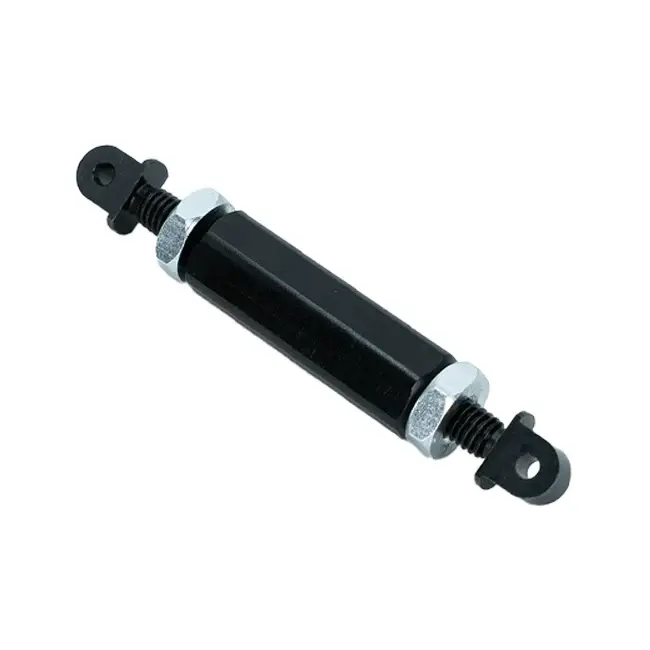

# 2C: Deadaxle Pivot

# What is a Rotary Mechanism? 
Rotary mechanisms allow us to pivot objects or mechanisms through a rotational movement. These are typically done through wrists or arms. There are two ways 

### What is a Dead Axle?
Dead axles are the preferred way of holding a pivoting mechanism. The mechanism is then directly powered through a different means. This tends to be significantly stronger since you can have a larger axle and there is no risk of twisting. 

### What is a Live Axle?
Live axles are most commonly thought of when doing pivots. Teams commonly do this through a hex axle and hub, but this is heavily not recommended due to the risk of twisting, as well as being extremely weak due to the small diameter.

That being said, live axles can be strong if using the appropriate live axle shaft, such as SplineXL or MAXSpline.

 

## Concepts

### Strength

The first concept we need to keep in mind is how are we going to securely hold our rotary mechanism? If it is too weak, it may break or bend. The most common solution to this is dead axles.

Dead axles are a type of axle that doesn't move and your object rotates around it. As a result you can have much stronger axles which are more rigid and allow for a more consistent motion. This is typically done through the strength of the axle, in addition to the fact that the shaft isn't able to be twisted. 

The main factor that impacts strength of a dead axle is the diameter of the axle. As the diameter increases, the strength increases proportionally. This is significantly more important than material choice. You may see teams use steel hex shaft that twists, but a large diameter round tube of 3/4 inches or greater would probably be strong enough.

In extreme cases, you may find massive diameters of 2+ inches, though these are not common. 6061 round aluminum tube with a 1/16 thickness is the most common choice for the maximum strength to weight. Common diameters are 3/4 inches and 7/8 inches.

### Friction

Since your mechanism is pivoting on the axle, you need to reduce the friction. This is typically done either through bushings or bearings. Bushings are the most common choice, since they are strong, package smaller, and work fine for the application.

You can also use bearings for pivots, but you may need to do research in order to properly spec the loads. Bearings are typically used for extremely large diameter pivots greater than 1 inch. 

### Power 
Since the axle is fixed in place, you need to directly power your pivot. This usually involves bolting a sprocket, pulley, or gear to your mechanism, instead of transfering torque through a hex.  

25H chain sprockets are common for pivots, but your choice is heavily dependant on the application. 

Sprockets and Pulleys often have a bolt circle (2 inches) which you can bolt to. You may also need a spacer to prevent the chain from rubbing with the mechanism. 

### Tensioning

Chain stretched over time, creating backlash. As a result, you need to have an active tensioning system you can adjust. Backlash increases the amount of slop in your pivot, which makes it less accurate. 

**Inline Tensioners**

Inline tensioners include the turnbuckle tensioner and spartan tensioner. These are the most common way of tensioning. Since they are inline with the chain, you want to make sure to have enough chain length for your tensioner, or it might hit one of the sprockets.

(Chain Pitch * Sprocket Teeth) * (Total Travel / 360)

Sprocket teeth being for the large pivot sprocket.

Total travel being in degrees. 

This gives you the distance your tensioner travels. You then add the tensioner length to find the total amount of chain length necessary. (add about 10 percent to make it more forgiving)

### Other backlash sources

- Hex interfaces

    - For every hex to hex hole interface, there is gap which adds backlash. Utilizing shim tape (insert mcmaster link), you can reduce this backlash significantly. You usually need 2-3 pieces of tape. This is most commonly seen in hex sprockets and spur gears. 

    Refer to the images to see how to apply. 

Can buy from here: https://www.mcmaster.com/1143N23/

- Sprocket Clocking

    - Make sure your sprockets are clocked correctly. You'll notice that in modern FRC cots sprockets that there is a small notch indicating the clock. Make sure that on both sides they are the same! 

- Mounting slop 

    - Depending on how you mount, you may have some slop due to the bolt to hole interface. With proper bolting and strong spacers this is not an issue though. 

- Stages

    - In general, the amount of reduction stages multiples the amount of backlash you have. It is best to stay 3 stages or lower, with one stage being the pivot reduction. 

 

## Applications
In the above fundamentals, you can see that there are different options for different use cases. You can mix these concepts and make the tradeoffs in order to best fit your use application and scope. 
 
### Wrist (insert wrist picture here)
Wrists are rotary mechanisms that are typically short and light. You can find both live axle and dead axle applications for wrists. 
bearings or bushings 

### Large Pivots
Large pivots include things such as pink arms, pivoting elevators, and arms. 
chain, 35 chain
big axle
dead axle good
could use thin bearings but bushings more common
Generally not recommended due to difficulty controling and weight 

### High Load Short Pivot
bearings or bushings are common
In some games like 2024, you may pivots full mechanisms such as a shooter to adjust your shot angle. These are heavy, but shorter.

Can use rack and pinion or sprocket, but rack and pinion is becoming popular 

## Rules for Design:
1. Try to make whatever "arm" you are pivoting as short as physically possible. This makes it easier to program, design, and build. For the majority of pick and place games, you want to generally start with a linear mechanism, and then add a short wrist if necessary. 
2. Make sure that your axle is fully supported. This can be done through tube or nesting in plate. 
3. Make sure the support structure is rigid. 
4. If you have a wide structure that isn't very rigid, power both sides for rigidity. Try to make your structure as rigid as possible for your pivot though, box tube across is often the easiest to make rigid.  

  

# Project

We'll be designing a simple dead axle that is attached to an elevator. 

Requirements:

Utilize Max planetaries for your initial reduction.

Use a 25 chain with a large sprocket reduction. 

Use 7/8 tube for your "dead axle" and make sure its properly supported. 

uhh good luck? 

## Process

1. Start by laying out your pivot location and your driving sprocket location.
2. Design the rest of the plates
3. Finish the rest of the pivot
4. idk anymore

 

