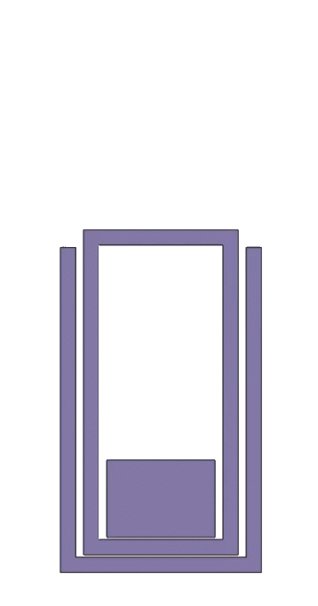

# 2H: Cascade Elevator

## Cascade Elevator
Elevators pop up commonly in FRC and are used to move mechanisms in a compact linear fashion. This is usually to reach higher places with a mechanism, reach far out from your frame perimeter, or even climb on a field element. Elevators are typically classified by the way they are "Rigged". Elevator "Rigging" is what allows the motor to transmit motion to each stage. FRC elevators are usually rigged to be either Cascade or Continuous. This page will be covering the design of a Cascade elevator due to there currently being much better COTS part availability for making a Cascade elevator.

[INSERT EXAMPLE PICTURES OF ELEVATORS]

Elevators as designed most typically may be out of the scope of a lower-capability team because of the amount of custom metal parts that need to be bought or manufactured, but once you know how one works and have designed one, you may be able to make one with minimal manufacturing capabalities and time required.

## "Cascade" Motion
Cascade elevators are characterized by the way the stages move. In a cascade rigged system, each elevator stage moves the same distance from its parent stage.

<figure markdown="span">
    
    <figcaption>Cascade Motion</figcaption>
</figure>

### Comparison
**Pros:**

- Cascade elevators are great when you just need to move a mechanism up and down and you dont need more than 3 Elevator stages to reach the desired height. While it is possible to make cascade elevators with more than 3 stages, desigining the rigging gets harder, especially if you are width constrained.

- Cascade motion is faster than continuous due to the stages being linked together and continuous effectively being one long stage

- All of the major Cascade Elevator components are available as COTS components, which means you can simply stock cascade elevator components and throw it together without worrying about custom manufacturing.

<figure markdown="span">
    {width=60%}
    <figcaption>[Elevator Components Sold By West Coast Products](https://wcproducts.com/collections/systems-structure/products/elevator-components){target=none}</figcaption>
</figure>

**Cons:**

- Usually things cannot be passed through a cascade elevator because of the rigging, while you can pass things through a continuous elevator

- The center of gravity is not optimal in the middle range of extension compared to continuous

- The motors powering a cascade elevator need geared down more to counteract the natural upduction the cascade rigging adds.

 

## Project

Because elevators are just mechanisms to move other mechanisms around, this project is similar to the dead axle pivot and will be designed without much context to learn the design process and components. You will get practice with designing elevators in the context of a robot in Stage 3.

[INSERT PICTURE OF MAIN ASSEMBLY]

The reference is provided in [**this document**](https://cad.onshape.com/documents/da5aef9e6bf6e869f4a51a45/w/5a0f4a3426876db0ba214277/e/c64f9fd69e2ddbe82410f283). Model a copy of it in your own document. Key components of the elevator and an overview of the design process are provided below.

### Key Components

**Elevator Blocks**

Every modern elevator will use some form of "elevator block" to allow the stages to slide past each other smoothly using bearings. Most teams will purchase elevator blocks from WCP or TTB instead of manufacturing them in-house (because of the time investment and machining capabilities of a typical team) but ones can be made with plates instead of billet (see [2471 2018](https://cad.onshape.com/documents/bd18a956391f75b5bca27546/w/827793489fb93072e2a1d993/e/adea515b9f2a94ccfd7ca72e)). 
 

<figure markdown="span">
    
</figure>

The elevator featured in this guide uses the WCP Inline Clamping and Inline blocks, but different blocks from WCP or TTB could be substituted with little to no design changes besides the distance between the stages on the sides.

 

**Chain Attachment Point**

Most cascade elevators use chain to power their initial stage; this chain can run either parallel or perpendicular to the face of the elevator, but the core concept is the same. The chain is bolted to the first stage of the elevator, and the rigging moves the other stages off it. The elevator design featured in this guide uses the TTB chain comb to bolt the chain to the first stage.
 

<figure markdown="span">
    
</figure>

 

**Cable Clamp & Pulleys**

Cascade elevators function by moving a fixed length of cable from one side of a clamp to the other side of the clamp, to force the elevator up. This cable clamp is usually bolted to some form of crossmember. The elevator from this guide uses the TTB cable clamp to maintain consistency in rigging components (they come in [a kit](https://www.thethriftybot.com/products/elevator-dyneema-pulley-kit?_pos=6&_sid=1876486ab&_ss=r)). The clamp consists of two plates; the first one is fastened to the tube and the second one is ONLY fastened to the first plate. You can choose to make access holes for the bolts or bolt all the way through the cross member with a crushblock.

!!! Note 
    The WCP cable clamp uses a similar design but the fasteners go through both plates into the crossmember tube, sharing the clamping force with the crossmember.
 

<figure markdown="span">
    
</figure>

 

**Cable Ends**

The ends of the cable are arguably the most important part of elevator rigging to do right. If they are handled improperly it can cause issues with rigging falling apart during impacts; this usually takes the elevator (and anything requiring it to move) completely out of commission for the match. Cascade rigging consists of at least one loop of cable per stage, which drives the motion for the next stage.
 

<figure markdown="span">
    
</figure>

To ensure smooth motion, these cables need tensioned. One of the best ways to tension these cables is through a ratcheting cable spool. The COTS solution is to use the [WCP Ratchet Plate](https://wcproducts.com/products/wcp-0585) (though an easy homemade solution can be done by cutting the end off of a ratcheting wrench and fastening it to your mechanism), with a hex shaft acting as the spool. The hex shaft gets a hole drilled in it so the cable is forced to wrap around it. 

It is important to tie a self-tightening knot in the cable to prevent this from coming undone under high load. This ratcheting spool only needs to be done on one side, with a simple fixed loop on the other side. To tension properly you will need to loosen the clamping plate before adding tension so that it gets added to each side, instead of just the side with the ratchet.
 

<figure markdown="span">
    
</figure>

### Master Sketch
Like most mechanisms, it begins with a master sketch. Elevator master sketches usually start as a side view. It can sometimes be helpful to separate the stages into their own individual side sketches to let you "animate" how it moves in the sketch. After making a side sketch you can make a "top" sketch that lets you define in the master sketch how wide the elevator will be, and how big the carriage will be.
 

<figure markdown="span">
    
</figure>

### Tubing
Usually the first place to start with an elevator is making the tubes from the master sketch. After you make the tubes you can mate those together, and give it off to other team members to work with, since that is the core of the elevator. This is just one example of how you can parallelize the design process.
 

<figure markdown="span">
    
</figure>

### Rigging
Elevator rigging typically takes up the bulk of the design process, as its the most important part of the elevator. Rigging style, and organization drives the motor mounting, and position of the crossmember the clamp plate is mounted to, so its important to properly plan out the cable paths.
 
<figure markdown="span">
    
    
</figure>

### Power Gearbox
Elevators need motors to power them. Once you have the rigging planned out you can figure out where you can fit the motors to drive the base elevator stage.
There are many methods to power the base stage, but this guide will be using a vertical chain, and the TTB chain comb.
 
<figure markdown="span">
    
</figure>

### Polishing
The polishing stage consists of adding crush blocks to key areas, shafts for gearboes/the top sprocket(s), and making sure everything is in line. Its important to not skip this step. Even if it "looks like an elevator" it is always critical to look everything over and put little polishes on the design to make sure assembly and operation go smoothly.
