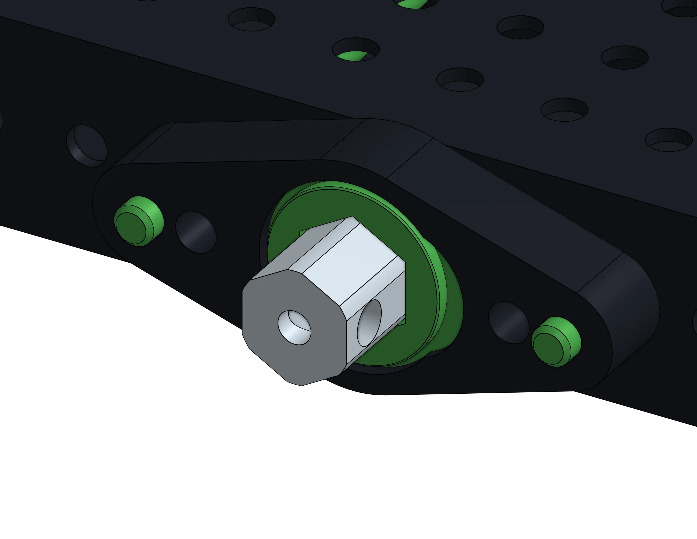
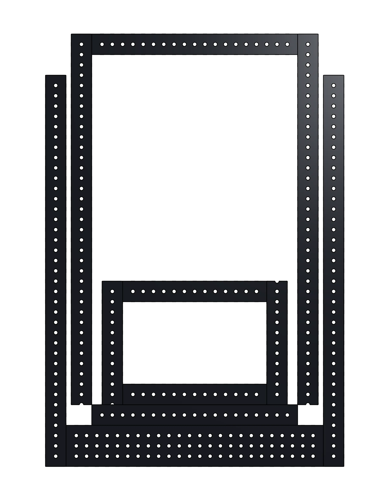

# 2H: Cascade Elevator

[< 2G: Four-bar Linkage](2G-fourbarLinkage.md) [Stage 3A >](../stage3/3A-multidoc&MS.md)
 

## Cascade Elevator
Elevators pop up nearly every year in FRC. Elevators are typically classified by the way they are "Rigged". Elevator "Rigging" is what allows the motor to transmit motion to each stage. FRC elevators are usually rigged to be either Cascade or Continuous. This page will be covering the design of a Cascade elevator due to their currently being much better COTS part availability for making a Cascade elevator.

## "Cascade" Motion
Cascade elevators are characterized by the way the stages move. In a cascade rigged system, each elevator stage moves the same distance from its parent stage.
 

<figure markdown="span">
    
    <figcaption>Cascade Motion</figcaption>
</figure>

## Pros and Cons of Cascade
Pro: Cascade elevators are great when you just need to move a mechanism up and down and you dont need more than 3 Elevator stages to reach the desired height. While it is possible to make cascade elevators with more than 3 stages, desigining the rigging gets harder, especially if you are width constrained.

Con: The motors powering a cascade elevator need geared down more to counteract the natural upduction the cascade rigging adds.

Pro: All of the major Cascade Elevator components are available as COTS components, which means you can simply stock cascade elevator components and throw it together without worrying about custom manufacturing.

# Key parts of a Cascade Elevator

## Elevator Blocks
Every modern elevator will use some form of Elevator Blocks. Most teams will purchase elevator blocks from WCP, or TTB instead of manufacturing them in-house. Buying COTS stuff is usually "better" than custom manufacturing due to the time investment involved with re-machining components inseason. The elevator featured in this guide uses the WCP Inline Clamping and Inline blocks, but the TTB blocks, or different WCP Blocks could be substituted, with little to no design changes.
 

<figure markdown="span">
    
</figure>

## Chain Attachment Point
Most cascade elevators use chain to power their initial stage, this chain can either be horizontal or vertical, but the core concept is the same. The chain is bolted to the first stage of the elevator, and the rigging moves the other stages off it. The elevator design featured in this guide uses the TTB chain comb to bolt the chain to the first stage.
 

<figure markdown="span">
    
</figure>

## Cable Clamp & Pulleys
Cascade elevators function by moving a fixed length of cable from one side of a clamp to the other side of the clamp, to force the elevator up. This cable clamp is usually bolted to some form of crossmember. The elevator from this guide uses the TTB cable clamp to maintain consistency in rigging components. This clamp consists of two parts, the base plate bolts to the crossmember, and a second clamping plate gets bolted to the base-plate, clamping the cable between the two. The WCP cable clamp uses the same idea, but its slightly more annoying because it uses bolts that go through both plates instad of having one fixed mounted plate. This makes a crush-block inside the tube nessisary as the tube is bearing the clamping force instead of just the threads of the base-plate. 
 

<figure markdown="span">
    
</figure>

## Cable Ends
The ends of the cable are arguably the most important part of elevator rigging, as if they are done improperly it can cause issues with rigging falling apart during impacts. Elevator rigging coming apart is usually takes the elevator completely out of commission for the match. Cascade rigging consists of atleast one loop of cable per stage, which drives the motion for the next stage.
 

<figure markdown="span">
    
</figure>

These cables need tensioned, the "best" way to tension these cables is through a ratcheting cable spool. The easiest way we have found to do this, is to use the WCP Ratchet plate, with a hex shaft acting as the spool. The hex shaft gets a hole drilled in it so the cable is forced to wrap around it. It is important to tie a self-tightening knot in the cable to prevent this from coming undone under high load. This ratcheting spool only needs to be done on one side, with a simple fixed loop on the other side. To tension properly you will need to loosen the clamping plate before adding tension so that it gets added to each side, instead of just the side with the ratchet.
 

<figure markdown="span">
    
</figure>

# The Design Process Overview

## Master Sketch
Like most mechanisms, it begins with a master sketch. Elevator master sketches usually start as a side view. It can sometimes be helpful to separate the stages into their own individual side sketches to let you "animate" how it moves in the sketch. After making a side sketch you can make a "top" sketch that lets you define in the master sketch how wide the elevator will be, and how big the carriage will be.
 

<figure markdown="span">
    
</figure>

## Tubing
Usually the first place to start with an elevator is making the tubes from the master sketch. After you make the tubes you can mate those together, and give it off to other team members to work with, since that is the core of the elevator. This is just one example of how you can parallelize the design process.
 

<figure markdown="span">
    
</figure>

## Rigging
Elevator rigging typically takes up the bulk of the design process, as its the most important part of the elevator. Rigging style, and organization drives the motor mounting, and position of the crossmember the clamp plate is mounted to, so its important to properly plan out the cable paths.
 
<figure markdown="span">
    
    
</figure>

## Power Gearbox
Elevators need motors to power them. Once you have the rigging planned out you can figure out where you can fit the motors to drive the base elevator stage.
There are many methods to power the base stage, but this guide will be using a vertical chain, and the TTB chain comb.
 
<figure markdown="span">
    
</figure>

## Polishing
The polishing stage consists of adding crush blocks to key areas, shafts for gearboes/the top sprocket(s), and making sure everything is in line. Its important to not skip this step. Even if it "looks like an elevator" it is always critical to look everything over and put little polishes on the design to make sure assembly and operation go smoothly.

 

2H: Elevator
 
[< 2G: Four-bar Linkage](2G-fourbarLinkage.md) [Stage 3A >](../stage3/3A-multidoc&MS.md)
 
 