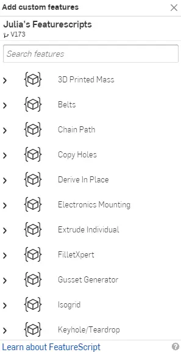

# 0B: Onshape Setup

## Registration

Onshape offers a free education license for students to use their software. It is highly recommended to use the education plan, as it allows for the creation of private documents, as well as other useful features.

To register, go to [Onshape for Education](https://onshape.com/education-plan){:target="_blank"}, and select "Create EDU ACCOUNT"

{:target="_blank"}

Fill out the details in the sign up form

In the next screen, select that you are a student and that you are in Grade School.

{height=70% width=70%}

Finally, fill our your school information. You may enter "Robotics" as the reason for using Onshape.

{height=60% width=60%}

Onshape will proceed to check your information, then send you an email once complete. This may be instant, but may take some time if Onshape needs to verify your school.

Once the verification is complete, check your email, then activate your account. Onshape will ask you to set a password, then you will enter your main account.

The first time you enter Onshape, it will prompt you to setup your accounts. We recommend you keep the default units as is, as well as keep the default mouse controls ("Onshape (default)"). You can also set a profile picture, as well as nickname (we recommend keeping this as your name). Finally, Onshape will run a browser check, to ensure compatibility. 

!!! tip

    If the browser check fails, you may want to try a different browser. Currently, Chrome is the best supported browser with Onshape.

If your team uses Onshape, contact your mentor/design lead for access to the Onshape classroom/team.

### Chrome Browser Setup

If you are using Chrome, an additional setup step may be required.

First, type `chrome://settings/` in your searchbar to navigate to chrome settings. Make sure that "Use graphics acceleration when available" is enabled. Relaunch chrome if you have updated it to enable it.

Next, go to `chrome://flags/` and enable these:

## Setting up MKCad

MKCad is an Onshape plugin that contains a large library of parts that are often useful in FRC.

To install it, go to the [MKCad App](https://appstore.onshape.com/apps/Manufacturers%20Models/2ZT7X5D646R3LM3ZND7LGBTYRVM4SVH6CDDGM6I=/description){:target="_blank"}

Press "Subscribe"

{height=60% width=60%}

Press "Get for Free". This will automatically add MKCad to your Onshape account.

## Featurescripts
Featurescripts are handy tools that assist with the FRC design process. For now, just follow the instructions and you'll use the featurescripts in stage 1A.

Click this link for [Featurescripts](https://cad.onshape.com/documents/95c00401c440b44ad8799ef5/w/1f1ebce01a3b8eb6fa102975/e/b92d638809ae48771ecc7ad8){:target="_blank"}

Now click "Custom Features" 

{width=500}

You should see this menu now:

Click "Belts", "Chain Path", "FilletXpert", "Gusset Generator", "Shaft", "Spacer", and **"Tube Converter"** (this one is important)

Once you have done that, you are done!