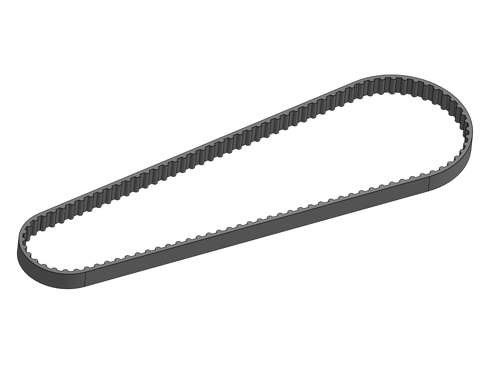
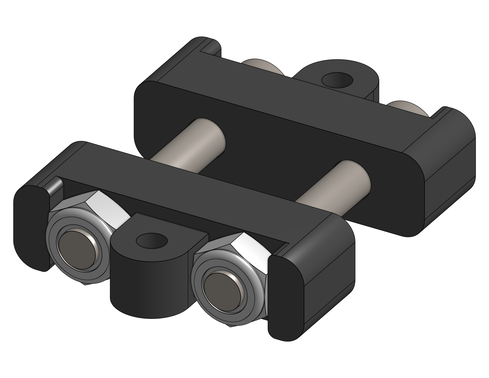
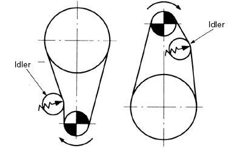
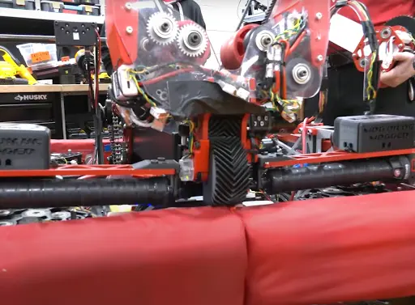

# Transfer of Rotational Motion

A guide on rotational power transmission components. Includes gears, belts, and chain.

**Coming Soon**

 

<!-- 

Belts

- Belts are lightweight and drive high speed mechanisms extremely well.
- In FRC, most common belt type is HTD5, and GT2 are the second most common.

<figure markdown="span">
{height=50% width=50%}
</figure>
<figcaption> Difference between GT2 and HTD5 is the tooth profile, as GT2 tooth profile has teeth that are spaced 3mm apart from each other, whereas HTD5 teeth are spaced 5mm apart. 
</figcaption>
When designing belts, you need to use a calculator such as ReCalc's [belt-calculator](https://www.reca.lc/belts) to figure out the correct belt center to center, otherwise your belts may be over tensioned, or have too much slack. 

Chain

- Chains are heavy duty and handle high torque, but need to be tensioned unlike belts.
- 3 Main Types:
    - 25:
        - While 25 chain is relatively light, it is a lot less durable than 35 or 25h Chain, which is a concern when thinking about shock loads on a pivot.
    - 25H:
        - 25H Chain stands for Hardened #25, which means that the plates on the chain are thicker.This means that its a bit stronger than the 25 chain, while staying compatible with all 25 chain hardware.
    - 35:
        - 35 Chain is the strongest chain there is, and breaking this is a bit challenging. Best use case is heavy pivots. 
<figure markdown="span">
{height=50% width=50%}
</figure>

What is Backlash:

- Backlash is when there is a gap between the teeth of gears or threads, which allows them to move slightly before actually engaging fully. This results in a delay in the motion when moving, and its extremely problematic as it introduces errors in positioning, affects the repeatability of your systems, and the systems response time is a bit slower. 

- How to eliminate backlash:
    - To minimize backlash in your system, you need to ensure that your chains are properly tensioned, or use a belt setup as your final reduction. When you assemble gearboxes apply [shim tape](https://www.mcmaster.com/products/shims/shim-tape-6/). In FRC, the hex shafts are not all the exact same size, and this causes slop between the gear and shaft, and in gearboxes this slop accumulates. The way that 4414 shims all their position controlled subsystems is by cutting strips around 1.5x the width of the actual gear, and then apply the tape onto 1-2 faces depending on the tolerance of the shaft.

How To Tension Chain:

  - Turnbuckle:
      - A turnbuckle is a device that is used to attach to two links, and tighten the chain together to keep the chain tensioned. 
<figure markdown="span">
{height=50% width=50%}
</figure>

  - Idler System:
      - Idlers are a method to ensure that there is proper chain tensioning, and it essentially either pushes the chain in or outwards to decrease the amount of slack. 

<figure markdown="span">
{height=50% width=50%}
</figure>

Gears:

- Toothed wheels that are able to transmit motion and power. Commonly used to reverse directions, build gearboxes, and many more applications. 

- Types of Gears:
    - Spur Gears:
        - 3 main types are 10 DP, 20 DP, 32 DP.  
        - 10 DP:
        - Used to drive rack and pinions and turrets 
      - 20 DP:
        - Used a lot in gearboxes due to the wide variety of gear teeth. 
      - 32 DP:
        - Used in smaller areas due its smaller size.
<figure markdown="span">
{height=50% width=50%}
</figure>
  - Herringbone
    - Also known as a double helical gear, the teeth form a V shape and are used to provide smooth and quiet operation while transmitting high torque. You can put a pretty high load on this as long as you increase the surface area and the contact between the teeth. These gears are commonly 3d printed.

|||
|:-:|:-:|
|<figure>{height=100% width=100%}</figure>|<figure markdown="span">{height=50% width=50%}</figure>|

  - Bevel Gears
    - Bevel gears are popularized with the COTS Max90 Gearbox, and are great for transmitting motion between shafts that are not parallel. They cannot handle a high load, and are used mainly for packaging.
<figure markdown="span">
{height=50% width=50%}
</figure>

Rack and Pinion:

- A rack and pinion is a system where a larger gear is driven by a smaller gear, and it is used a lot for hooded shooters like 1678 in 2022. You get a higher degree of control, but this system cannot handles a large amount of load. 

<figure markdown="span">
  
</figure>

Winch:

  - A  winch is a mechanical device that is used to wind up or wind out ropes or cable, and typically consists of a drum or spool around which the rope is swound and a handle or a motor that is used to rotate the drum, and it is used traditionally in telescoping arms and other climbers.
<figure markdown="span">
{height=75% width=75%}
</figure>

Linear Actuator:

  - Linear actuators are good for precise linear motion. They work by converting rotational motion into linear motion using a lead screw, and you get a very high degree of control and precision. 
<figure markdown="span">
{height=75% width=75%}
</figure>

  -->