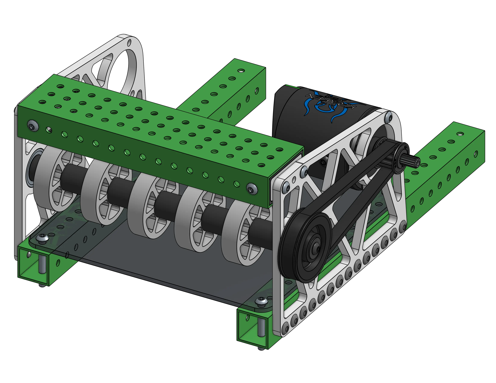
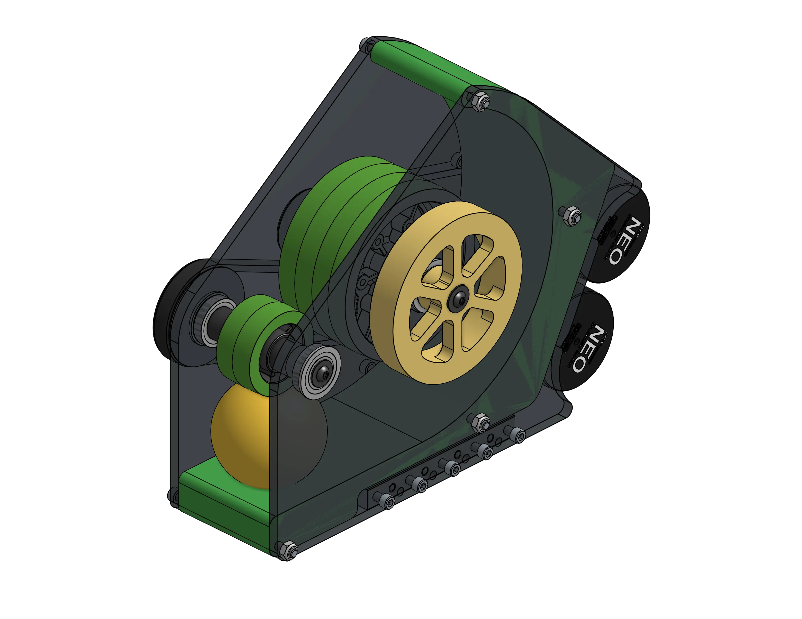

# 1C: Practice Mechanisms
## Exercise Overview

**Make a copy of the Stage 1C Exercises Document** through the button below. Each exercise has a folder, a "reference" tab (a preview of what the final model should look like), and a tab or two for doing your exercise in. Solutions are also provided in the 1C Exercise Solutions Document to check your work afterwards. You **do not** need to make a copy of the solutions document.

[1C Exercises Document (COPY THIS)](https://cad.onshape.com/documents/a9be0985d5e798d784f8b4cb/w/5c862e02b9b471157ba3ca40/e/c5babadecc47dfbe0d8ab454 "1A Exercises Onshape Document"){:target="_blank"  .md-button .md-button--primary}
[1C Exercise Solutions Document](https://cad.onshape.com/documents/99b4fd36c41bdb5b3e6d5ceb/w/f8e04439667e38aedb8f8196/e/52d6f1268d1392beb2834209 "1C Exercise Solutions Onshape Document"){:target="_blank" .md-button .md-button--primary}

-   

-   

<figure>
<figcaption>Two of the exercises in this section</figcaption>
</figure>

Each exercise should take from around an hour to a few hours to complete depending on your experience.

As you progress through the exercises, the level of guidance will gradually decrease. This is to help transition you from more guided exercises to projects that have little more than the parts to be added and the reference model, as will be the norm for the rest of Stages 1 and 2. While you should reference the solutions document to ensure your model and modeling methods are correct, try to avoid *blindly* copying the model later in the exercises.

### Focusing on Improvement

The primary goal of this stage is to get you enough practice with CAD and modeling in the context of FRC where you won't need guidance in every step that you do. 

Focus on refining your CAD techniques and following best practices such as fully constraining your sketches, learning and practicing keyboard shortcuts, modeling in a way that captures design intent, and naming your features and parts. 

!!! Tip "Customizing Keyboard Shortcuts"
    If the default for a keyboard shortcut doesn't work for you, you can rebind it by going to your account page, going to `Preferences`, and scrolling down to find the keyboard shortcuts.
    
    For example: you can rebind the keyboard shortcut for renaming something (the default is `shift+n`) to something easier, like `shift+r`, to make your workflow faster.

**Following the self-review guidelines outlined in [this page](../1A/focusing-on-improvement.md "Focusing on Improvement Page"){:target="_blank"}** while going through these exercises will help you target the specific skills and practices you need to improve on.

If you find that you still struggle without guidance on the later exercises, feel free to try and model more small mechanisms of your choice, making sure to get feedback on them from more experienced members/mentors of your team or [the Discord Server](https://discord.gg/jHXTdNjYCg "David's Design Server Invite"){:target="_blank"}.

 