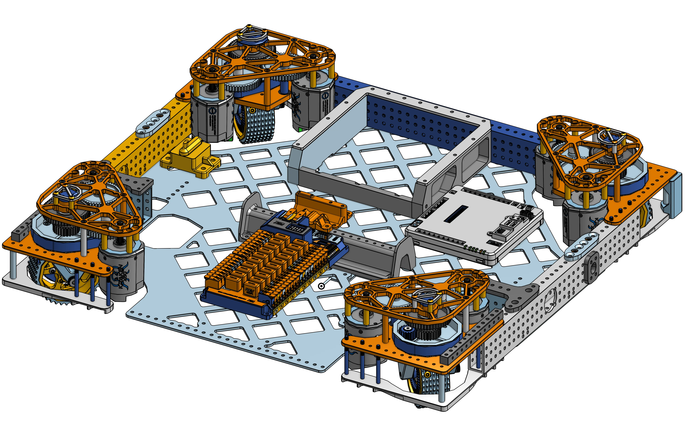

# 581 Crescendo Drivebase

<figure markdown="span">
[{height=80% width=80%}](https://cad.onshape.com/documents/e0b1ba5e437ff36752e3516b/w/09c92da8e227d0ad729ed92d/e/15405b87c28d21922eef3ab9){target = "_blank"}
<figcaption>Swerve drivebase using aluminum tubing, a pocketed bellypan, and more. Also includes modification to one of the rails to support an under the bumper intake.</figcaption>
</figure>

### Links

[CAD Document](https://cad.onshape.com/documents/e0b1ba5e437ff36752e3516b/w/09c92da8e227d0ad729ed92d/e/15405b87c28d21922eef3ab9 "CAD Document Link"){:target="_blank" .md-button .md-button--primary}

## Behind the Design
**Coming Soon**