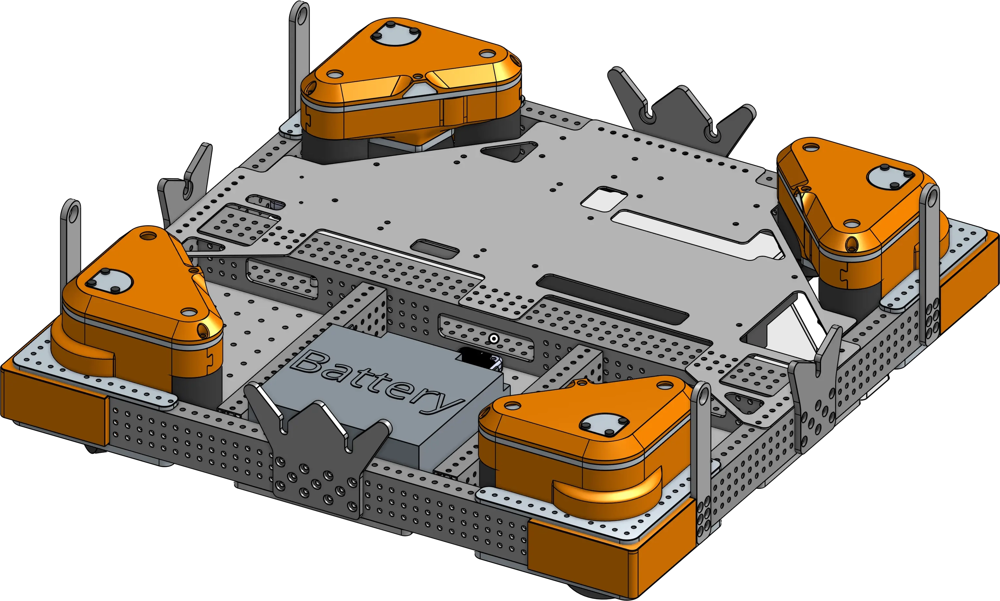

# 972 Brainpan Drivebase

<figure markdown="span">
[{height=80% width=80%}](https://lgsstudent.onshape.com/documents/0e95e39213c03c7423bfb91b/w/4b99a31cc58cad3a9204fd96/e/6abeeb6af28f118928da9d06?aa=true){target = "_blank"}
<figcaption>Swerve drivetrain featuring the "brainpan" style of electroncis mounting.</figcaption>
</figure>

### Links
[CAD Link](https://lgsstudent.onshape.com/documents/0e95e39213c03c7423bfb91b/w/4b99a31cc58cad3a9204fd96/e/6abeeb6af28f118928da9d06?aa=true){target = "_blank"}

## Behind the Design
**Coming Soon**

 