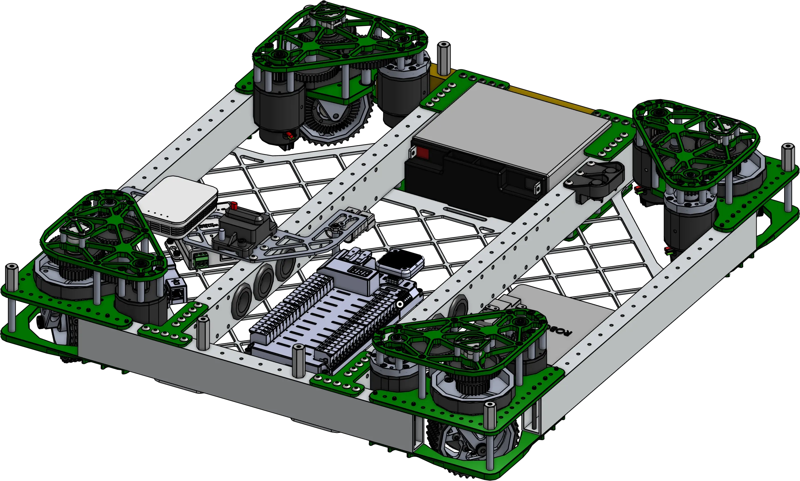

<meta property="og:title" content="Drivebase CAD Examples">
<meta property="og:type" content="website">
<meta property="og:url" content="https://frcdesign.org/mechanism-examples/drivebase/">
<meta property="og:image" content="https://www.frcdesign.org/img/mechanism-examples/drivebase/2910drivebase.webp">
<meta name="theme-color" content="#4CAE4F">
<meta name="twitter:card" content="summary_large_image"> 

# Swerve Drivebases
The drivebase is the single most important part of your robot, providing a bed for every other subsystem to build off. Examples of different drivebases can provide inspiration for electronics layout, bellypan shapes, and structural cross members for mounting, all of which can be a hard but crucial part of designing a robot, as accessibility and maintainability need to be preserved even as subsystems get placed on top of the robot.

-   

    ---

    A custom plate to keep the radio and breaker accessible, holes with grommets to allow wires to pass through the cross members
    
    [:octicons-arrow-right-24: 2910 Charged Up Drivebase](2910.md)

-   

    ---

    A central 2x2 cross member, a brainpan, and citrus bumper mounting plates.
    
    [:octicons-arrow-right-24: 972 Brainpan Drivebase](brainpan.md)

 