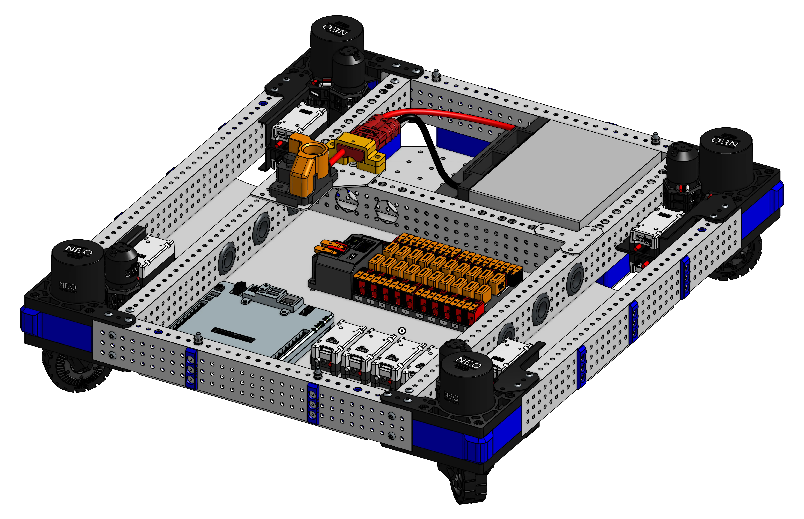

# 3005 Charged Up Drivebase

<figure markdown="span">
[{height=80% width=80%}](https://cad.onshape.com/documents/61f1c6e5e23b6db02f155b44/w/e187605289e24e26c92cd93e/e/7c20462a144d4d6128cb32b1){target = "_blank"}
<figcaption>Swerve drivetrain featuring a combination of REV MaxSwerve and NEO motors.</figcaption>
</figure>

### Links

[CAD Document](https://cad.onshape.com/documents/61f1c6e5e23b6db02f155b44/w/e187605289e24e26c92cd93e/e/7c20462a144d4d6128cb32b1 "CAD Document Link"){:target="_blank" .md-button .md-button--primary}

## Behind the Design
**Coming Soon**

 