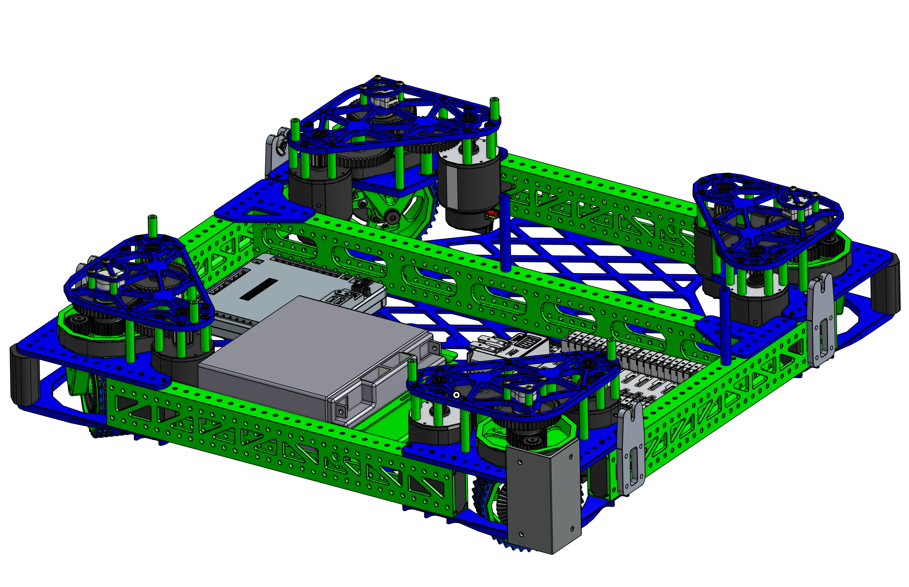

# 5460 Charged Up Drivebase

<figure markdown="span">
[{height=80% width=80%}](https://cad.onshape.com/documents/0b20b359a25b9a8142fe9631/w/263949fda713f005d5add009/e/9ff2797a21aae7b8fea3933c){target = "_blank"}
<figcaption>Swerve drivebase using aluminum tubing, a pocketed bellypan, and more. A clean high performant design, that mgiht it very far in 2023.</figcaption>
</figure>

### Links

[CAD Document](https://cad.onshape.com/documents/0b20b359a25b9a8142fe9631/w/263949fda713f005d5add009/e/9ff2797a21aae7b8fea3933c "CAD Document Link"){:target="_blank" .md-button .md-button--primary}

## Behind the Design
**Coming Soon**