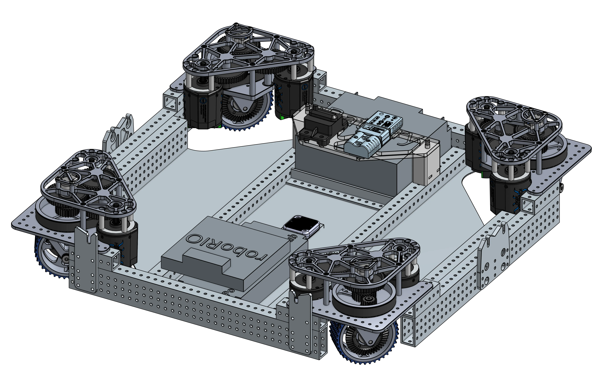
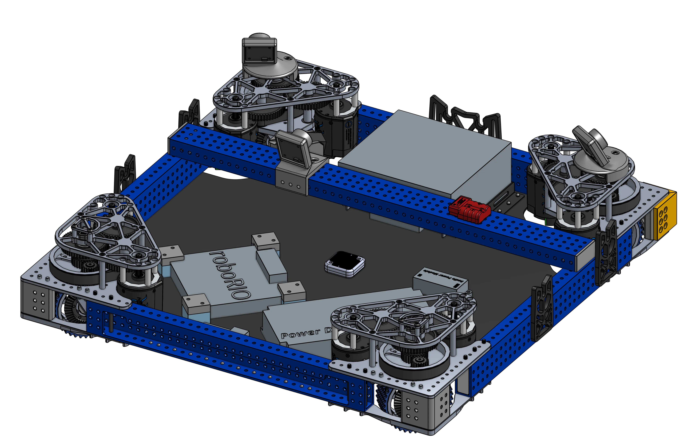

# Swerve Drivebases
The drivebase is the single most important part of your robot, if you can't move, you can't score or play defense.
All other mechanisms will also build on top of the drivebase.
These examples can provide useful inspiration for electronics layout, bellypan design, and structural supports.

## Featured

-   

    ---

    A drivebase with two cross tubes featuring wire grommets
    
    [:octicons-arrow-right-24: 2910 Charged Up Drivebase](2910_2023_dt.md)

-   

    ---

    A drivebase featuring a "dropped frame" frame found on many robots in 2024
    
    [:octicons-arrow-right-24: 1678 Crescendo Drivebase](1678_2024_dt.md)

-   

    ---

    A drivebase featuring REV swerve modules and NEO motors
    
    [:octicons-arrow-right-24: 3005 Charged Up Drivebase](3005_2023_dt.md)

-   

    ---

    A drivebase featuring a unique frame cutout for an UTB intake
    
    [:octicons-arrow-right-24: 6328 Crescendo Drivebase](6328_2024_dt.md)

-   

    ---

    A standard swerve drivebase with SDS MK4i modules and pocketed tubing
    
    [:octicons-arrow-right-24: 5460 Charged Up Drivebase](5460_2023_dt.md)

-   

    ---

    A drivebase featuring an inverted bellypan, or "brainpan" for electronics mounting
    
    [:octicons-arrow-right-24: 972 Crescendo Drivebase](972_2024_dt.md)

## More Examples

### 2024
    
- [1778's Crescendo Drivebase](https://cad.onshape.com/documents/21700de5780384d6ad1fa400/v/2df097eb26f61c667560f279/e/2501a63e8a1e274c06f6ffa9){target = "_blank"}

- [2910's Crescendo Drivebase](https://2910.onshape.com/documents/b05af223ad0d2a358074cc0a/v/0769959730f43a1859a1f370/e/9d8b5a55e5c746878f41c2bc?configuration=default&renderMode=0&uiState=665d856d39a4630af3899e94&aa=true){target = "_blank"}

- [6036's Crescendo Drivebase](https://cad.onshape.com/documents/22a2d0f831f60e64d21620b9/v/dbe74dd7c8d389c79208ff23/e/8de2be52d382e7a9e35e8f71){target = "_blank"}

### 2023

- [1678's Charged Up Drivebase](https://cad.onshape.com/documents/e96fd59ce7ac19e7f6efda0e/w/21eb649ac86f456f426e47a6/e/1816729067fb37bcba2a150b){target = "_blank"}

- [3847's Charged Up Drivebase](https://cad.onshape.com/documents/de43bfb90686cd44b0870071/w/9d183c2710bcbdcce0b821b4/e/52ffe457d07a49279860d194){target = "_blank"}

- [5460's Charged Up Drivebase](https://cad.onshape.com/documents/0b20b359a25b9a8142fe9631/w/263949fda713f005d5add009/e/9ff2797a21aae7b8fea3933c?renderMode=1&uiState=648328542cfd1e2011ef8378){target = "_blank"}

### 2022

- [1678's Rapid React Drivebase](https://cad.onshape.com/documents/76cceb18fbc1c922c8217ec3/w/e35ea9353fc3c4781b8f8883/e/f4de020844649ab5f8786b52){target = "_blank"}

### 2021 (Infinite Recharge @ Home)

- [111's IR @ Home Drivebase](https://cad.onshape.com/documents/e82ea426e855038e49d02864/w/718b2c5ff33cd33e39664376/e/0b83d5f80ed251fa566e4b51){target = "_blank"}

 