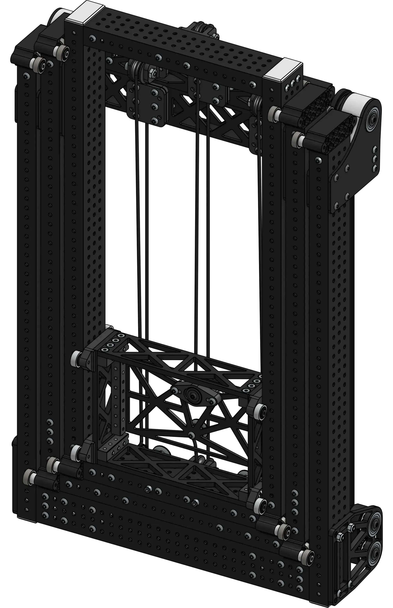

# 3 Stage Cascade Elevator

<figure markdown="span">
[{height=35% width=35%}](https://cad.onshape.com/documents/b21eea4e68dca3055c81016f/w/28943b84028061b6bfc5cc51/e/87fb54e646175dee9e71b213){target = "_blank"}
<figcaption>Chain driven 3 stage elevator featuring a plate based carriage. Uses TTB COTS Rigging and WCP Elevator Blocks.</figcaption>
</figure>

### Links

[CAD Document](https://cad.onshape.com/documents/b21eea4e68dca3055c81016f/w/28943b84028061b6bfc5cc51/e/87fb54e646175dee9e71b213 "CAD Document Link"){:target="_blank" .md-button .md-button--primary}

## Behind the design
**Coming Soon**