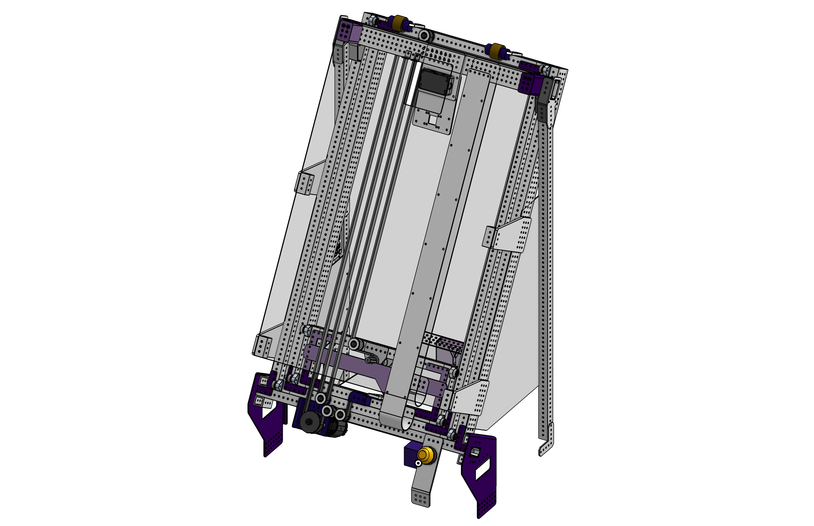

# 3847 Charged Up Elevator

<figure markdown="span">
[{height=80% width=80%}](https://cad.onshape.com/documents/de43bfb90686cd44b0870071/w/9d183c2710bcbdcce0b821b4/e/52ffe457d07a49279860d194){target = "_blank"}
<figcaption>External timing belt driven 2-stage continuous elevator with constant force springs and COTS bearing blocks.</figcaption>
</figure>

### Links

[CAD Document](https://cad.onshape.com/documents/de43bfb90686cd44b0870071/w/9d183c2710bcbdcce0b821b4/e/52ffe457d07a49279860d194 "CAD Document Link"){:target="_blank" .md-button .md-button--primary}

## Behind the Design
**Coming Soon**

 