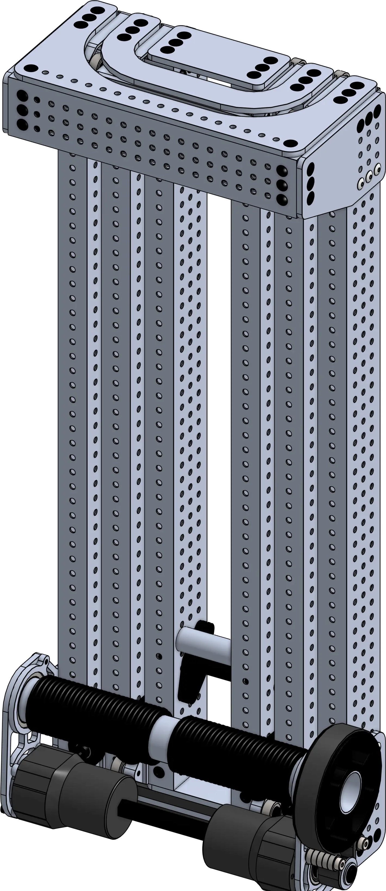

<meta property="og:title" content="Elevator CAD Example: External Cable Driven Continuous">
<meta property="og:type" content="website">
<meta property="og:url" content="https://www.frcdesign.org/cad-examples/elevator/continuous/examples/cable/">
<meta property="og:image" content="https://www.frcdesign.org/img/cad-examples/elevator/continuous/cable.webp">
<meta name="theme-color" content="#4CAE4F">
<meta name="twitter:card" content="summary_large_image">

# External Cable Driven Elevator

<figure markdown="span">
[{height=35% width=35%}](https://cad.onshape.com/documents/79b0f48266d9c0d8381a1d17/w/442b54966a8aa4ca80a5cec6/e/89863d0d5119abd0076d00ef){target = "_blank"}
<figcaption>Externally rigged cable driven elevator, utilizing the throughbore capabilities of the NEO vortex to simplify the power delivery.</figcaption>
</figure>

## Behind the design
**Coming Soon**
