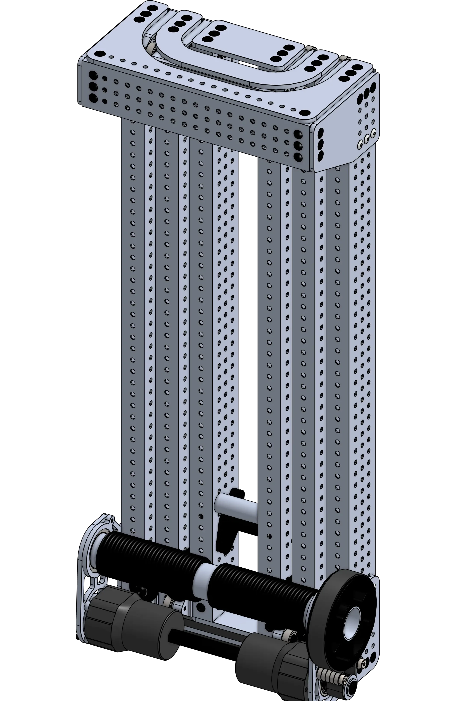
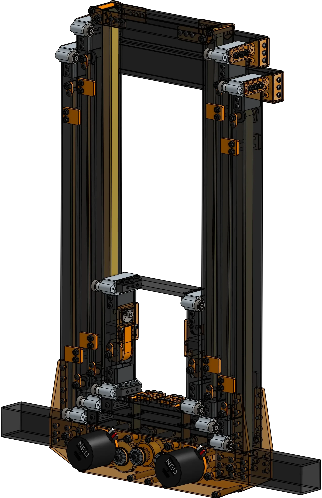

<meta property="og:title" content="Continuous Elevator Examples">
<meta property="og:type" content="website">
<meta property="og:url" content="https://www.frcdesign.org/mechanism-examples/elevator/continuous/">
<meta property="og:image" content="https://www.frcdesign.org/img/mechanism-examples/elevator/continuous/belt.webp">
<meta name="theme-color" content="#4CAE4F">
<meta name="twitter:card" content="summary_large_image">

# Continuous Elevators
Continuous elevators are great when you need a lot of extension distance, high stage overlap, or elevator passthrough.

-   
[{width=61%}](cable.md)

    ---

    Similar to 1678's 2023 Elevator, 3-stage, driven by a spool and line, with unique power transmission 
    
    [:octicons-arrow-right-24: External Cable Driven Elevator](cable.md)

-   
[{width=90%}](belt.md)

    ---

    A 3-stage belt-driven continuous elevator with a tube carriage, belts tensioned by cams, and WCP bearing blocks
    
    [:octicons-arrow-right-24: Internal Belt Driven Elevator](belt.md)

 