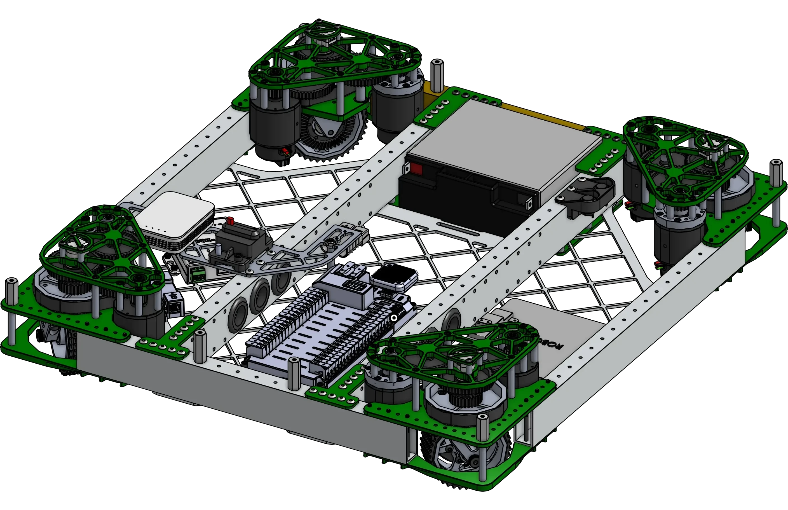
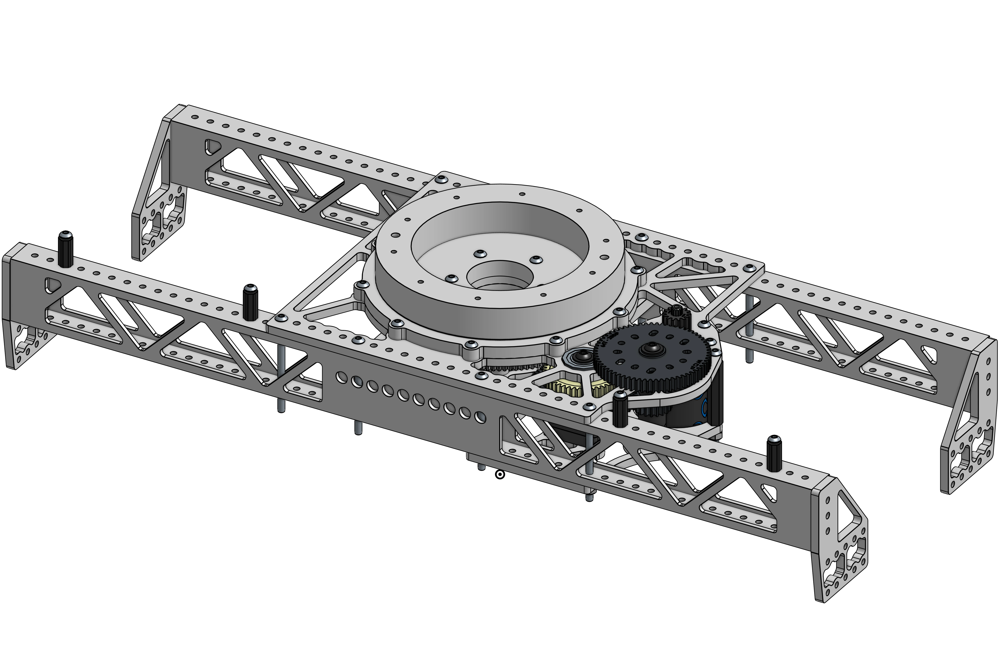
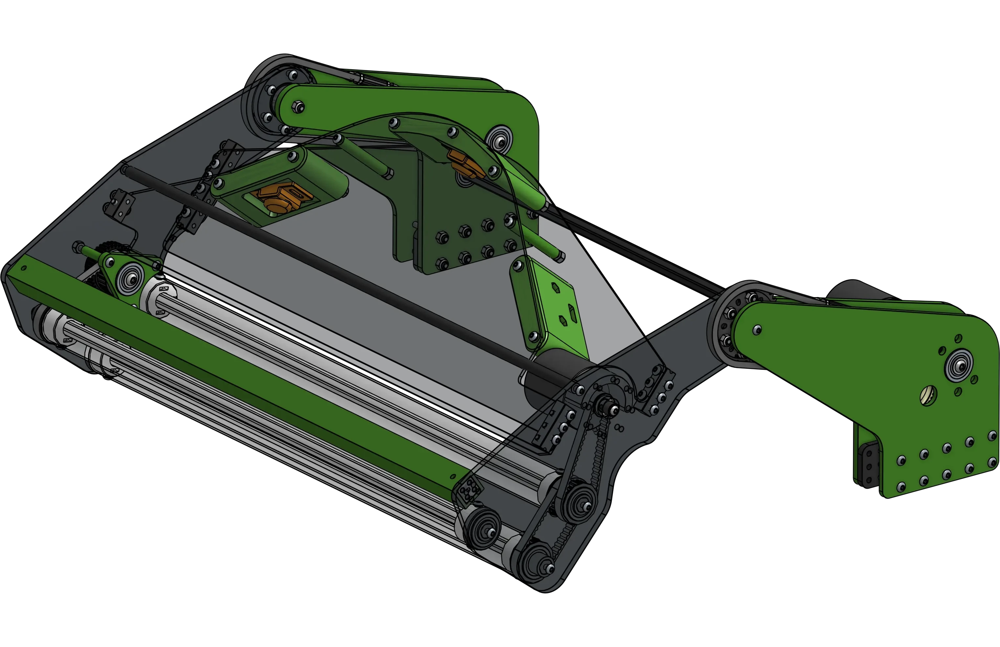
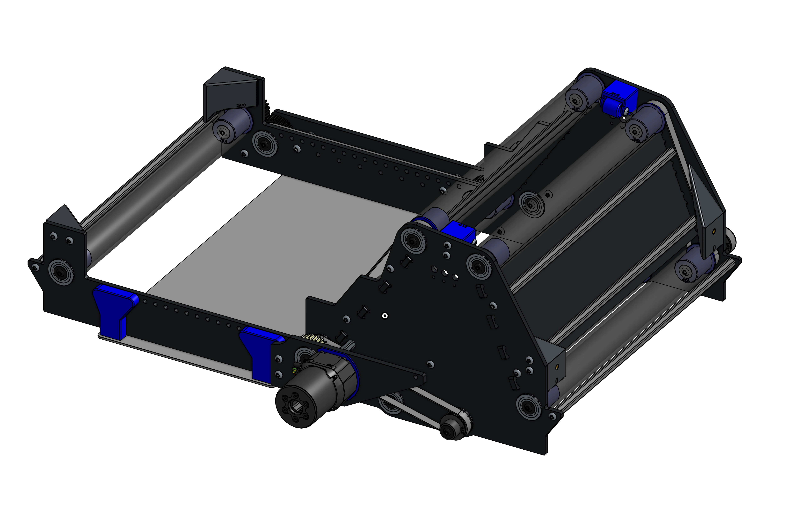
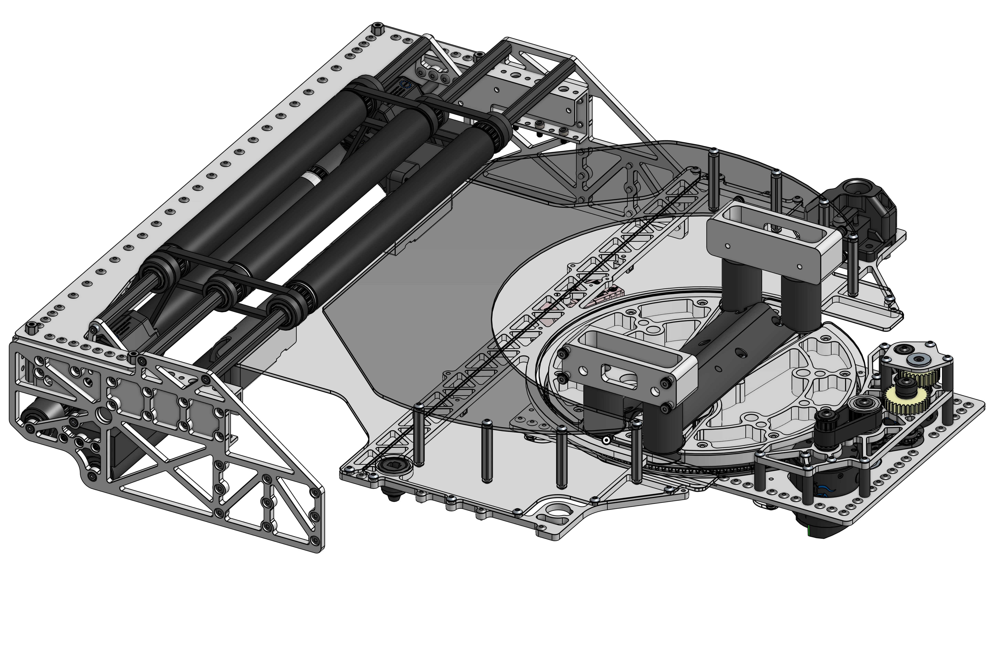
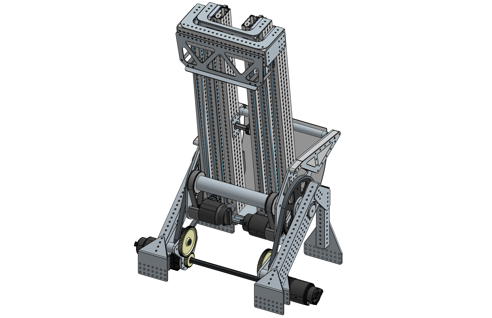
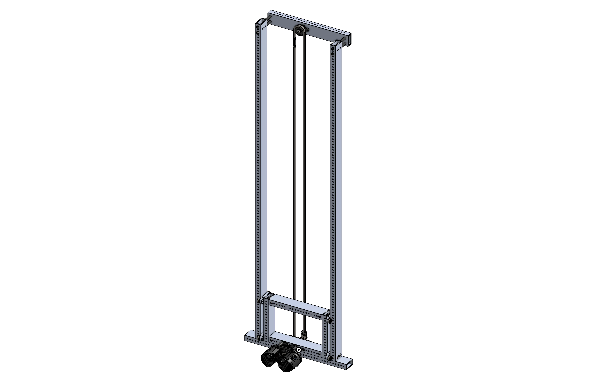
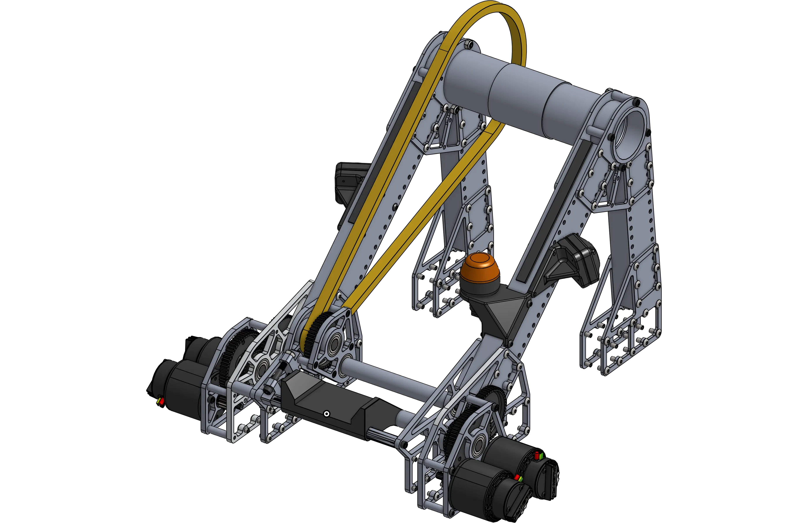
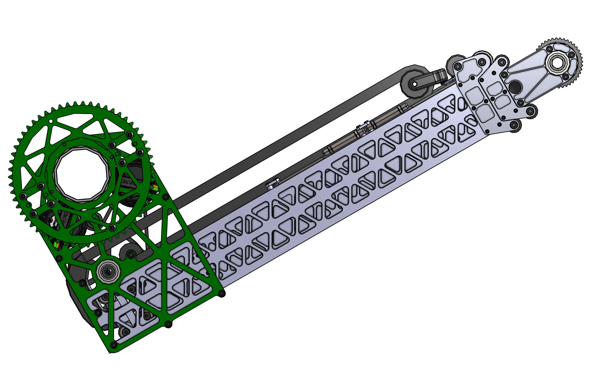
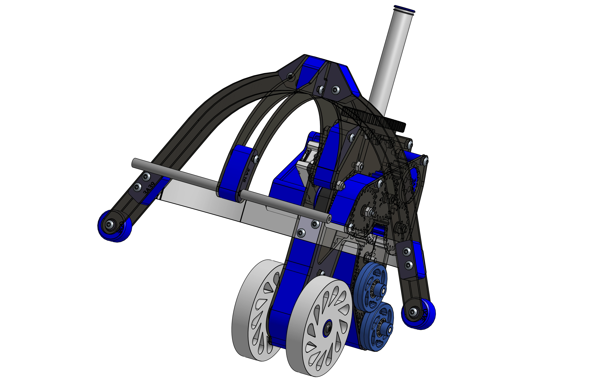

# Mechanism Examples

"Steal from the best, invent the rest" - Mike Corsetto, Head Coach of Team 1678. There's nothing that hasn't already been done; don't ever be afraid of taking inspiration from designs of other robots, especially when designing in a build season. Both for design reference and for learning about different executions of different mechanisms, a library of a wide variety of mechanisms is being compiled here.

!!! Note

    A CAD link has been provided when available, but examples without CAD can still be useful to look at with Behind The Bumpers videos and ChiefDelphi threads.

!!! Abstract "Contribution"

    This library of mechanism examples could always be expanded. Follow the [methods of contributing page](../contribution/methodsOfContributing.md "Methods of Contributing Page") to add your own examples or help write "Behind the Design"s for existing examples.

-   

    ---

    Swerve drivebases with examples of electronics layout
    
    [:octicons-arrow-right-24: Swerve Drivebases](drivebase/swerve/index.md)

-   

    ---

    Tank drivebases are not used as commonly anymore with the proliferation of swerve, but they are still a good option in certain situations.
    
    [:octicons-arrow-right-24: Tank Drivebases (Coming Soon)](./)

-   

    ---

    Mechanisms designed to shoot gamepieces
    
    [:octicons-arrow-right-24: Shooters](shooter/index.md)

-   

    ---

    Turrets are designed to rotate other mechanisms
    
    [:octicons-arrow-right-24: Turrets (Coming Soon)](./)

-   

    ---

    Over-the-bumper intakes deployed with a four-bar linkage
    
    [:octicons-arrow-right-24: Four-bar Intakes](intake/4bar/index.md)

-   

    ---

    Over-the-bumper intakes deployed with a single pivot
    
    [:octicons-arrow-right-24: Slapdown Intakes](intake/slapdown/index.md)

-   

    ---

    Intakes that grab gamepieces by intaking them under the bumper
    
    [:octicons-arrow-right-24: Under The Bumper Intakes (Coming Soon)](./)

-   

    ---

    Indexers are designed to move the game pieces from on part of the robot to another. They can also perform other functions such as sorting or aligning the game pieces.
    
    [:octicons-arrow-right-24: Indexers (Coming Soon)](./)

-   

    ---

    Elevators rigged continuously with belt or string
    
    [:octicons-arrow-right-24: Continuous Elevators](elevator/continuous/index.md)

-   

    ---

    Elevators rigged in a cascading fashion, with each stage linked to the last
    
    [:octicons-arrow-right-24: Cascade Elevators](elevator/cascade/index.md)
    
-   

    ---

    Different pivot designs, usually for arms
    
    [:octicons-arrow-right-24: Pivots](pivots/index.md)

-   

    ---

    Extending arms to reach out and grab gamepieces, sometimes attached to a pivot or having a pivot attached.
    
    [:octicons-arrow-right-24: Telescoping Arms (Coming Soon)](./)

-   

    ---

    End effectors are the mechanisms that interact with the game pieces, such as intakes, shooters, and other manipulators, usually attached to another mechanism.
    
    [:octicons-arrow-right-24: End Effectors (Coming Soon)](./)

 