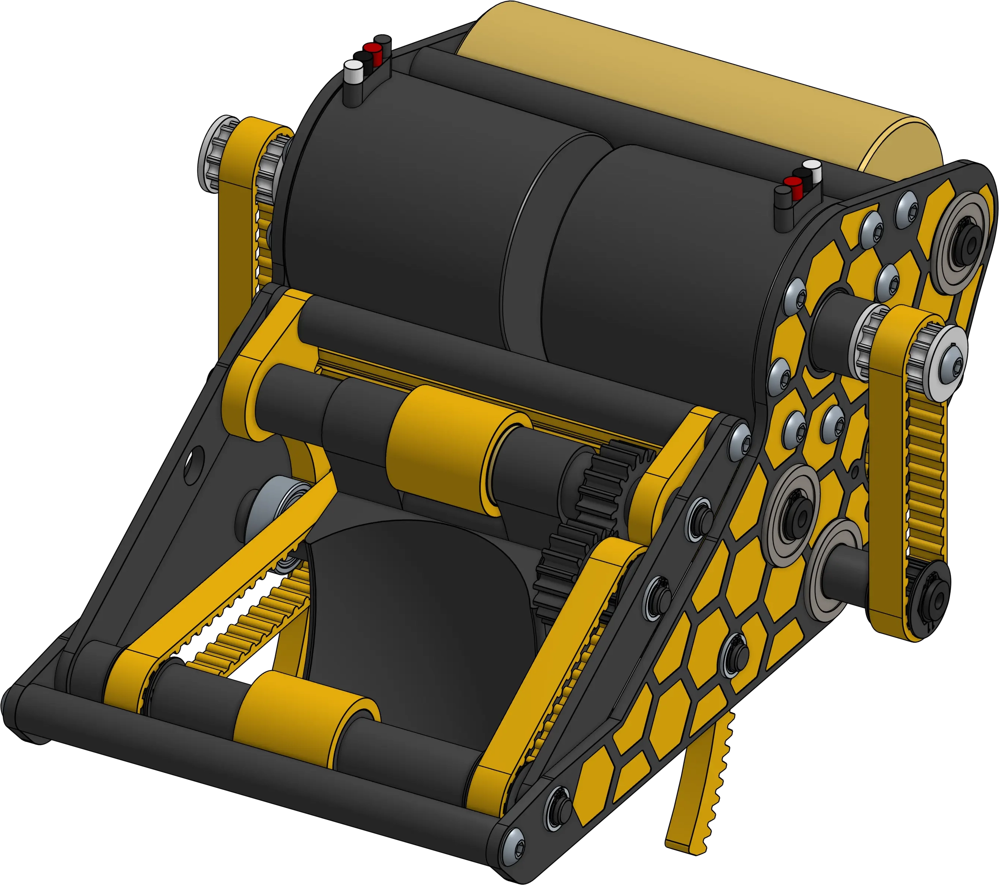
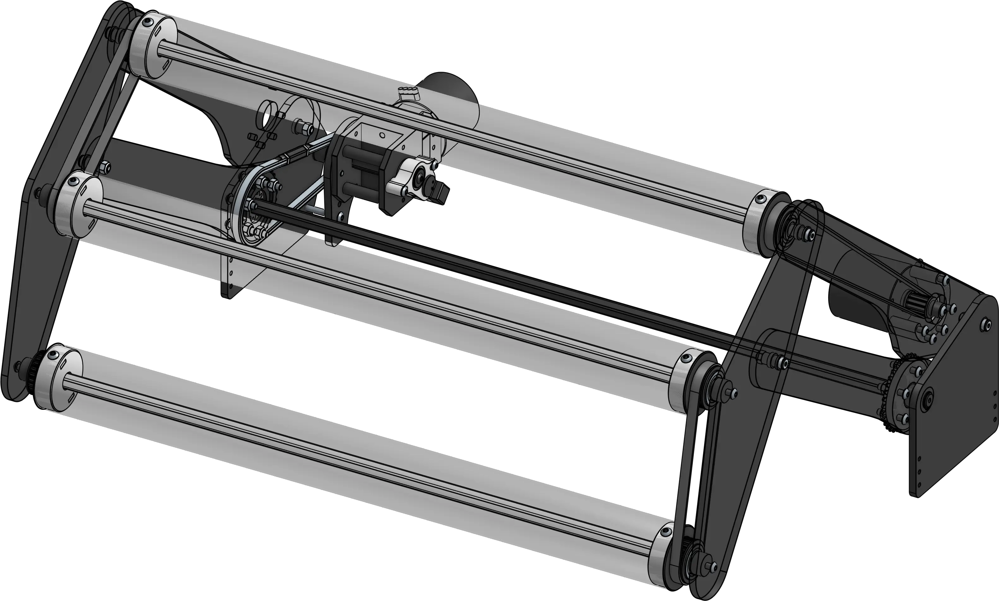
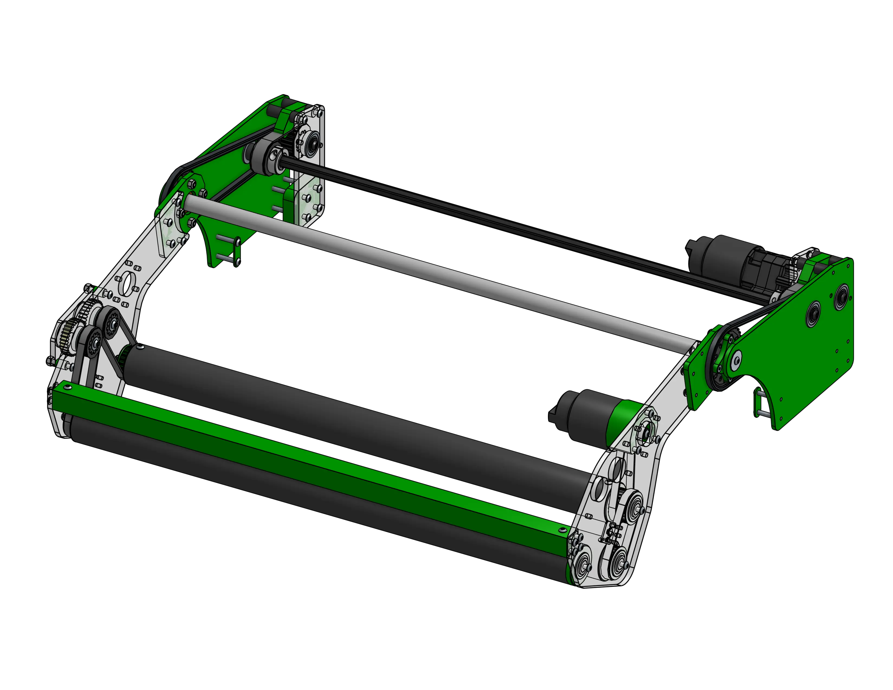

<meta property="og:title" content="Mechanism Examples">
<meta property="og:type" content="website">
<meta property="og:url" content="https://www.frcdesign.org/cad-examples/">
<meta property="og:description" content="Our collection of various mechanism examples and deep dives">
<meta name="theme-color" content="#4CAE4F">
<meta name="twitter:card" content="summary_large_image">

# Mechanism Examples

"Steal from the best, invent the rest" has been an FRC ethos ever since the competitions creation. Because of how important looking at past designs is in the learning process, we have created a library of mechanisms that can be used as reference when learning how to design a wide variety of FRC mechanisms.

!!! Note

    A CAD link has been provided when available, but examples without CAD can still be useful to look at with Behind The Bumpers videos and ChiefDelphi threads.

-   

    ---

    Swerve drivebases with examples of electronics layout
    
    [:octicons-arrow-right-24: Swerve Drivebases](drivebase/index.md)

-   
[{width=70%}](shooter/index.md)

    ---

    Mechanisms designed to shoot gamepieces
    
    [:octicons-arrow-right-24: Shooters](shooter/index.md)

-   

    ---

    Over-the-bumper intakes deployed with a four-bar linkage
    
    [:octicons-arrow-right-24: Four-bar Intakes](intake/4bar/index.md)

-   

    ---

    Over-the-bumper intakes deployed with a single pivot
    
    [:octicons-arrow-right-24: Slapdown Intakes](intake/slapdown/index.md)

-   

    ---

    Elevators rigged continuously with belt or string
    
    [:octicons-arrow-right-24: Continuous Elevators](elevator/continuous/index.md)

-   
[{width=80%}](elevator/cascade/index.md)

    ---

    Elevators rigged in a cascading fashion, with each stage linked to the last
    
    [:octicons-arrow-right-24: Cascade Elevators](elevator/cascade/index.md)

-   

    ---

    Mechanisms designed to shoot gamepieces
    
    [:octicons-arrow-right-24: Pivots](pivots/index.md)

 