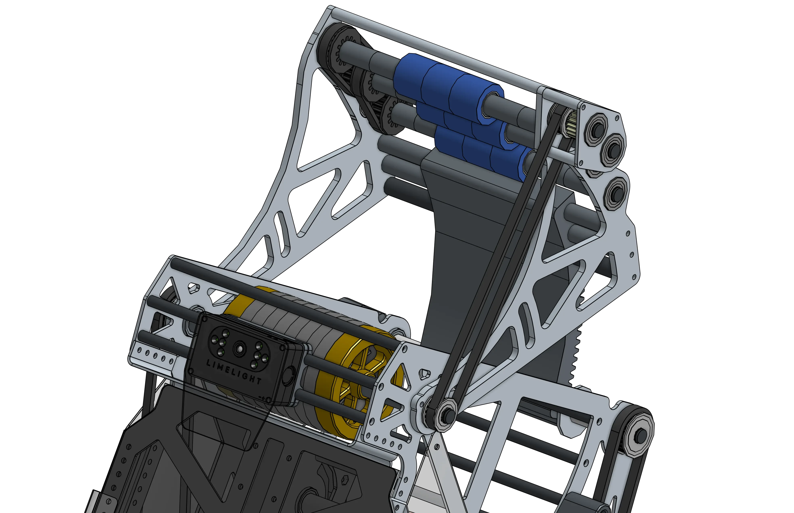
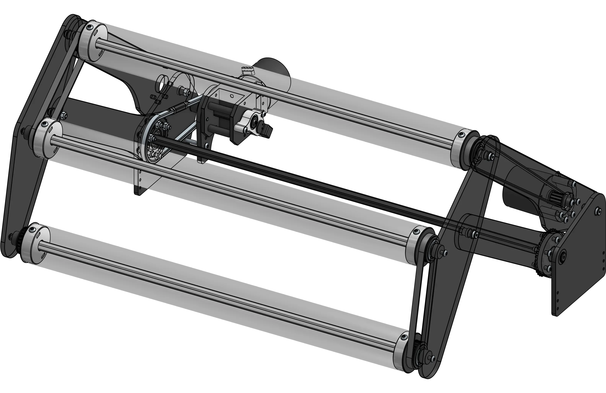
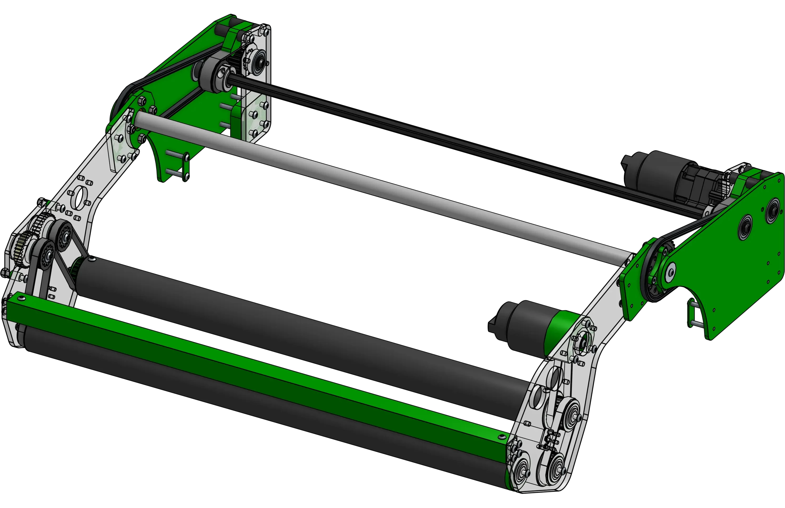
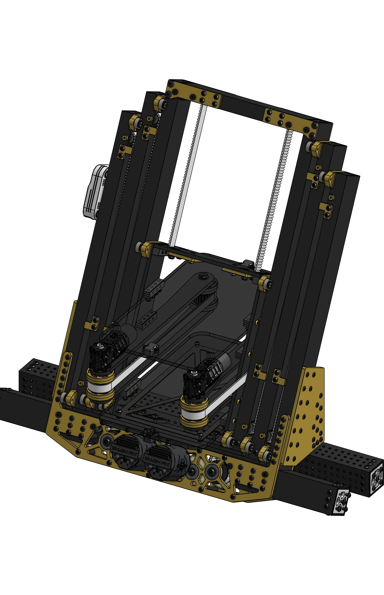
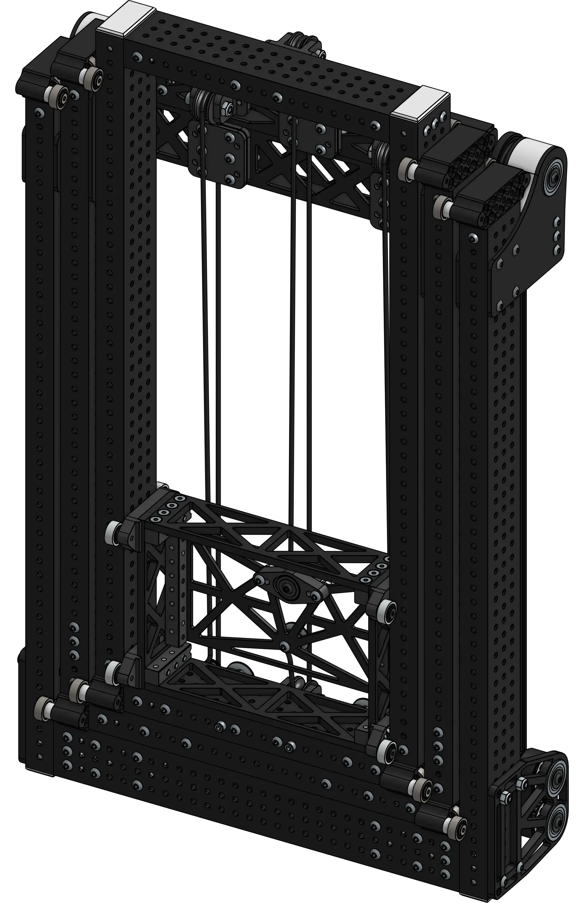

# Mechanism Examples

"Steal from the best, invent the rest" - Mike Corsetto, Head Coach of Team 1678. There's nothing that hasn't already been done; don't ever be afraid of taking inspiration from designs of other robots, especially when designing in a build season. Both for design reference and for learning about different executions of different mechanisms, a library of a wide variety of mechanisms is being compiled here.

!!! Note

    A CAD link has been provided when available, but examples without CAD can still be useful to look at with Behind The Bumpers videos and ChiefDelphi threads.

!!! Abstract "Contribution"

    This library of mechanism examples could always be expanded. Follow the [methods of contributing page](../contribution/methodsOfContributing.md "Methods of Contributing Page") to add your own examples or help write "Behind the Design"s for existing examples.

-   

    ---

    Swerve drivebases with examples of electronics layout
    
    [:octicons-arrow-right-24: Swerve Drivebases](drivebase/index.md)

-   

    ---

    Mechanisms designed to shoot gamepieces
    
    [:octicons-arrow-right-24: Shooters](shooter/index.md)

-   

    ---

    Over-the-bumper intakes deployed with a four-bar linkage
    
    [:octicons-arrow-right-24: Four-bar Intakes](intake/4bar/index.md)

-   

    ---

    Over-the-bumper intakes deployed with a single pivot
    
    [:octicons-arrow-right-24: Slapdown Intakes](intake/slapdown/index.md)

-   

    ---

    Elevators rigged continuously with belt or string
    
    [:octicons-arrow-right-24: Continuous Elevators](elevator/continuous/index.md)

-   

    ---

    Elevators rigged in a cascading fashion, with each stage linked to the last
    
    [:octicons-arrow-right-24: Cascade Elevators](elevator/cascade/index.md)
    
-   

    ---

    Different pivot designs, usually for arms
    
    [:octicons-arrow-right-24: Pivots](pivots/index.md)

 