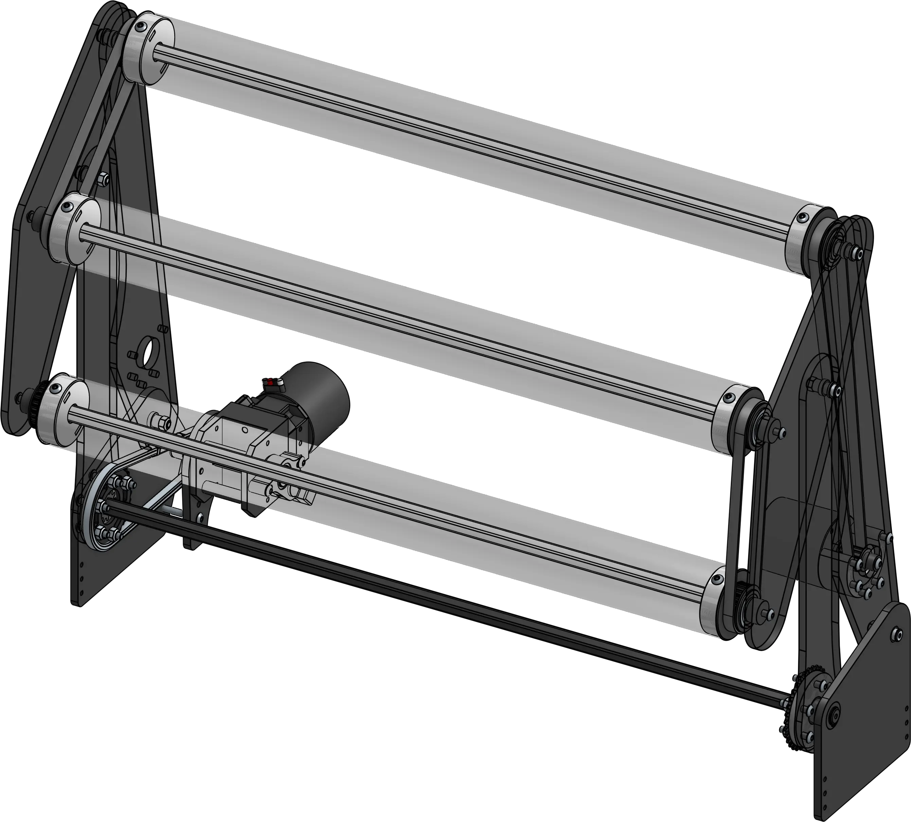

# Andrew's Clean 4 Bar

<figure markdown="span">
[{height=60% width=60%}](https://cad.onshape.com/documents/6234b0d874936d2e9369564a/w/d125e10125b7bf681b26e6fc/e/b555fd481c3384d870efd5e1){target = "_blank"}
<figcaption>Motor driven 4 bar intake designed to be as simple as possible, utilizing deadaxle rollers</figcaption>
</figure>

### Link

[CAD Document](https://cad.onshape.com/documents/6234b0d874936d2e9369564a/w/d125e10125b7bf681b26e6fc/e/b555fd481c3384d870efd5e1 "CAD Document Link"){:target="_blank" .md-button .md-button--primary}

## Behind the Design

**Coming Soon**

 