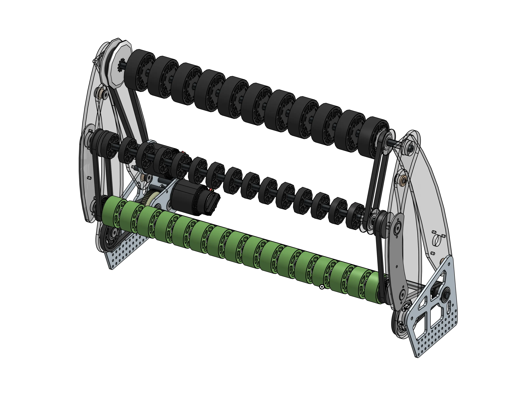
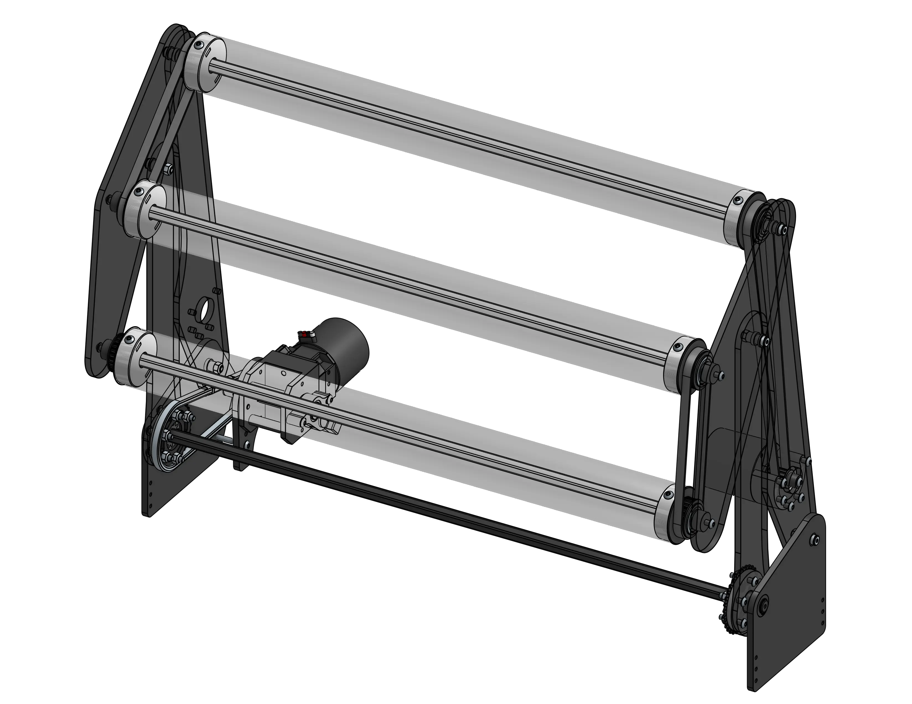
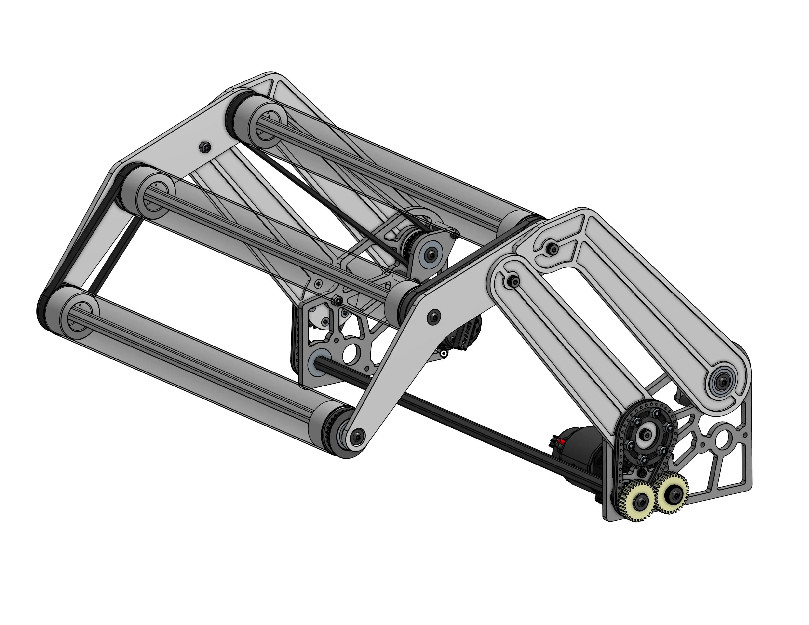

<meta property="og:title" content="Four-Bar Intake Examples">
<meta property="og:type" content="website">
<meta property="og:url" content="https://www.frcdesign.org/cad-examples/intake/4bar/">
<meta property="og:image" content="https://www.frcdesign.org/img/cad-examples/intake/4bar/vaughn4bar.webp">
<meta name="theme-color" content="#4CAE4F">
<meta name="twitter:card" content="summary_large_image">

# Four-Bar Intakes

The four-bar style of over-the-bumper intakes is very common in situations where your packaging is constrained vertically but not horizontally.

-   
[{width=100%}](1678.md)

    ---

    Extremely simple four-bar intake with compliance wheels, motor driven with chain
    
    [:octicons-arrow-right-24: 1678's Rapid React Intake](1678.md)

-   
[{width=94%}](clean.md)

    ---

    Simple four-bar intake with deadaxle rollers for a more rigid design
    
    [:octicons-arrow-right-24: Andrew's Clean Four-Bar Intake](clean.md)

-   
[{width=100%}](vaughn4bar.md)

    ---

    Another example of a four-bar intake with deadaxle rollers but with a different power transmission setup
    
    [:octicons-arrow-right-24: Vaughn's Four-bar Intake](vaughn4bar.md)

 