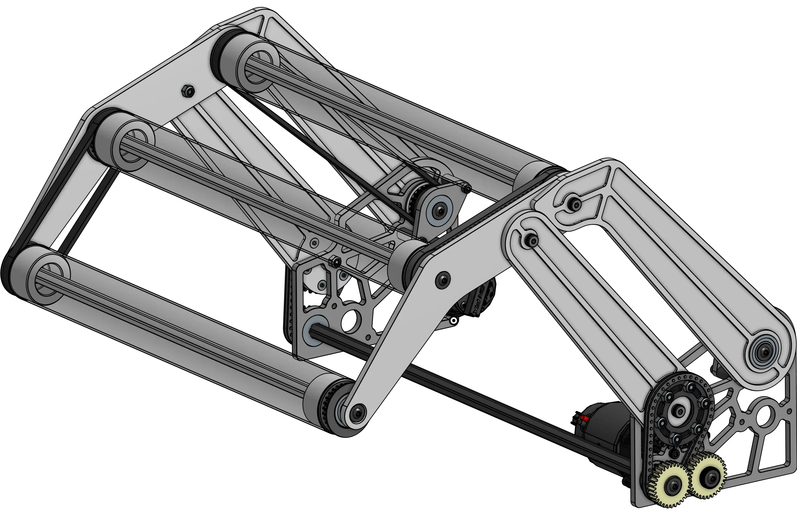

# Vaughn's 4bar Intake

<figure markdown="span">
[{height=80% width=80%}](https://cad.onshape.com/documents/0240c56dd59a35adc08efb64/w/e5c853d4b027af1b1c60e272/e/e5ac8dd57fe0c91a13372170){target = "_blank"}
<figcaption>Motor driven 4 bar intake designed to be as simple as possible, utilizing deadaxle rollers</figcaption>
</figure>

### Link

[CAD Document](https://cad.onshape.com/documents/0240c56dd59a35adc08efb64/w/e5c853d4b027af1b1c60e272/e/e5ac8dd57fe0c91a13372170 "CAD Document Link"){:target="_blank" .md-button .md-button--primary}

## Behind the design

**Coming Soon**

 