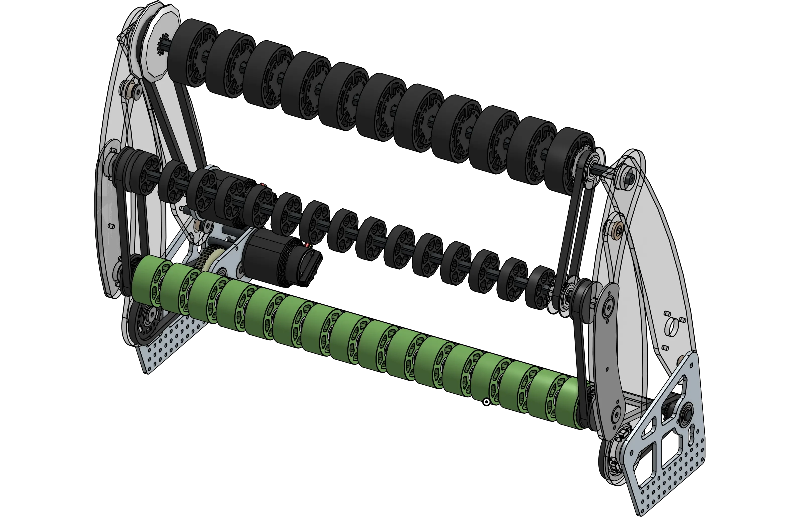
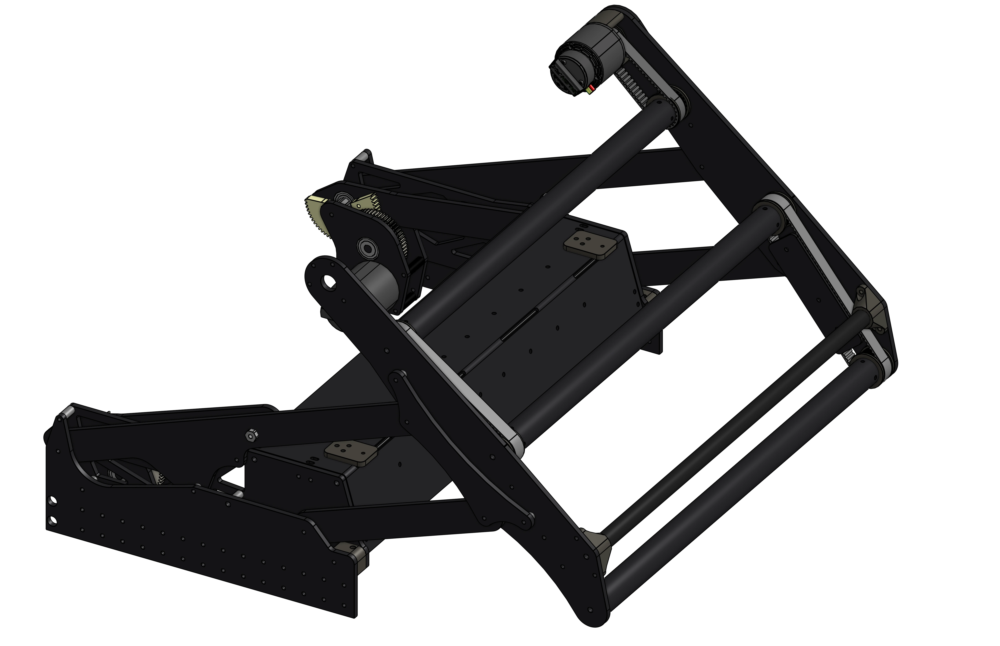
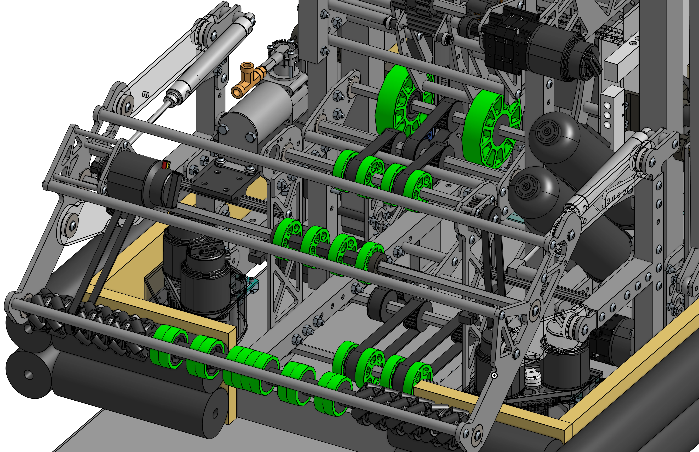

# Linkage Intakes

Linkage deployed over-the-bumper intakes offer creative packaging and added compliance.

## Featured

-   
[{width=100%}](1678_2022_intake.md)

    ---

    A motor driven four-bar intake with compliance wheels
    
    [:octicons-arrow-right-24: 1678's Rapid React Intake](1678_2022_intake.md)

-   
[{width=100%}](6800_2022_intake.md)

    ---

    A motor driven four-bar intake with round rollers
    
    [:octicons-arrow-right-24: 6800's Rapid React Intake](6800_2022_intake.md)

-   
[{width=100%}](4089_2022_intake.md)

    ---

    A pneumatically actuated 4-bar intake with vectoring wheels for centering
    
    [:octicons-arrow-right-24: 4089's Rapid React Intake](4089_2022_intake.md)

 