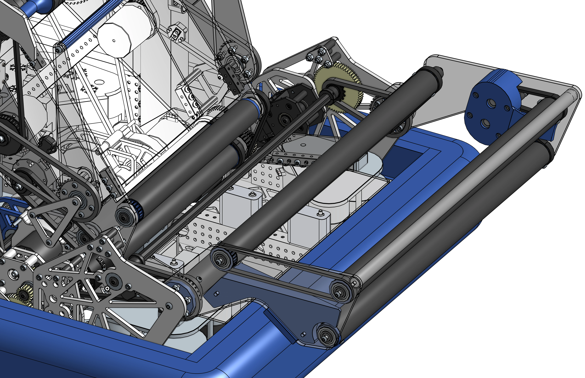

# 1778 Crescendo Flip Intake

<figure markdown="span">
[{height=60% width=60%}](https://cad.onshape.com/documents/05760c4d8b40fba37db8fa48/w/f31b499c519e8471cced93dc/e/b53dde24ab8b46d679af9944){target = "_blank"}
<figcaption>A motor powered slapdown intake with a zombie axle pivot for intaking notes</figcaption>
</figure>

### Links

[CAD Document](https://cad.onshape.com/documents/05760c4d8b40fba37db8fa48/w/f31b499c519e8471cced93dc/e/b53dde24ab8b46d679af9944 "CAD Document Link"){:target="_blank" .md-button .md-button--primary}

## Behind the design

**Coming Soon**

 