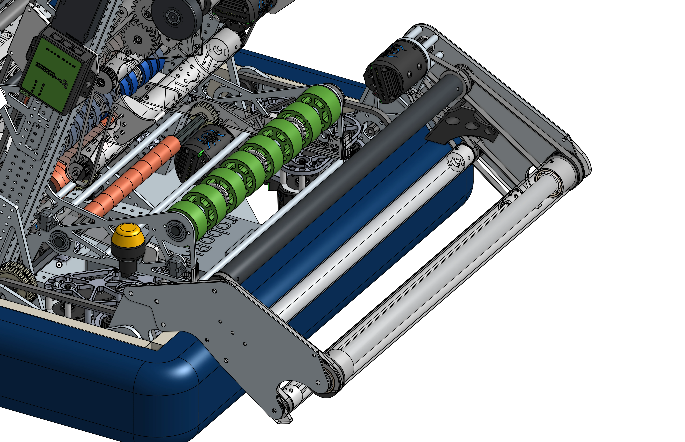

# 1778 Crescendo Flip Intake

<figure markdown="span">
[{height=60% width=60%}](https://cad.onshape.com/documents/05760c4d8b40fba37db8fa48/w/f31b499c519e8471cced93dc/e/b53dde24ab8b46d679af9944){target = "_blank"}
<figcaption>A quality slap-down intake design. The intake rotates around a single pivot to move the intake behind and past the frame perimeters. The intake uses 2 sets of polycarb rollers to intake the ring and feed it into the robot. The rollers and the side plates of the intake are made out of polycarb to help with impact resistance.</figcaption>
</figure>

### Links

[CAD Document](https://cad.onshape.com/documents/05760c4d8b40fba37db8fa48/w/f31b499c519e8471cced93dc/e/b53dde24ab8b46d679af9944 "CAD Document Link"){:target="_blank" .md-button .md-button--primary}

## Behind the design

**Coming Soon**