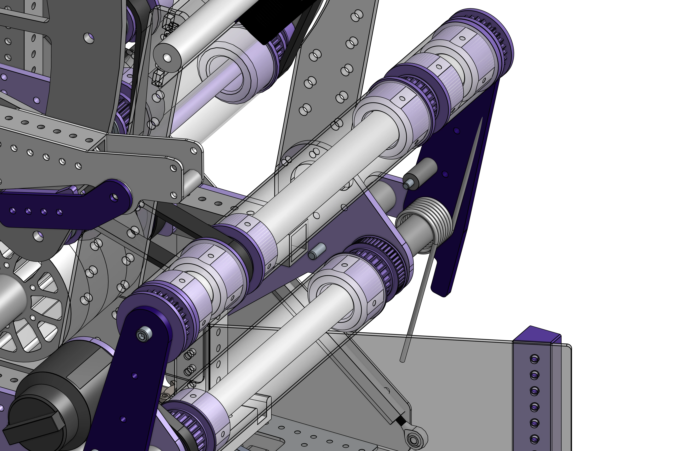

# 3847 Rapid React Flip Intake

<figure markdown="span">
[{height=60% width=60%}](https://cad.onshape.com/documents/995ee9b75573cf463f84dbbc/w/80aecca8674f728b1e04236c/e/dac0a7693d84c119c3ce8bab?configuration=default){target = "_blank"}
<figcaption>A springed intake driven by a brushless motor. The intake pitches up and down and uses polycarb rollers wrapped in grip material to grab the balls and feed them into the indexer. There is a spring attached to the pivot the help the motor bring the intake back up.</figcaption>
</figure>

### Links

[CAD Document](https://cad.onshape.com/documents/995ee9b75573cf463f84dbbc/w/80aecca8674f728b1e04236c/e/dac0a7693d84c119c3ce8bab"CAD Document Link"){:target="_blank" .md-button .md-button--primary}

## Behind the design

**Coming Soon**