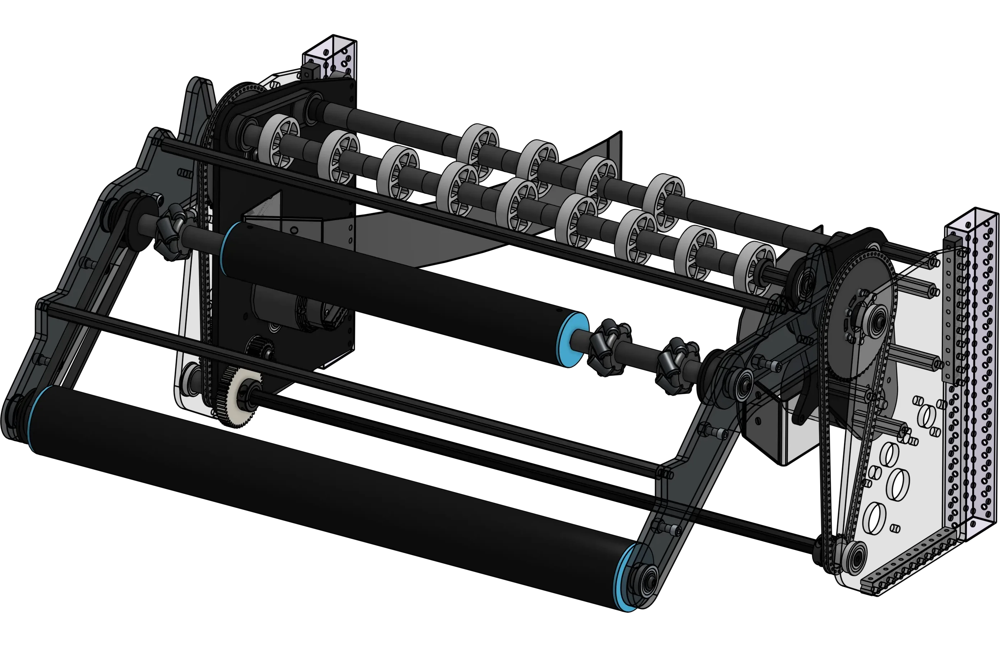

# 4414 Style Slapdown Intake

<figure markdown="span">
[{height=60% width=60%}](https://cad.onshape.com/documents/5e2a86e39b5394e3278ec95e/w/9377bb69803efd269a7f84e9/e/8269d804101a62e745aa7a65){target = "_blank"}
<figcaption>A coaxial slapdown design popularized by Team 4414 | HighTide</figcaption>
</figure>

### Links

[CAD Document](https://cad.onshape.com/documents/5e2a86e39b5394e3278ec95e/w/9377bb69803efd269a7f84e9/e/8269d804101a62e745aa7a65 "CAD Document Link"){:target="_blank" .md-button .md-button--primary}

## Behind the design

**Coming Soon**

 