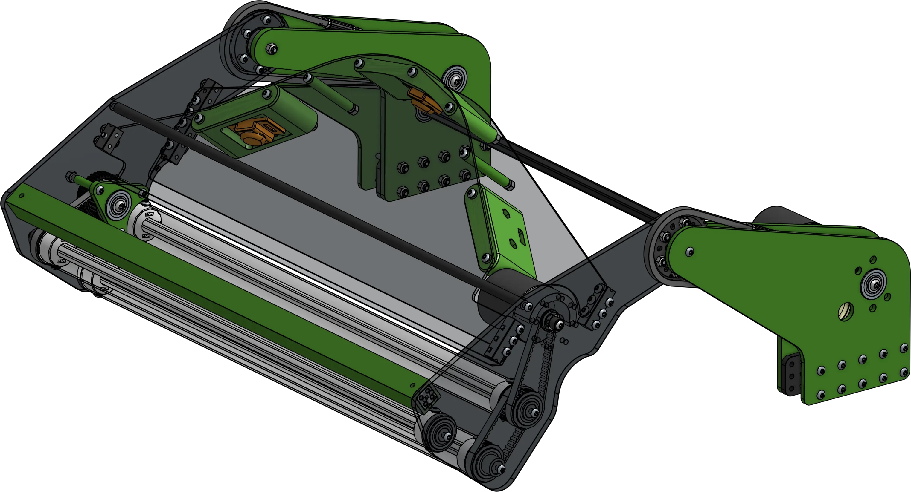

# 6423 Crescendo Flip Intake

<figure markdown="span">
[{height=60% width=60%}](https://cad.onshape.com/documents/e466c9e10766af7b45952ce2/w/daa5adbb115d62e1a82bdad9/e/efc90f45c6b5a34bffb7429c){target = "_blank"}
<figcaption>This common 2024 design was inspired by the ri3d team Cranberry Alarm. It is distinct from the traditional "passthrough" intake design, not letting the note travel fully through the intake. </figcaption>
</figure>

### Links

[CAD Document](https://cad.onshape.com/documents/e466c9e10766af7b45952ce2/w/daa5adbb115d62e1a82bdad9/e/efc90f45c6b5a34bffb7429c "CAD Document Link"){:target="_blank" .md-button .md-button--primary}

## Behind the design

**Coming Soon**

 