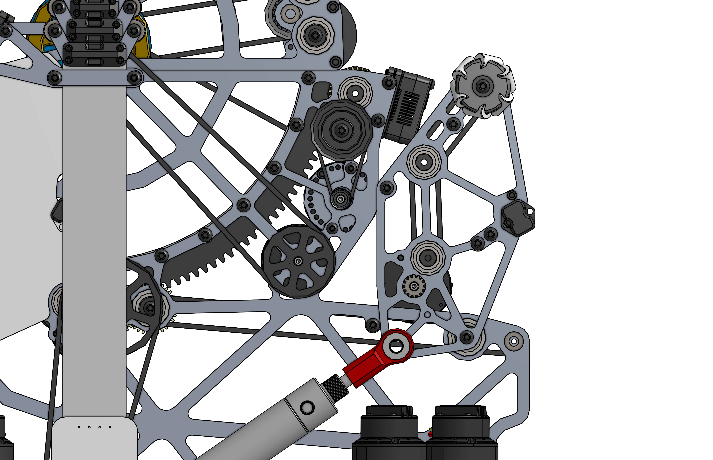

# Slapdown Intakes

The slapdown style of "Over the Bumper" intakes is very common in situations where your packaging is constrained horizontally, but not vertically.

## Featured

-   
[{width=100%}](1678_2024_intake.md)

    ---

    A slapdown intake that uses a motor attached to custom gearing to rotate the intake in and out of frame perimeter. With polycarb tubing used as rollers to intake the notes. Designed to intake Crescendo foam rings.
    
    [:octicons-arrow-right-24: 1678's Crescendo Slapdown Intake](1678_2024_intake.md)

-   
[{width=100%}](1778_2024_intake.md)

    ---

    A crescendo intake, deployed using a single pivot. The intake has 2 front rollers to initially grab the foam rings, and 2 back rollers to feed the ring into the robot. The intake uses polycarbonate to help improve durability against impacts.
    
    [:octicons-arrow-right-24: 1778's Crescendo Slapdown Intake](1778_2024_intake.md)

-   
[{width=100%}](6423_2024_intake.md)

    ---

    Uses rollers to center a piece against bent polycarb, then flips it back for a passthrough. Examples of how to mount cameras and sensors to allow more automation
    
    [:octicons-arrow-right-24: 6423's Crescendo Flip Intake](6423_2024_intake.md)

-   
[{width=100%}](3847_2022_intake.md)

    ---

    Uses polycarb rollers intake the ball into the feeder. The intake is pitched up and down by a single brushless motor. There is a spring attached to the intake pivot to help the motor bring the intake back up. 
    
    [:octicons-arrow-right-24: 3847's Rapid React Springed Intake](3847_2022_intake.md)

-   
[{width=100%}](2910_2021_intake.md)

    ---

    This intake was built for Infinite Recharge, to intake foam balls. It uses a pneumatic cylinder to deploy the intake, on a single pivot. On the end of the intake, there is a roller with 3D printed vector intake wheels to help center the ball into the intake.
    
    [:octicons-arrow-right-24: 2910's IR @ Home / 2021 Offseason Pnuematic Intake](2910_2021_intake.md)

