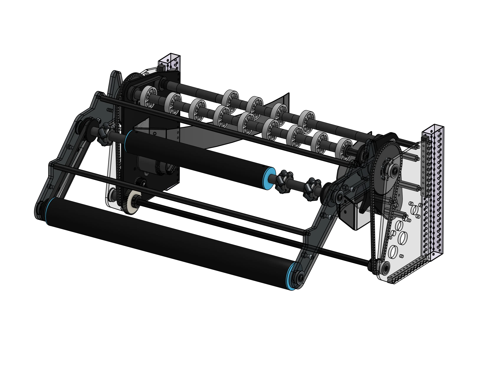
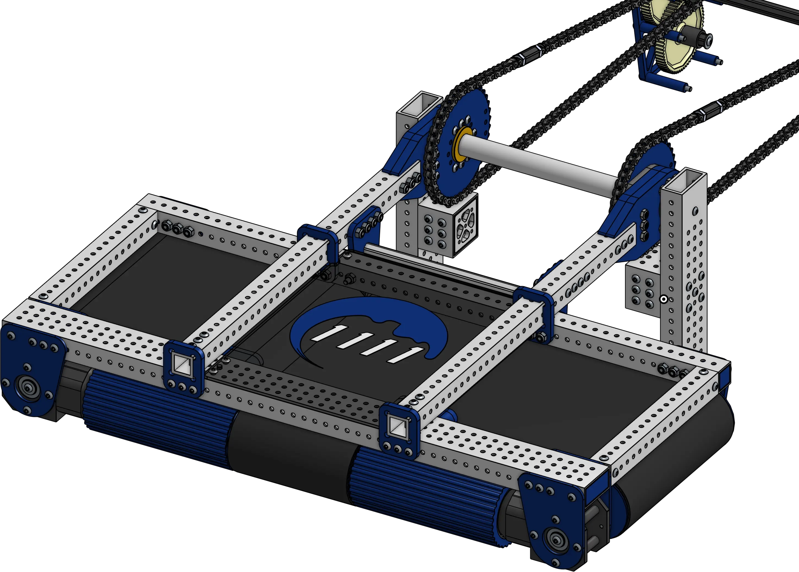
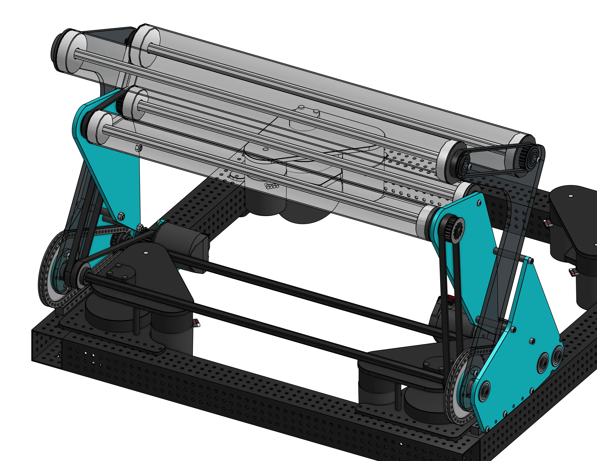

<meta property="og:title" content="Slapdown Intake Examples">
<meta property="og:type" content="website">
<meta property="og:url" content="https://www.frcdesign.org/cad-examples/intake/slapdown/">
<meta property="og:image" content="https://www.frcdesign.org/img/cad-examples/intake/slapdown/6423crecendo.webp">
<meta name="theme-color" content="#4CAE4F">
<meta name="twitter:card" content="summary_large_image">

# Slapdown Intakes

The slapdown style of "Over the Bumper" intakes is very common in situations where your packaging is constrained horizontally, but not vertically.

-   
[{width=100%}](4414style.md)

    ---

    Pivot driven by chain and a torque transfer bar, separate stationary wheel axles, bent polycarb funnel, mounted with nutstrips
    
    [:octicons-arrow-right-24: 4414-Style Intake](4414style.md)

-   
[{width=80%}](washed.md)

    ---

    Very different from most modern intakes, it helps center heavy gamepieces through a gap in the bumpers, driven by chain with a deadaxle pivot
    
    [:octicons-arrow-right-24: Washed's Beavertail Intake](washed.md)

-   
[{width=80%}](low.md)

    ---

    Some rollers are decoupled so the pivot for the intake can be lowered below the ball path
    
    [:octicons-arrow-right-24: Low Pivot Slapdown Intake](low.md)

-   
[{width=100%}](6423otb.md)

    ---

    Uses rollers to center a piece against bent polycarb, then flips it back for a passthrough. Examples of how to mount cameras and sensors to allow more automation
    
    [:octicons-arrow-right-24: 6423's 2024 Flip Intake](6423otb.md)

 