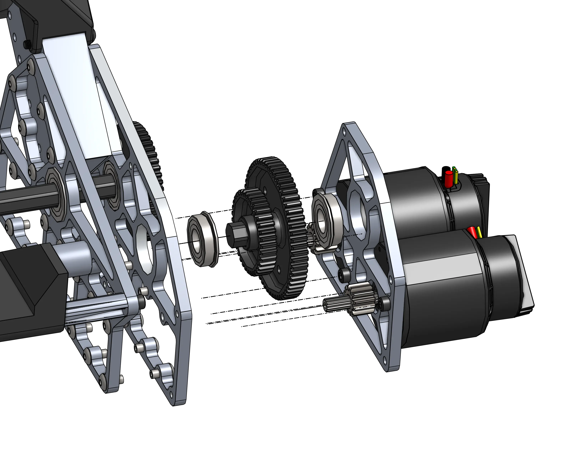
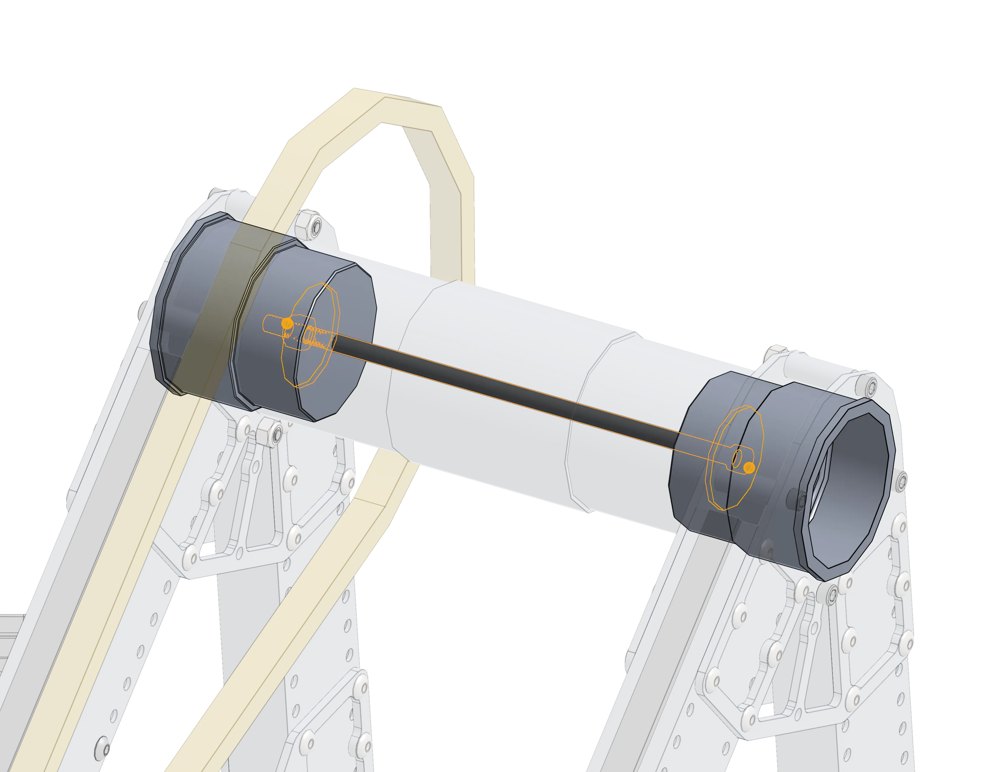
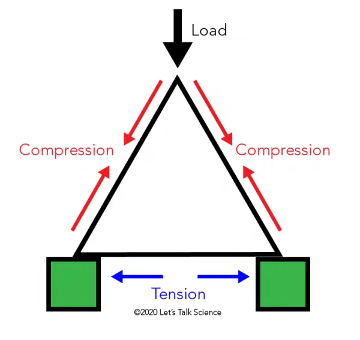

# 2910's 2023 Dead Axle Pivot

<figure markdown="span">
[{height=60% width=60%}](https://cad.onshape.com/documents/9b839dcfb57e2325343c7e68/w/d4eb9bd29f2760b8b1531c60/e/f0179551d0ae559b6caa8dd6){target = "_blank"}
<figcaption>A custom dead-axle pivot with a creative chain tensioning solution.</figcaption>
</figure>

### Links

[CAD Document](https://cad.onshape.com/documents/9b839dcfb57e2325343c7e68/w/d4eb9bd29f2760b8b1531c60/e/f0179551d0ae559b6caa8dd6 "CAD Document Link"){:target="_blank" .md-button .md-button--primary} 

(Thanks to JB of FRC6995 for cleaning the OnShape document up!)

[CAD and Tech Binder Release ChiefDelphi Thread](https://www.chiefdelphi.com/t/2910-cad-and-tech-binder-release-2023/436653 "Tech Binder Chief Delphi Thread"){:target="_blank"}

[Match Video](https://www.youtube.com/watch?v=LzgU0rbpWqY "2910 Match Video"){:target="_blank"}

## Behind the Design

The pivot is driven by 2 mirrored dual falcon 500 gearboxes. These gearboxes are incredibly compact and thoughtful design decisions have been made throughout the whole pivot to reduce part count. One method utilized in this gearbox is to use a Thunderhex bearing retention technique in which each shaft is turned down from 1/2" Hex to 13.75mm (Thunderhex diameter) on each end, which fully constrains each flange bearing as long as the two plates are compressed. This both reduces part count, design complexity, and makes the gearboxes easier to assemble and service, requiring only 5 bolts to swap out the entire motor plate (motors included) and the entire gearset.

||||
|:-:|:-:|:-:|
|<figure markdown="span">{height=60% width=60%}</figure>|<figure markdown="span">{height=100% width=100%}<figcaption>Thunderhex bearing retention technique utilizing turned hex flanges, bearing flanges, and fixed plates.</figcaption></figure>|<figure markdown="span">{height=60% width=60%}</figure>|

All of these plates are heavily lightened to increase the robots top speed and acceleration capabilities (F=ma), and to keep the center of gravity low. The gearboxes and even motor placement on the gearboxes are as low and central as possible to improve the robots center of mass. Lower center of mass helps to reduce tipping and gives the robot an advantage in pushing battles.

The second stage shaft runs across the robot to link the two gearboxes, which is essential to eliminate any torsion in the arm that would be caused by unevenly driving each side of the pivot independently.

|||
|:-:|:-:|
|<figure markdown="span">{height=60% width=60%}</figure>|<figure markdown="span">{height=100% width=100%}<figcaption>Wheel Support Reference from REV ION Robot Basics Guide</figcaption></figure>|

The third stage is an additional reduction that doubles as a tensioning mechanism,  reusing the mechanical link shaft as an idler shaft to pivot around, adjusting the center to center distance of the final chain run. Tightening the bolt (shown in red in the diagram below) pulls the lever back, applying tension to the chain. The planet gear & sprocket shaft uses the same ½” to 13.75mm diameter hex shaft technique to reduce part count. Using a chain for the final reduction and power transmission is optimal due to its exeptional tensile strength and ability to absorb shock loads.

<figure markdown="span">{height=80% width=80%}</figure>

The main pivot itself is a massive dead axle fixed into the triangular superstructure. Triangles are strong! This (almost) right angle superstructure is incompressible, as when a force is applied to compress any side there is always an opposite side in tension to counteract that force. This dead axle assembly is very simple, with 3 custom parts that are all easily manually machineable on a lathe. The large dead axle has two end caps and a single bolt through from one end to the other to hold the whole axle assembly together.

|||
|:-:|:-:|
|<figure markdown="span">{height=100% width=100%}</figure>|<figure markdown="span">{height=100% width=100%}</figure>|

|||
|:-:|:-:|
|<figure markdown="span">{height=100% width=100%}</figure>|<figure markdown="span">{height=100% width=100%}</figure>|

 
