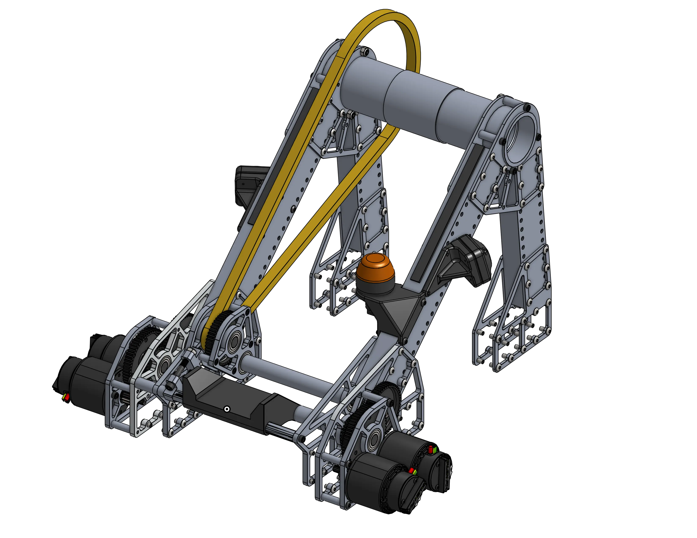
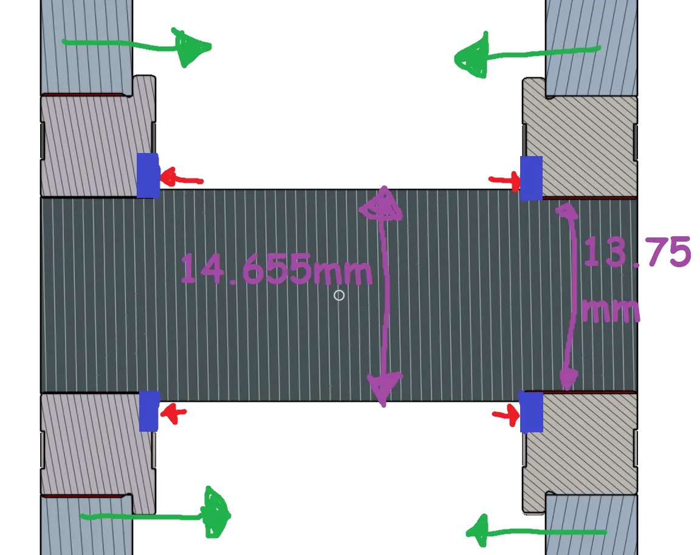
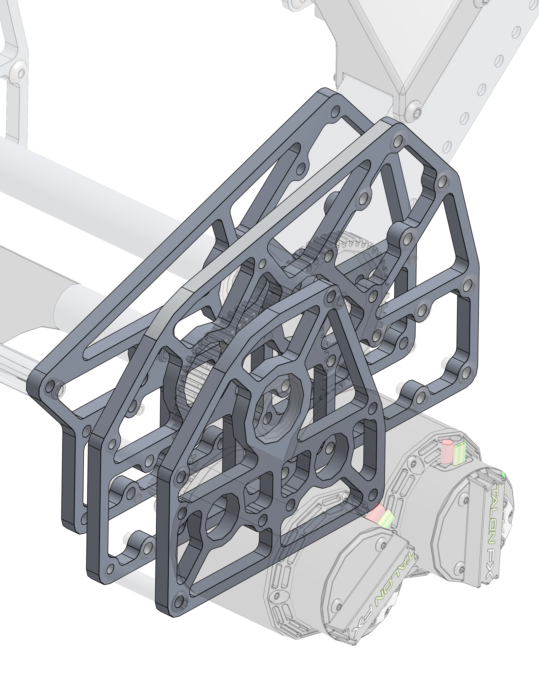
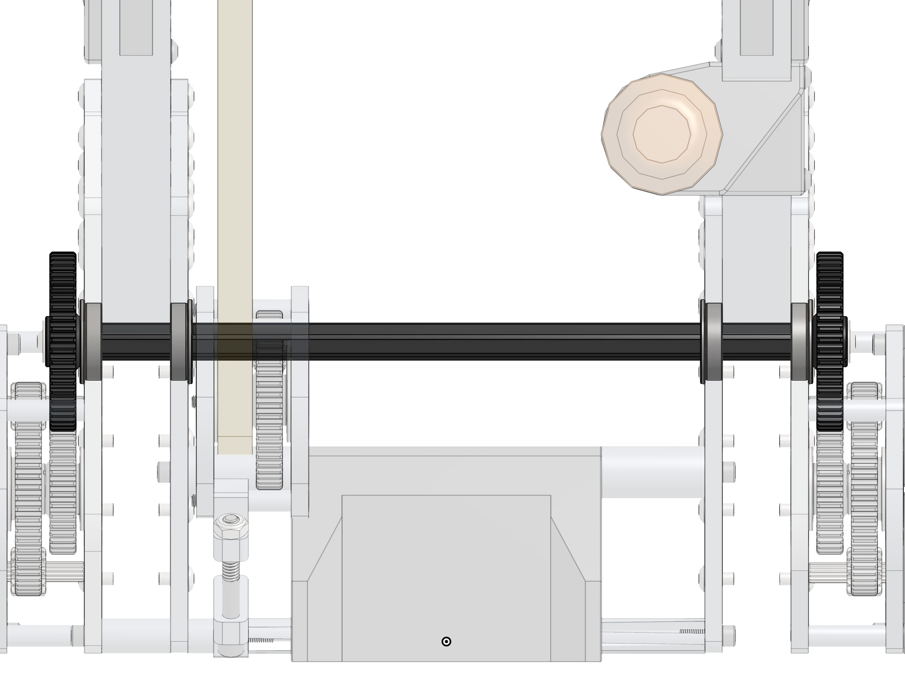
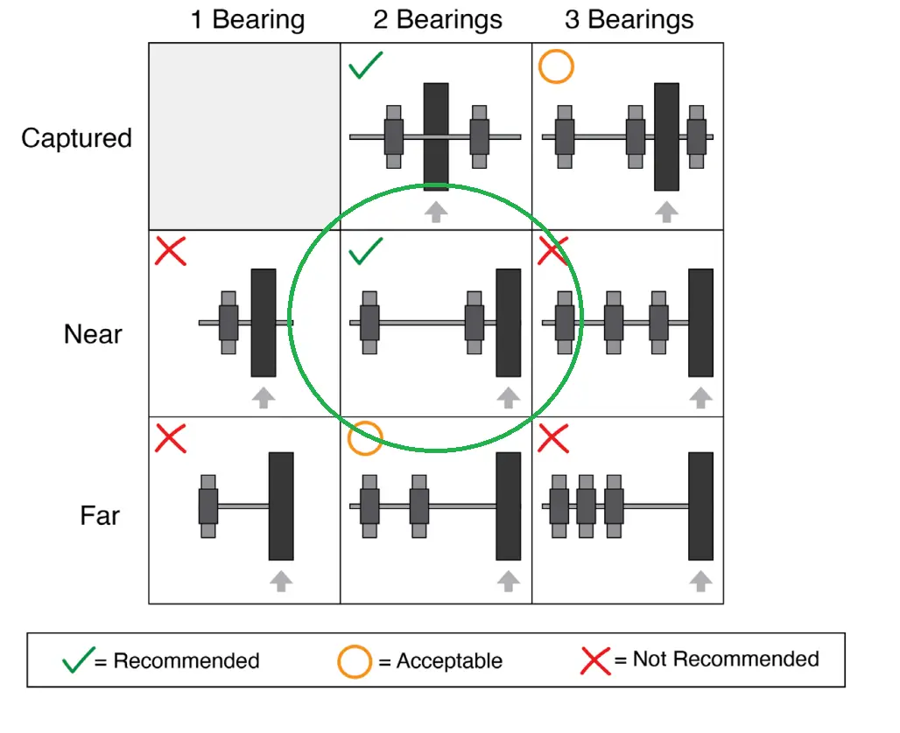
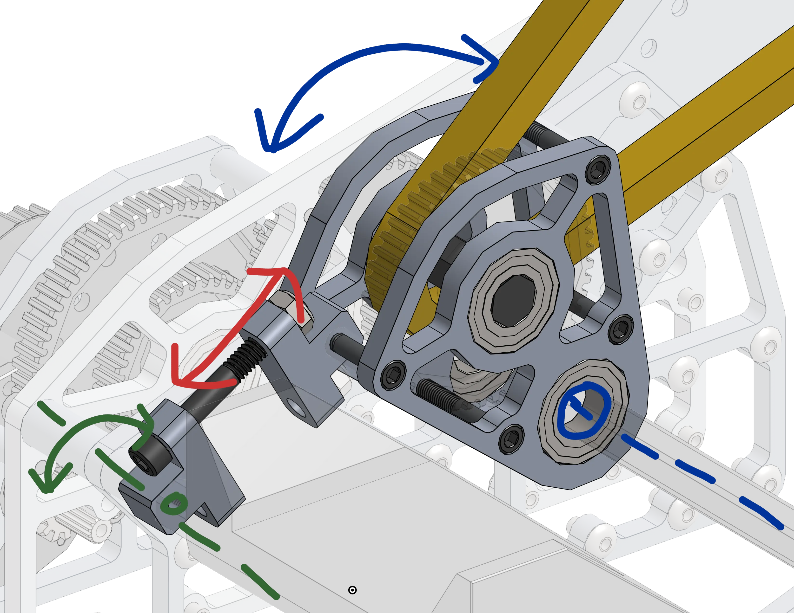
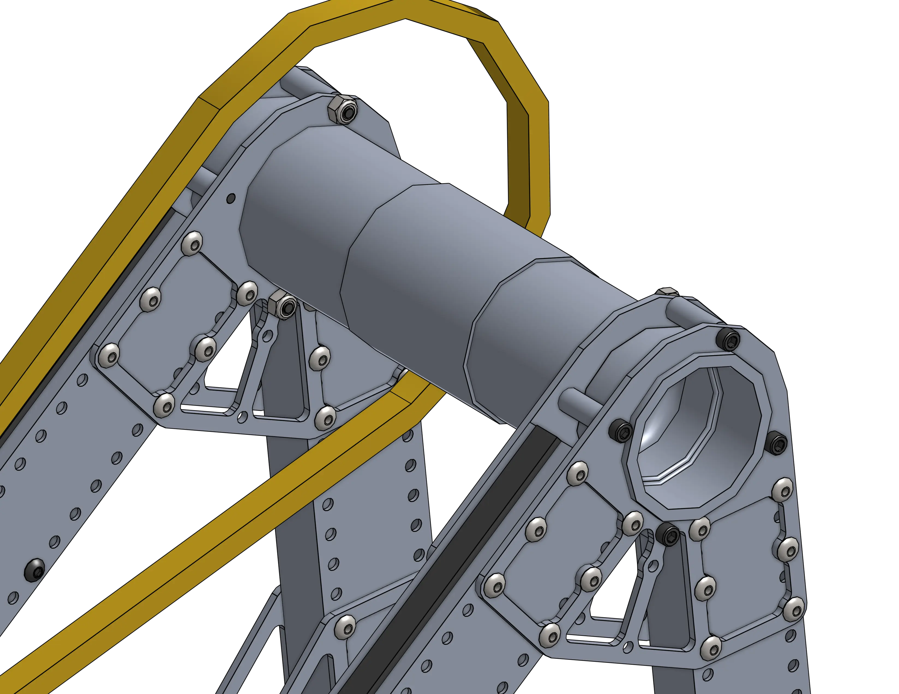
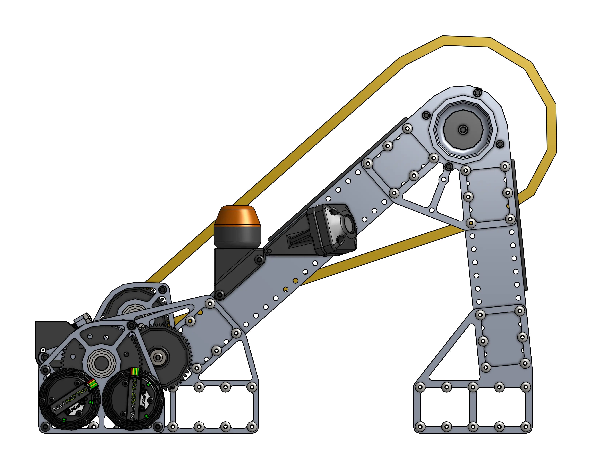
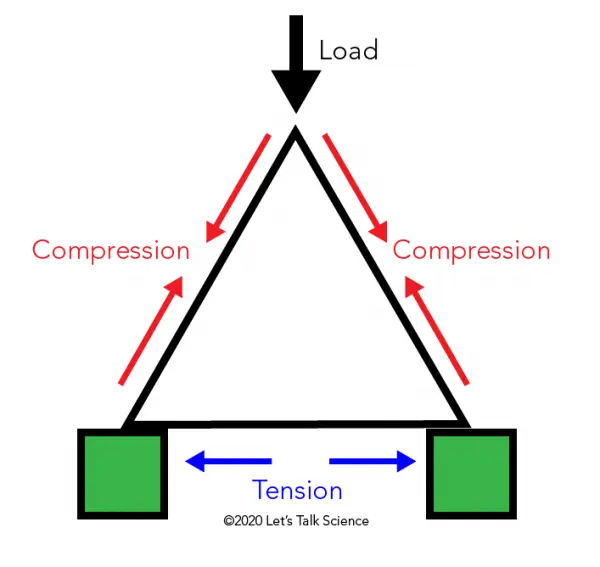
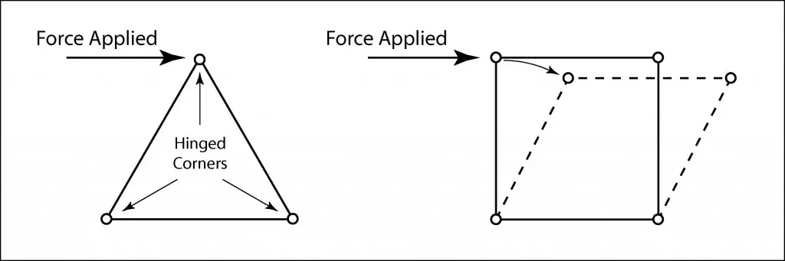

# 2910's 2023 Dead Axle Pivot

<figure markdown="span">
[{height=60% width=60%}](https://cad.onshape.com/documents/43505c3f750efb19e995ad36/w/e246489aced2d23991a0f2a1/e/0237a300633b2cf31e173173?renderMode=0&uiState=663907354e7bd8067caebdc4){target = "_blank"}
<figcaption>This dead axle pivot was created by 2910 just recently in the 2023 season and has already been utilized by a number of different teams, including Hall of Fame Team 359 Hawaiian Kids that next year in 2024, who ranked #20 in the world using this pivot as the base for their robot.</figcaption>
</figure>

### Links

[CAD Link](https://cad.onshape.com/documents/43505c3f750efb19e995ad36/w/e246489aced2d23991a0f2a1/e/0237a300633b2cf31e173173?renderMode=0&uiState=663907354e7bd8067caebdc4){target = "_blank"}

[CAD and Tech Binder Release ChiefDelphi Thread](https://www.chiefdelphi.com/t/2910-cad-and-tech-binder-release-2023/436653)

[Match Video](https://www.youtube.com/watch?v=LzgU0rbpWqY)

## Behind the Design

The pivot is driven by 2 mirrored dual falcon 500 gearboxes. These gearboxes are incredibly compact and are designed immaculately to reduce part count. The first stage gear shaft is a piece of ½” Hex shaft turned down to 13.75mm (thunderhex) on each end, which fully constrains each flange bearing as long as the two plates are compressed.

||||
|:-:|:-:|:-:|
|<figure markdown="span">{height=60% width=60%}</figure>|<figure markdown="span">{height=100% width=100%}</figure>|<figure markdown="span">{height=60% width=60%}</figure>|

All of these plates are heavily lightened to make the robot light, increase the acceleration capabilities (F=ma), and keep the center of gravity low. The gearboxes and even motor placement on the gearboxes are as low and central as possible to improve the robots center of mass. Lower center of mass helps to reduce tipping and gives the robot an advantage in pushing battles.

The second stage shaft runs across the robot to link the two gearboxes. These second stage gears are cantilever to reduce gearbox size, and are properly supported with two bearings on each end.

|||
|:-:|:-:|
|<figure markdown="span">{height=60% width=60%}</figure>|<figure markdown="span">{height=100% width=100%}<figcaption>Wheel Support Reference from REV ION Robot Basics Guide</figcaption></figure>|

The third stage ingeniously doubles as a tensioner arm for the final chain run reduction to the main pivot. Using a chain for the final reduction and power transmission is optimal due to its ability to absorb shock loads. Tightening the bolt here pulls the lever, applying tension to the chain. The entire tensioner pivots around the 2nd stage shaft, using the existing bearing. The planet (larger) gear rotates around the sun (smaller) gear. The planet gear & sprocket shaft uses the same ½” to 13.75mm diameter hex shaft technique to reduce part count.

<figure markdown="span">{height=80% width=80%}</figure>

The main pivot itself is a massive dead axle fixed into the triangular superstructure. Triangles are strong! This (almost) right angle superstructure is incompressible, as when a force is applied to compress any side there is always an opposite side in tension to counteract that force.

|||
|:-:|:-:|
|<figure markdown="span">{height=100% width=100%}</figure>|<figure markdown="span">{height=100% width=100%}</figure>|

|||
|:-:|:-:|
|<figure markdown="span">{height=100% width=100%}</figure>|<figure markdown="span">{height=100% width=100%}</figure>|

 