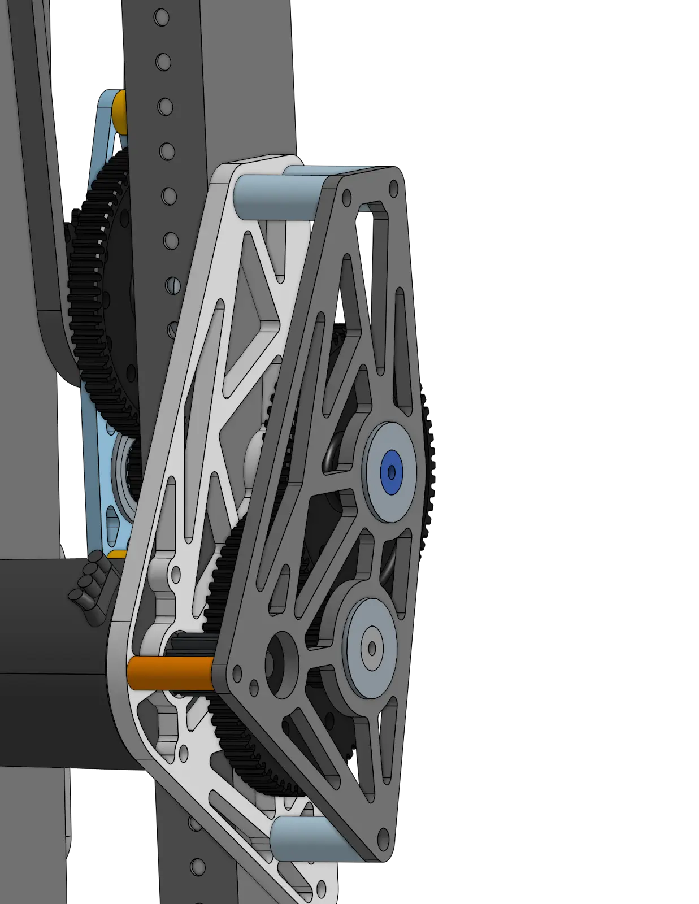

# 6328 A-Frame Pivot 2023

<figure markdown="span">
[{height=50% width=50%}](https://cad.onshape.com/documents/7b17c8664d1313c397a0fcf3/w/61b5c8329f7f5c6023f50c77/e/58bc5035e6e718d34ade872d){target = "_blank"}
<figcaption>This triple pivoted design folded in on itself to start inside frame perimeter, and allowed for a near universal manipulation of the robot’s end effector.</figcaption>
</figure>

### Links

[CAD Document](https://cad.onshape.com/documents/7b17c8664d1313c397a0fcf3/w/61b5c8329f7f5c6023f50c77/e/58bc5035e6e718d34ade872d "CAD Document Link"){:target="_blank" .md-button .md-button--primary}

[ChiefDelphi OpenAlliance Build Thread](https://www.chiefdelphi.com/t/frc-6328-mechanical-advantage-2023-build-thread/420691 "ChiefDelphi OpenAlliance Build Thread")

[Pivot April Tag Tracking](https://youtu.be/XA15Qq2CXY0 "6328 Pivot April Tag Tracking")

## Behind the Design

In many cases, pivoting arms are a fundamental mechanism in the architecture of a robot. Thus, rigid, robust, and fast pivoting mechanisms can make or break a good design. Due to the massive moment load applied on this pivot joint at full arm extension, its essential that this pivots drive mechanism is both powerful and bulletproof.

### Force Breakdown on Pivot Arm

Torque is a function of two main variables: the magnitude of the applied force, the distance from the axis of rotation to where the force is applied (often referred to as the lever arm or moment arm), as well as the angle at which the force is applied. The force applied across an objects mass by gravity can be equivalently represented by a single force applied to the center of gravity of the object. At full arm extension, the CoG of the lever arm is at its max distance from the pivot axis, and gravity applies a point load at the CoG at a 90 degree angle relative to the lever arm, at which point the torque applied the pivot is this force MULTIPLIED by the distance from the CoG to the pivot.

<figure markdown="span">{height=150% width=150%}
</figure>

This massive moment load on the main pivot joint requires the pivot mechanism to both be built durable enough to handle this large torque without breaking, and also powerful enough to counteract and overcome this torque so that the pivot is able to be driven. When designing drive mechanisms and gearboxes for pivot arms like this, it is generally very useful to get a good estimation of how powerful a mechanism you will need to drive your arm depending on its length and mass, so many designers use simulators such as the [Reca.lc Arm Calculator](https://www.reca.lc/arm) or the [AMB Mechanism Ratio Calculator](https://ambcalc.com/mechanism?=).

 
 
*The following breakdown is an exerpt from the 6328 OpenAlliance thread on ChiefDelphi, written by [Matthew3 of FRC 6328](https://www.chiefdelphi.com/u/Matthew3/summary)*
 
 
 

# **The Improved Design**

## Custom Gearbox

Due to the limited availability of MAXPlanetaries and belly pan space constraints, we have re-evaluated the way we are powering the first joint. The gearbox will be placed low in the belly pan powering a dead-axle MAXSpline where we chain that to the two first joints. This has a few major advantages over our previous approach: packaging, mechanically linking the first two joints, limited stick out into the middle of the robot to make it easier to pass through, and eliminating several MAXPlantary cartridges.

<figure markdown="span">{height=50% width=50%}</figure>

The two bottom Neos power the MAXSpline that crosses the width of the robot, while the MAXPlantery neo is powering the joint of the cube intake.

 
For the new first joint dead axles, we are using 1.25” 0.25 wall tube turned down to 30mm for the bearings. To hold the dead axles, we were inspired by 971’s 2018 robot and their use of mitee-bites to hold the dead axle.

<figure markdown="span">{height=50% width=50%}
</figure>

For this, we use an ‘outside’ 0.25 aluminum plate with an interesting profile put into it for clearance around the tube and to be selective about contact points. On the inside plate, the one that can move, this same profile is used but flipped 180 degrees.

<figure markdown="span">{height=50% width=50%}
</figure>

This inside plate is mounted with a few bolts in some oversized holes (0.005”). They tap into the outer plate and the clearance holes in the blue plate allow the blue inner plate to have some movement. This means when you tighten the mitee-bite, it clamps the dead-axle in place. We calculated that this system provides around 1800 lbs of clamping force on the dead-axle for secure mounting. This also means it can easily switch out in the somewhat extreme scenario where we need to replace the dead-axle or if we need to replace the joint.

<figure markdown="span">{height=50% width=50%}
</figure>

This stackup is all contained within two snap rings (98541A134). This outermost constraint is for the “worst case scenario” where the mitee-bites fail. The inside snap ring is essential for keeping the stack up together.

<figure markdown="span">{height=50% width=50%}
</figure>

Moving to the joint itself, the previous design for this was a live axle MAXspline, this had a few small issues, but definitely things we would like to fix going forward. With the move to a real dead-axle, we solve all of these problems (hopefully).

<figure markdown="span">{height=50% width=50%}
</figure>

Taking a look at the joint itself, you will see the tube of the link, and the joint that connects to that link, this is a drastic improvement in repairability and was a requirement for us. We also switched the link tube into a thick wall MAXtube from the thin wall MAXtube. The joint itself consists of 0.25” aluminum plates captured in PA12-CF nylon 3d prints. In the following picture, you can see the aluminum plate (light blue) captured in the nylon part (light gray). The aluminum plate takes the bearing while the nylon part captures it and locates it in the tube (creating the more complicated geometry of the inside of the MAXtube) and becomes a spacer for the bearings side to side.

<figure markdown="span">{height=50% width=50%}
</figure>

The encoder is a 3d printed part that comes off the side of the sprocket and uses the same system as the previous design.

<figure markdown="span">{height=50% width=50%}
</figure>

## The second joint

The second joint was host to most of the issues with the arm. This is mostly due to us taking what seemed to be the easiest design-wise when building it at first. Just as a reminder, the previous joint was a 3 stage max planetary and a 32t to 80t geared reduction. A very simple joint, but an issue ridden one at best. The MAXplanetary has a significant amount of backlash, it is all assembled with press fit tube blocks and such, making it almost impossible to take apart, and the MAXspline itself has a significant amount of spring in it. With these issues in mind, let’s take a look at the new design.

<figure markdown="span">{height=50% width=50%}
</figure>

This joint looks fairly similar to the first joint. The dead axle is clamped by a very similar system as the first joint, with the sub plate (light blue) clamping the dead axle onto the first tube. The shaft has snap rings on the outside for the worst case scenario where the tube slips.

<figure markdown="span">{height=50% width=50%}
</figure>

The dead axle tube (orange) has thin wall aluminum tube (1.25 OD 0.028 wall) acting as spacers, contacting the inner race of the bearing and the outer tube. The dead axle (orange tube) has a length of it turned 0.005” less than the 30mm OD of the rest of the tube (the length where no bearings are in contact) for assembly reasons.

This system will (hopefully) reduce spring and separate the joints from the tubes, aiding repairability.

|||
|:-:|:-:|
|<figure markdown="span">{height=100% width=100%}</figure>|<figure markdown="span">{height=100% width=100%}</figure>|

The gearbox is 3 stages (+ chain) to a total of 228:1 of reduction. While this will add weight to the arm, it is located relatively low when compared to the previous solution and we are willing to trade weight for lower backlash. The output of the gearbox is chained to the sprocket attached to the second link. The sprocket is a Rev 64t maxspline sprocket with the center enlarged to 1.375 for clearance around the dead axle. The sprocket is spaced off of the joint with a 3d printed spacer made in Pa12-CF nylon filament bolted to the joint with through bolts.

<figure markdown="span">{height=50% width=50%}
</figure>

The second joint has significantly more bracing in the previous design. We will now have full 1/16 wall 2x1s going across the second link, compared to the previous ½ hex going across. The gussets will be riveted onto the cross 2x1 and bolted onto the MAXtube to allow for repairability.

<figure markdown="span">{height=50% width=50%}
</figure>

The wrist stackup will be the exact same as the previous, with the same end effector and encoder/chain system.

 
