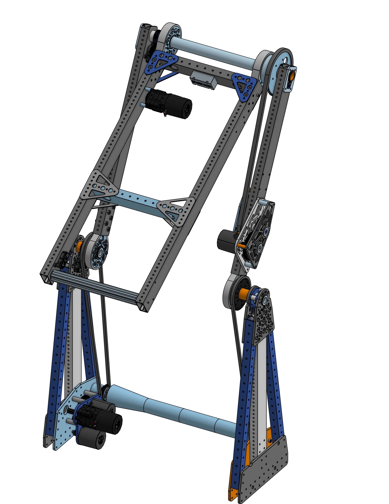
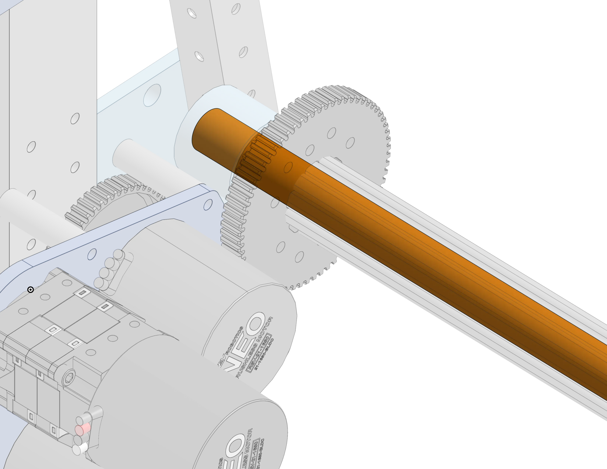
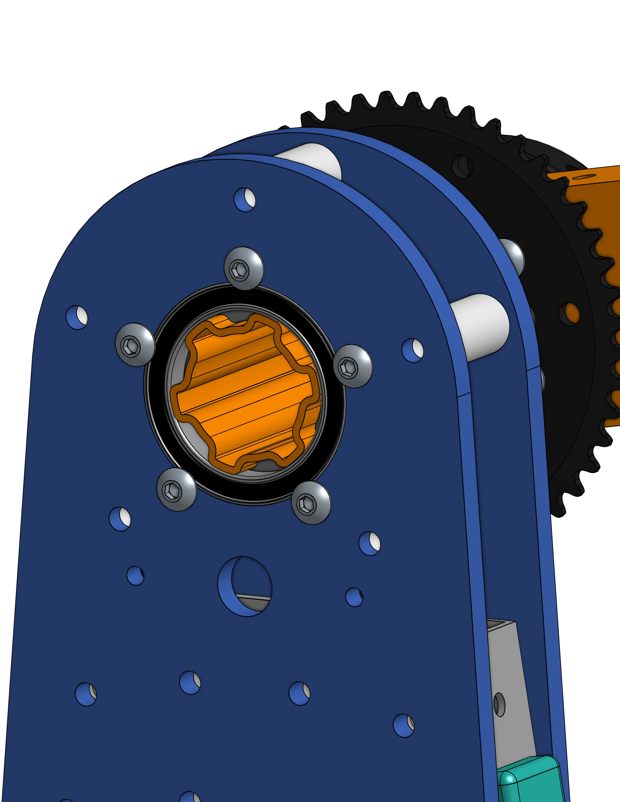
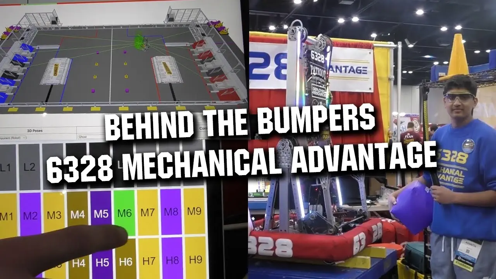
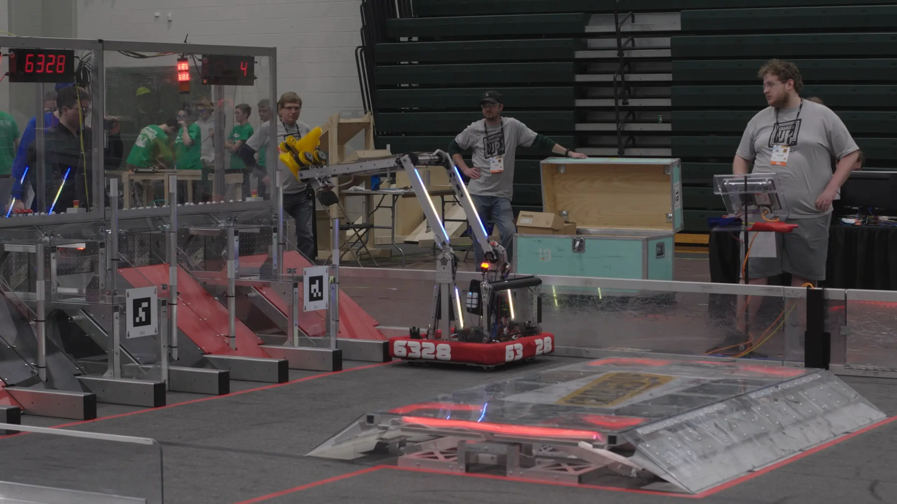

# 6328 A-Frame Pivot 2023

<figure markdown="span">
[{height=50% width=50%}](https://cad.onshape.com/documents/7b17c8664d1313c397a0fcf3/w/61b5c8329f7f5c6023f50c77/e/58bc5035e6e718d34ade872d){target = "_blank"}
<figcaption>This triple pivoted design folded in on itself to start inside frame perimeter, and allowed for a near universal manipulation of the robot’s end effector.</figcaption>
</figure>

### Links

[CAD Link](https://cad.onshape.com/documents/7b17c8664d1313c397a0fcf3/w/61b5c8329f7f5c6023f50c77/e/58bc5035e6e718d34ade872d){target = "_blank"}

## Behind the Design

In many cases, pivoting arms are a fundamental mechanism in the architecture of a robot. Thus, rigid, robust, and fast pivoting mechanisms can make or break a good design. A failure in the pivot of a design like this would put completely put a robot out of commission.

|||
|:-:|:-:|
|<figure>{height=120% width=120%}<figcaption> Robots with lower COG's are less likely to tip and have the advantage in pushing battles! </figcaption></figure>|The main pivot is powered by a custom 2 [NEO](https://www.revrobotics.com/rev-21-1650/) high-reduction gearbox that is integrated into the A-Frame of the pivot. This is the most important pivot on the robot, since it moves the most mass. For those reasons want as much power as possible here, so two-four motors is ideal. [MAXPlanetaries](https://www.revrobotics.com/rev-21-2100/) are not rated for the forces expected to be applied in this gearbox, so a custom gearbox is a necessity. The gearbox is placed as low as possible to lower the COG of the robot.|
| The gearbox drives a [Super Max Spline](https://www.chiefdelphi.com/t/experiences-with-rev-ion-so-far/431176/80?page=2) shaft, which is a [Max Spline](https://www.revrobotics.com/rev-21-2520/) shaft reinforced with an interal aluminum tube. Using this liveaxle takes the load of the pivot off of the gearbox and onto an incredibly heavy duty shaft. All of the Max Spline on this robot is reinforced Super Max Spline, except for the main pivot joint.|<figure>{height=60% width=60%}<figcaption> Internal aluminum tube reinforces the main drive shaft. </figcaption></figure>|

***
The main pivot joint is supported vertically on each side by 2 angled 1x1 shafts and a 2x1 shaft. Triangles are strong! The A frame is a triangle, and the vertical 2x1 splits each side into two more mirrored triangles. With the plates clamping on both sides this thing is bulletproof. Plates are not lightweighted at the bottom in order to lower COG and because these parts are fixed to the superstructure, so their weight doesn’t limit the rotational speed of the pivot.

|||
|:-:|:-:|
|<figure>{height=75% width=75%}<figcaption> A-Frame superstructure side view. </figcaption></figure>|<figure>{height=120% width=1500rem}<figcaption> Static triangle load distribution breakdown. Triangles are the only shape which are not collapsable when a force is applied to any side. </figcaption></figure>|

The main pivot is driven on both sides by long runs of chain to prevent torsion (twisting of the arm). These long runs of chain allow for inline tensioners to eliminate backlash in the pivot. The maxspline here is a live axle. There are bearings in the blue plates that are constrained from the outside with button head cap flanges and on the inside with 3d printed spacers. The large axle collar in between the two plates prevents the spline from sliding. The second arm section is rigidly bolted to both the sprocket and the maxspline shaft. There is tiny Zombie-Axle shaft with a gear on it rigged 1:1 with the main shaft to measure the rotation of the shaft directly for more accurate positioning. It doesn’t need a bearing, the shaft just spins with the inside of the encoder!

|||
|:-:|:-:|
|<figure>{height=60% width=60%}<figcaption> Main pivot side view. </figcaption></figure>|<figure>{height=60% width=60%}<figcaption> Bearing retention using button head machine screw flange. </figcaption></figure>|

***

## 
 See this Pivot in Action Here 

|||
|:-:|:-:|
|[<figure>{height=200% width=200%}<figcaption>6328 Behind the Bumpers</figcaption><figure>](https://youtu.be/3cXXOSFAnJU)|[<figure>{height=55% width=55%}<figcaption>6328 Rhode Island 2023 Recap</figcaption></figure>](https://youtu.be/89FRu3nUPtU)|

 