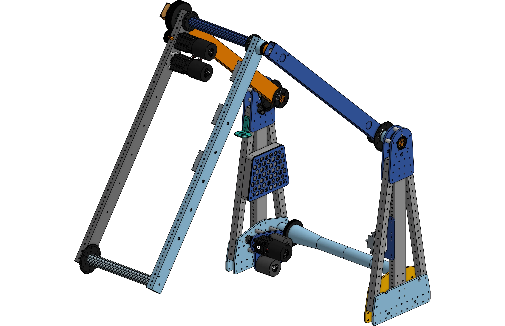
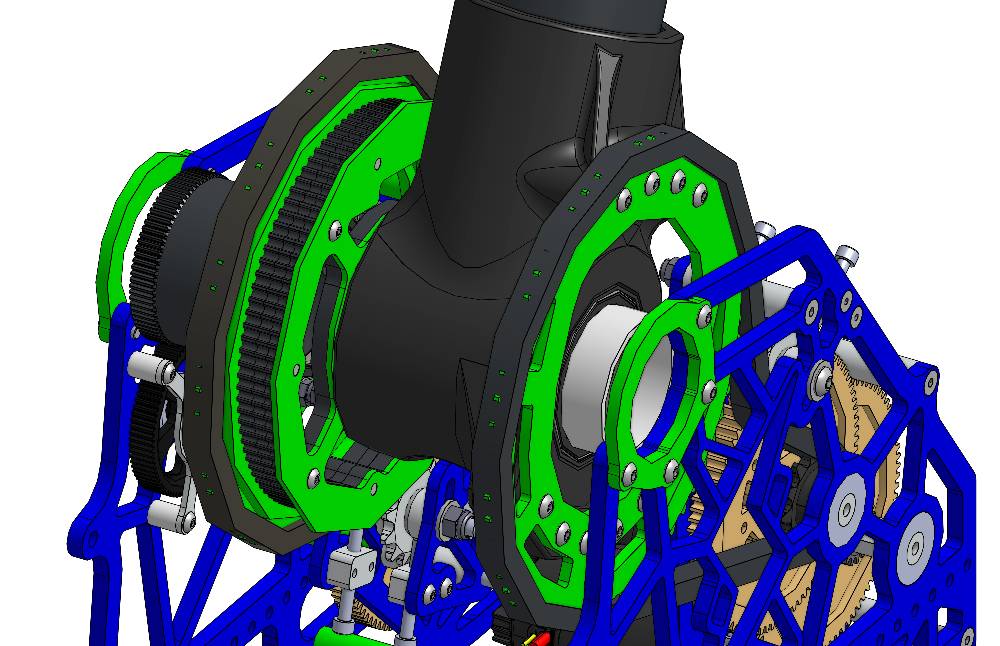

# Pivots

Rotating arms are a key mechanism in FRC® robotics. They are often essential in the deployment and manipulation of mechanisms.

-   
[{width=100%}](6328_2023_pivot.md)

    ---

    Double jointed arm, high pivot, A-frame structure, stub axles
    
    [:octicons-arrow-right-24: 6328 A-Frame Pivot](6328_2023_pivot.md)

-   
[{width=100%}](2910_2023_pivot.md)

    ---

    Chain-driven custom dead axle pivot, electronics and camera mounts, rotating final stage tensioning
    
    [:octicons-arrow-right-24: 2910 Dead Axle Pivot](2910_2023_pivot.md)

-   
[{width=100%}](1690_2024_pivot.md)

    ---

    A pivot designed to pitch a shooter up and down using a sector gear and a lantern gear.
    
    [:octicons-arrow-right-24: 1690 Lantern Gear Pivot](1690_2024_pivot.md)

-   
[{width=100%}](5460_2023_pivot.md)

    ---

    A high torque pivot using belt instead of chain or gear. This pivot was designed to minimize the amount of backlash as belt tends to come with less backlash than chain, but makes the design significantly more complex.
    
    [:octicons-arrow-right-24: 5460 Charged Up Belt Pivot](5460_2023_pivot.md)

