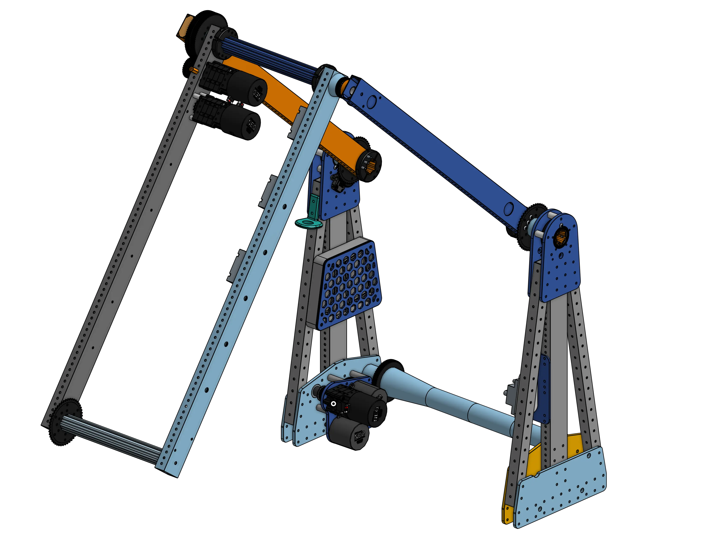

<meta property="og:title" content="Pivot Examples">
<meta property="og:type" content="website">
<meta property="og:url" content="https://www.frcdesign.org/cad-examples/pivots/">
<!--meta property="og:image" content="https://www.frcdesign.org/img/cad-examples/"-->
<meta name="theme-color" content="#4CAE4F">
<meta name="twitter:card" content="summary_large_image">

# Pivots

Rotating arms are a key mechanism in FRC® robotics. They are often essential in the deployment and manipulation of mechanisms.

-   
[{width=100%}](6328pivot.md)

    ---

    Double jointed arm, high pivot, A-frame structure, stub axles
    
    [:octicons-arrow-right-24: 6328 A-Frame Pivot](6328pivot.md)

-   
[{width=100%}](2910pivot.md)

    ---

    Chain-driven custom dead axle pivot, electronics and camera mounts, rotating final stage tensioning
    
    [:octicons-arrow-right-24: 2910 Dead Axle Pivot](2910pivot.md)

  
 