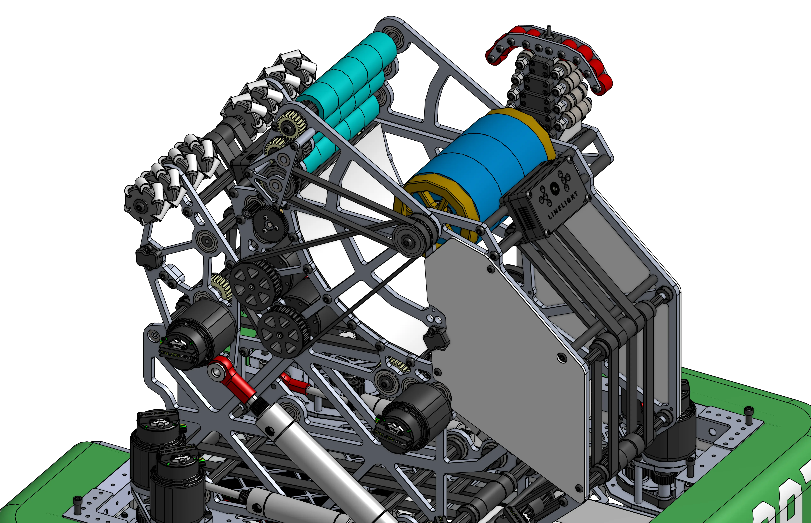

# 2910 IR @ Home / 2021 Offseason Shooter

<figure markdown="span">
[{height=80% width=80%}](https://cad.onshape.com/documents/846bb71ec3cc43151f8349d2/w/60581f1c24a22ae6f4f58b28/e/337be596fdf4879ed76381ca){target = "_blank"}
<figcaption>A FRC shooter design made to shoot 7" foam balls into a goal in the field wall. The shooter was designed to include brass flyweels on the shooter to mantain inertia when shooting the 5 balls in a row, the maximum allowed by the game rules.</figcaption>
</figure>

### Links

[CAD Document](https://cad.onshape.com/documents/846bb71ec3cc43151f8349d2/w/60581f1c24a22ae6f4f58b28/e/337be596fdf4879ed76381ca "CAD Document Link"){:target="_blank" .md-button .md-button--primary}

## Behind the Design
**Coming Soon**