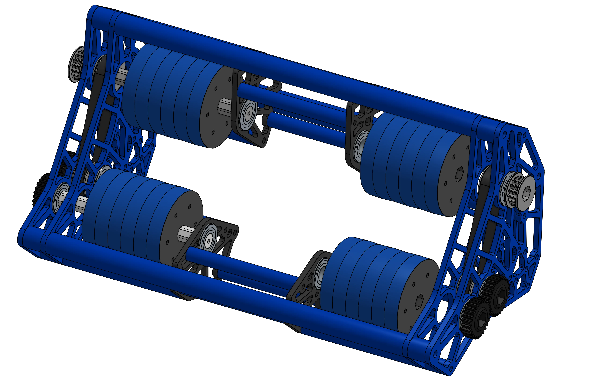

# 6328 Crescendo Shooter

<figure markdown="span">
[{height=80% width=80%}](https://cad.onshape.com/documents/9835aac8853d62a08e3c07ca/w/f30aeffcca5908da5dfd5c99/e/f183765154c242ac19e7644d){target = "_blank"}
<figcaption>Shooter made for the Crescendo game, to shoot 14" diameter, 2" thick foam rings up into a hooded goal. The shooter was designed to run the sides seperately, allowing the shooter to impart spin into the ring. The shooter was also mounted to a pivoting structure to allow for better aiming of the shot.</figcaption>
</figure>

### Links

[CAD Document](https://cad.onshape.com/documents/9835aac8853d62a08e3c07ca/w/f30aeffcca5908da5dfd5c99/e/f183765154c242ac19e7644d "CAD Document Link"){:target="_blank" .md-button .md-button--primary}

## Behind the Design
**Coming Soon**