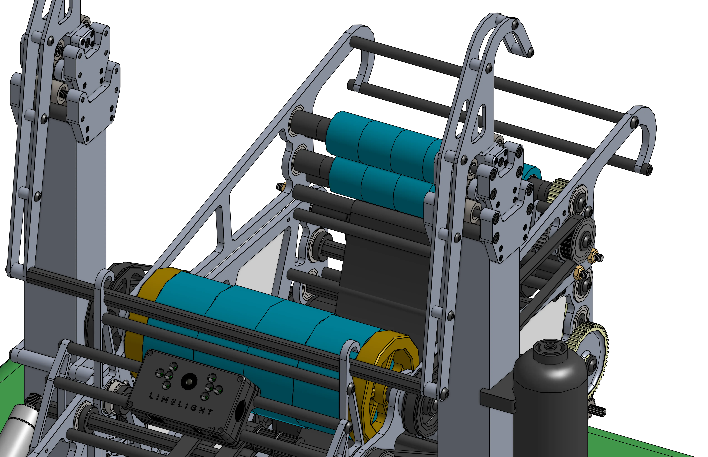
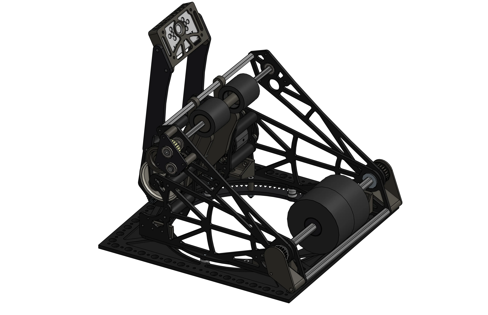

# Shooters

For all your piece launching needs. Shooter designs vary slightly with different size and shaped pieces, but the general concepts of what makes a "good" shooter tend to stay the same.

## Featured

-   

    ---

    For 9.5" balls, with a rack hood and a limelight mount
    
    [:octicons-arrow-right-24: 1678's Rapid React Shooter](1678_2022_shooter.md)

-   

    ---

    Made to launch 14" diameter foam rings. Different sides are driven seperately to add spin to the ring.
    
    [:octicons-arrow-right-24: 6328's Crescendo Shooter](6328_2024_shooter.md)

-   

    ---

    Made for for shooting Rapid React balls, while staying rigid. Includes flywheels, a limelight mount as well as a hood that is also designed to be climbed on.
    
    [:octicons-arrow-right-24: 2910's Rapid React Shooter](2910_2022_shooter.md)

-   

    ---

    Made for for shooting Rapid React balls, using a hood to aim to balls vertically, and a turret to aim horizontally.
    
    [:octicons-arrow-right-24: 6800's Rapid React Shooter](6800_2022_shooter.md)

-   

    ---

    Made for for shooting 7" foam balls, with a hood and flywheel design.
    
    [:octicons-arrow-right-24: 2910's IR @ Home / 2021 Offseason Shooter](2910_2021_shooter.md)

## More Examples

### 2024

- [111's Crescendo Shooter](https://cad.onshape.com/documents/3cfac28b1069c1daf6853747/w/4d63e656fbb8201161b14795/e/1373e5321b05597e914143b2?configuration=default){target = "_blank"}

- [581's Crescendo Shooter](https://cad.onshape.com/documents/e0b1ba5e437ff36752e3516b/w/09c92da8e227d0ad729ed92d/e/6a79f6313b90f11e04930444){target = "_blank"}

- [1778's Crescendo Shooter](https://cad.onshape.com/documents/bcbf24dd5a87e45bf4e7feb1/w/ffa6c81a1dfe71234cde9aca/e/e925d7cf2a2b03135bc67046){target = "_blank"}

- [1678's Crescendo Shooter](https://cad.onshape.com/documents/05760c4d8b40fba37db8fa48/w/f31b499c519e8471cced93dc/e/b53dde24ab8b46d679af9944){target = "_blank"}

- [2910's Crescendo Shooter](https://2910.onshape.com/documents/b05af223ad0d2a358074cc0a/v/0769959730f43a1859a1f370/e/9d8b5a55e5c746878f41c2bc){target = "_blank"}

- [3005's Crescendo Shooter](https://cad.onshape.com/documents/f1c0c9ce2309b0be3a22a379/w/c8169ca8774f2b499875ab45/e/b1639093afdfd702347929f0){target = "_blank"}

- [5419's Crescendo Shooter](https://cad.onshape.com/documents/f1c0c9ce2309b0be3a22a379/w/c8169ca8774f2b499875ab45/e/b1639093afdfd702347929f0){target = "_blank"}

- [5940's Crescendo Shooter](https://cad.onshape.com/documents/f1c0c9ce2309b0be3a22a379/w/c8169ca8774f2b499875ab45/e/b1639093afdfd702347929f0){target = "_blank"}

- [6036's Crescendo Shooter](https://cad.onshape.com/documents/b8e6794afb3a0d96fa312ae1/v/a47e847b9518dc43066543ac/e/1d767442ba2af50a6d55f05b){target = "_blank"}

### 2022

- [111's Rapid React Shooter](https://cad.onshape.com/documents/bcbf24dd5a87e45bf4e7feb1/w/ffa6c81a1dfe71234cde9aca/e/e925d7cf2a2b03135bc67046){target = "_blank"}

- [118's Rapid React Shooter](https://grabcad.com/library/robonauts-118-2022-robot-horizon-1){target = "_blank"}

- [2337's Rapid React Shooter](https://cad.onshape.com/documents/3ad3451c2339f674d0ab2b60/w/123a29c5b91a36bfb6787a41/e/41b65f0937c35c003465d507){target = "_blank"}

- [3357's Rapid React Shooter](https://grabcad.com/library/atlas-23){target = "_blank"}

- [3847's Rapid React Shooter](https://cad.onshape.com/documents/995ee9b75573cf463f84dbbc/w/80aecca8674f728b1e04236c/e/dac0a7693d84c119c3ce8bab){target = "_blank"}

- [4089's Rapid React Shooter](https://cad.onshape.com/documents/995ee9b75573cf463f84dbbc/w/80aecca8674f728b1e04236c/e/dac0a7693d84c119c3ce8bab){target = "_blank"}

- [4099's Rapid React Shooter](https://cad.onshape.com/documents/995ee9b75573cf463f84dbbc/w/80aecca8674f728b1e04236c/e/dac0a7693d84c119c3ce8bab){target = "_blank"}

- [4481's Rapid React Shooter](https://grabcad.com/library/frc-4481-team-rembrandts-resurrection-v3-1){target = "_blank"}

- [6328's Rapid React Shooter](https://cad.onshape.com/documents/b83cb8e60cea7c17cbee6692/w/13284a7a33c1b2621631c2ee/e/ee2cff08193b9fc024e2c99f){target = "_blank"}

### 2020

- [111's Infinite Recharge Shooter](https://grabcad.com/library/wildstang-2020-2){target = "_blank"}

- [1114's Infinite Recharge Shooter](https://grabcad.com/library/simbotics-frc-1114-2020-competition-robot-simbot-siakam-1){target = "_blank"}

- [1678's Infinite Recharge Shooter](https://cad.onshape.com/documents/473e3d39cea82227ad9b0954/w/d3a345153f7c78f70166d860/e/238fdfc44c853da8f18525e7){target = "_blank"}