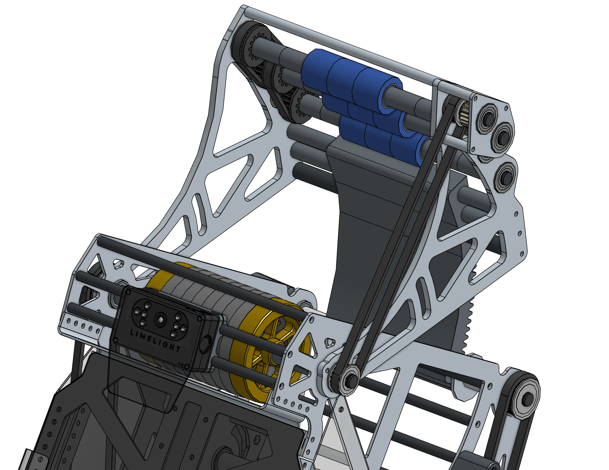

<meta property="og:title" content="Shooter Examples">
<meta property="og:type" content="website">
<meta property="og:url" content="https://www.frcdesign.org/cad-examples/shooter/">
<meta property="og:image" content="https://www.frcdesign.org/img/cad-examples/shooter/small.webp">
<meta name="theme-color" content="#4CAE4F">
<meta name="twitter:card" content="summary_large_image">

# Shooters

For all your piece launching needs. Shooter designs vary slightly with different size and shaped pieces, but the general concepts of what makes a "good" shooter tend to stay the same.

-   
[{width=80%}](small.md)

    ---

    For very small balls, clever packaging and design for a hooded shooter
    
    [:octicons-arrow-right-24: Andrew's Hyperhive Shooter](small.md)

-   

    ---

    For 9.5" balls, with a rack hood and a limelight mount
    
    [:octicons-arrow-right-24: 1678's Rapid React Shooter](citrus.md)

 