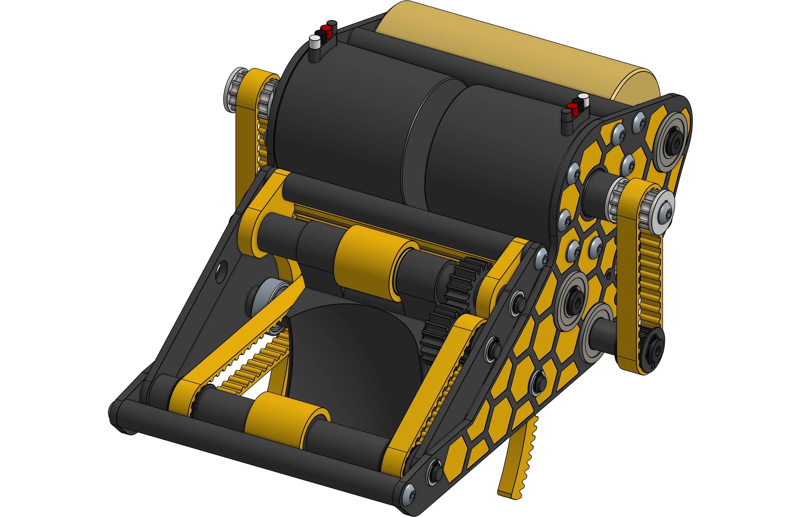

# Andrew's Hyperhive Shooter

<figure markdown="span">
[{height=65% width=65%}](https://cad.onshape.com/documents/d42bd2dc9506e15f18d5fb20/w/dd0c510b4c9e180ffb032d56/e/afcba37105e40abc1cb80663){target = "_blank"}
<figcaption>Small form factor shooter designed to shoot a high volume of tennis balls at a fast rate. Large overdriven flywheel increases shot consistency when firing large quantities of tennis balls</figcaption>
</figure>

### Links

[CAD Document](https://cad.onshape.com/documents/d42bd2dc9506e15f18d5fb20/w/dd0c510b4c9e180ffb032d56/e/afcba37105e40abc1cb80663 "CAD Document Link"){:target="_blank" .md-button .md-button--primary}

## Behind the design

**Coming Soon**

 