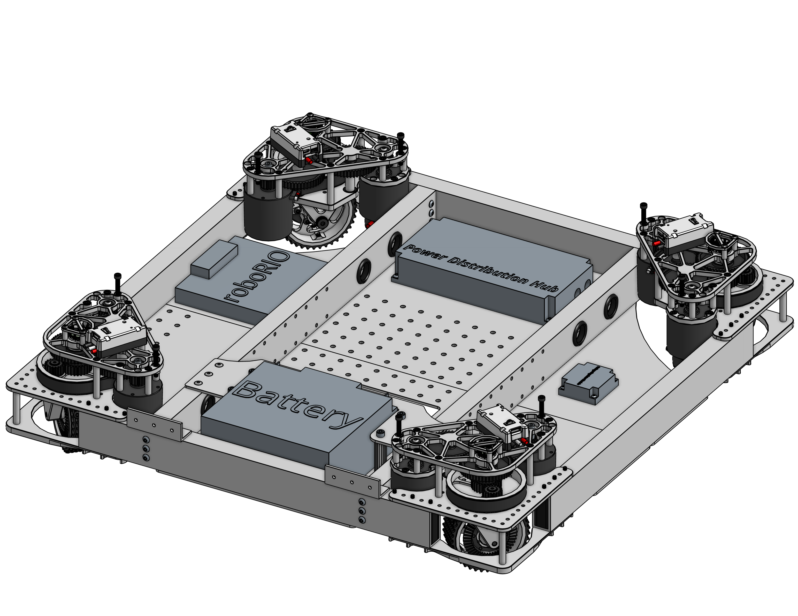
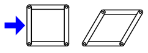
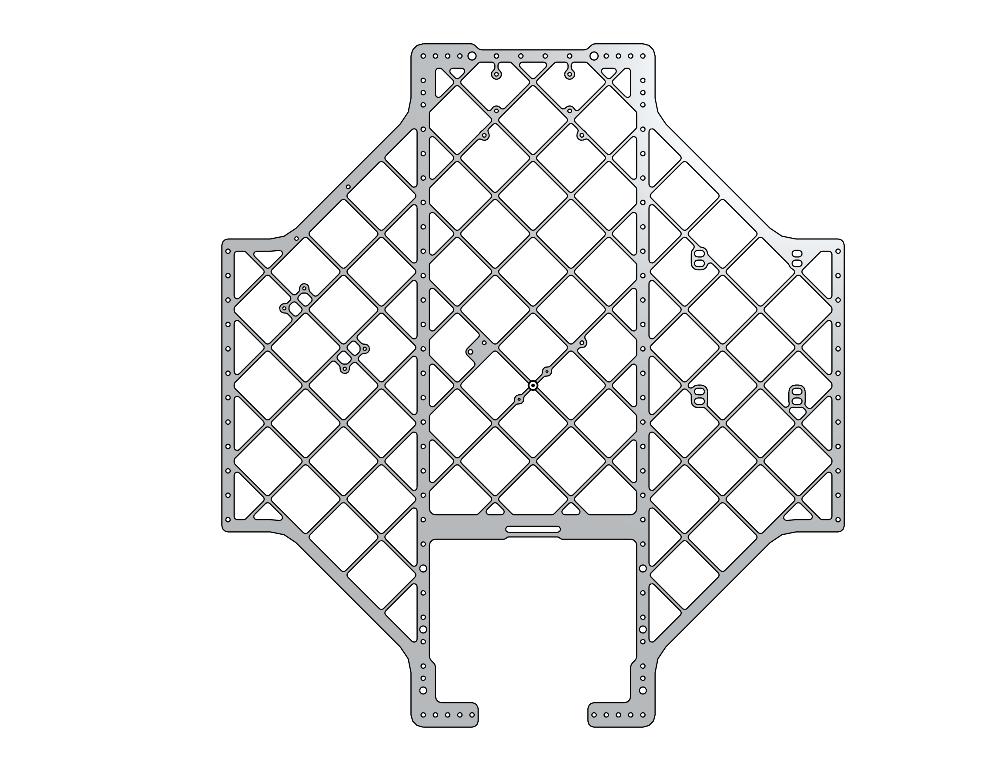

# Drivebase Fundamentals

## Types of Drivetrains

- Swerve - A drivetrain with 4 wheels in which all drive wheels are independently driven and steered. Drivetrain can move in any direction
<figure markdown="span">
{height=50% width=50%}
</figure>
- Kit of Part drivebase - 6 wheel drop center(the middle wheels is lower than the outer wheels) drive base made from bent-sheet metal and comes with the kit of parts. 
<figure markdown="span">
{height=50% width=50%}
</figure>
- West Coast Drive (WCD) - A six wheel drive base with a drop-center wheel that is directly driven from the gearbox. Traditionally, the power transmission is driven with chain, a gearbox, and box tubing for rigidity. A key characteristic for west coast drives is that the wheels are cantilevered. 
<figure markdown="span">
{height=50% width=50%}
</figure>

## Key Drivebase Choices

### Rigidity
In a single FRC game, robots encounter huge forces from collisions, and a rigid frame helps to reduce the risk of any structural damage. In your drivebase, you want to add something to increase the rigidity, such as a cross rail. When building a superstructure, you need to think from the bottom up, and it starts with your drivetrain being as rigid as possible.

#### What do cross members do for your structure?
- Contrary to popular belief, metal isn’t as strong as stable as people think, and it likes to “parallelogram” when compressive loads begin to come on your bracing.

<figure markdown="span">
{height=150% width=150%}<figcaption> In this picture you can see the square frame turns into a parallelogram as a load comes onto the left side. In a single FRC match, your chassis undergoes a ton of forces, which can affect the shape of your drivebase. </figcaption>
</figure>

#### Where to place cross rails?

- There are two main type of cross members that teams do:
    - The first type is two vertical cross members, as close to the swerve modules as possible.
    <figure markdown="span">
    {height=50% width=50%}
    </figure>
    - Pros:
        - Easier to mount things
        - Stiff structure, less change of compressive loads affecting your drivebase.
    - Cons:
        - You severely limit your electrical boards accessibility, and it affects the placement of your electronics.

    - The second type is a single 2x2 Horizontal Cross beam.
    <figure markdown="span">
    {height=50% width=50%}
    </figure>
    - Pros:
        - Opens up a ton of electrical board space
        - Stronger than having a single 2x1 there because of your cross sectional area, and it can withstand higher loads before yielding or failing. 
        - Moment of inertia is double, due to the width being double meaning there's a much larger increase in strength.
        - 2x2 box tubing spreads the [shear-load](https://www.youtube.com/watch?v=C-FEVzI8oe8&t=109s&ab_channel=TheEfficientEngineer) across a larger area
        - Stiffness of 2x2 is nicer.
    - Cons: 
        - Harder to mount your superstructure from there, you might have to introduce additional tubes.
            - This could mean that you have to potentially introduce complex bent-metal parts
        - Severely locks you into a mounting style.
### Which tube thickness should you use?
- In a majority of drivebases, people use 2x1 Box tubing that is 1/8th thickness. 
    - Generally, the thinner the wall thickness, the more susceptible it is to tearing, as well as crushing. In matches with heavy impacts, your drivebase tubes are the last thing you want bending: 
         - 1/8" wall thickness is best in scenarios where you know that you will have impacts, or in areas where you know that stress concentration will have to be high according to how it is fixtured or assembled.
### Belly Pans and its impact on rigidity:
- A belly pan is a plate for mounting electronics on the underside of your drivebase, however it also tremendously impacts the rigidity of your drivebase as it acts like a giant gusset bringing everything together 
- By spanning the underside of the drivebase and connecting to the key structural elements like the frame rails/cross-members, the belly pan is able to distribute loads evenly across the entire structure and the integration helps to prevent any flexing or deformation of the frame. 
- #### What Material should my belly pan be? 
 - By increasing the thickness of your belly pan, and changing the material, you can drastically change the center of gravity of your robot. 
- Popular Material Types:
    - Steel:
        - Pros:
            - Low center of gravity
            - High strength
        - Cons:
            - Heavy weight means you may need to lighten other parts of your robot to be under the weight limit. (See team 254's robot in 2022 when they used a 1/4" Steel Bellypan and compensated by lightening all their other parts)
            - Hard to machine
    - Aluminum:
        - Pros:
            - Easy to machine
            - Relatively high strength
            - Lighter weight than steel
        - Cons:
            - Aluminum is expensive.
    - Polycarbonate:
        - Pros: 
            - Lightweight, meaning that you are able to allocate more weight to other parts of the robot. 
            - Relatively cost-effective
            - Very simple to machine.
        - Cons:
            - Lower rigidity and can flex
            - Lower weight means that your center of gravity could be higher than you want it to be.
- What a lot of teams do to maintain rigidity while lightening the weight is called a pocketed bellypan , and what this accomplishes is it takes away the material in unnecessary places, while allowing for electronics to  be mounted by keeping the holes in the correct locations.
<figure markdown="span">
{height=50% width=50%}
</figure>

## Frame Perimeter:

- In accordance with the game manual, your driveabse frame perimeter must be a maximum of 120". 
    - Frame Extension: 
        - In accordance to the game manual, at the beginning of your match, no part of your robot can stick out of the frame. To gain more clearance teams use [Swerve-Corners](https://cad.onshape.com/documents/3969471095df924bad241f81/w/42f02d1579e8bcd9c0435d48/e/b1b02258ec73e6686b1e62fd) and 1/4” plates to extend their frame perimeter by a 1/2” on all sides, and this allows to mount plates to the edges of your tubing.

<figure markdown="span">
{height=50% width=50%}<figcaption>You can see in the highlighted section that it sticks out further than your box tubing extension.</figcaption>
</figure>

## Wheelbase Location:
- You want your wheels as far apart as possible in order to give you more stability, especially while turning. 

## Electrical Mounting
- When designing a bellypan, you need to ensure that your electronics are as accessible as possible. What some teams do is they drill massive access holes in their cross tubing. One thing to keep in mind for this is you may want to 3D Print protection guards/rubber grommets on the holes to ensure the wires don’t strip on the hole’s sharp edges.

<figure markdown="span">
{height=50% width=50%}
</figure>